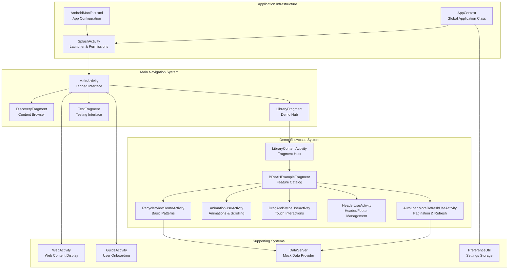
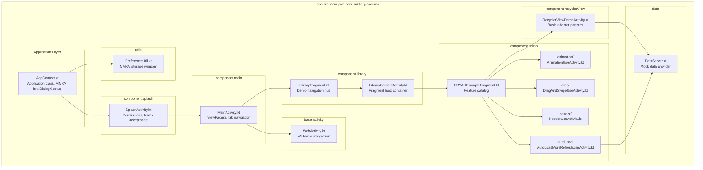

# Overview

Relevant source files

The following files were used as context for generating this wiki page:

- [app/build.gradle.kts](app/build.gradle.kts)
- [app/src/main/AndroidManifest.xml](app/src/main/AndroidManifest.xml)
- [app/src/main/java/com/suzhe/playdemo/AppContext.kt](app/src/main/java/com/suzhe/playdemo/AppContext.kt)
- [app/src/main/res/drawable/sun.png](app/src/main/res/drawable/sun.png)
- [settings.gradle.kts](settings.gradle.kts)

## Purpose and Scope

PlayDemo is a comprehensive Android demonstration application designed to showcase the capabilities
of the BRVAH (BaseRecyclerViewAdapterHelper) library and modern Android UI patterns. The application
serves as a feature catalog and testing ground for advanced RecyclerView implementations,
interactive UI components, and Android development best practices.

This document provides a high-level overview of the PlayDemo application architecture, key systems,
and technology stack. For detailed information about specific subsystems, see the following pages:
application setup and configuration ([Getting Started](#2)), core architectural
patterns ([Application Architecture](#3)), and the comprehensive BRVAH demonstration
system ([BRVAH Demo System](#4)).

## Application Architecture

The PlayDemo application follows a structured architecture with clear separation between
initialization, navigation, demonstration systems, and supporting utilities.

Sources: [app/src/main/AndroidManifest.xml:1-73](https://github.com/SuZhelevel6/PlayDemo/blob/a2338414/app/src/main/AndroidManifest.xml#L1-L73), [app/src/main/java/com/suzhe/playdemo/AppContext.kt:1-103](https://github.com/SuZhelevel6/PlayDemo/blob/a2338414/app/src/main/java/com/suzhe/playdemo/AppContext.kt#L1-L103)

## Technology Stack

PlayDemo integrates a comprehensive set of modern Android libraries and frameworks to demonstrate
current best practices in Android development.

| Category                     | Technology                    | Version       | Purpose                            |
|------------------------------|-------------------------------|---------------|------------------------------------|
| **Core Framework**           | Android SDK                   | 34            | Target platform                    |
| **RecyclerView Enhancement** | BaseRecyclerViewAdapterHelper | 4.1.4         | Primary demo focus                 |
| **UI Framework**             | QMUI                          | 2.1.0         | Enhanced UI components             |
| **Dialog System**            | DialogX                       | 0.0.50.beta33 | Advanced dialog management         |
| **Storage**                  | MMKV                          | 1.2.16        | High-performance key-value storage |
| **Crash Monitoring**         | XCrash                        | 3.1.0         | Crash capture and reporting        |
| **Tab Layout**               | DslTabLayout                  | 3.5.3         | Custom tab components              |
| **Utilities**                | AndroidUtilCode               | 1.31.1        | Common utility functions           |
| **Web Integration**          | WebProgress                   | 1.2.0         | WebView progress indicators        |

Sources: [app/build.gradle.kts:62-131](https://github.com/SuZhelevel6/PlayDemo/blob/a2338414/app/build.gradle.kts#L62-L131)

## Key Components and Code Mapping

The following diagram maps the major functional systems to their corresponding code entities,
providing a bridge between conceptual understanding and implementation details.

Sources: [app/src/main/AndroidManifest.xml:14-71](https://github.com/SuZhelevel6/PlayDemo/blob/a2338414/app/src/main/AndroidManifest.xml#L14-L71), [app/src/main/java/com/suzhe/playdemo/AppContext.kt:23-101](https://github.com/SuZhelevel6/PlayDemo/blob/a2338414/app/src/main/java/com/suzhe/playdemo/AppContext.kt#L23-L101)

## Application Flow

The PlayDemo application follows a structured initialization and navigation flow:

1. **Application Startup**: `AppContext` initializes global services including MMKV storage, XCrash
   monitoring, and DialogX framework
2. **Permission Handling**: `SplashActivity` manages runtime permissions and terms of service
   acceptance before proceeding
3. **Main Interface**: `MainActivity` provides a tabbed interface with three primary sections:
    - Discovery tab for content browsing
    - Library tab serving as the main demo hub
    - Test tab for experimental features
4. **Demo Navigation**: `LibraryFragment` acts as the central navigation point, launching
   `LibraryContentActivity` to host various demonstration fragments
5. **Feature Demonstrations**: Individual activities showcase specific BRVAH capabilities and
   Android UI patterns

## Build Configuration

The application targets Android SDK 34 with a minimum SDK of 33, using Kotlin as the primary
development language. Key build configurations include:

- **ViewBinding**: Enabled for type-safe view references
- **RenderScript**: Enabled to support DialogX real-time blur effects
- **NDK Support**: Configured for ARM architectures (armeabi-v7a, arm64-v8a)
- **Repository Sources**: Maven Central, Google, and JitPack for dependency resolution

Sources: [app/build.gradle.kts:6-60](https://github.com/SuZhelevel6/PlayDemo/blob/a2338414/app/build.gradle.kts#L6-L60), [settings.gradle.kts:1-19](https://github.com/SuZhelevel6/PlayDemo/blob/a2338414/settings.gradle.kts#L1-L19)

The PlayDemo application serves as both a comprehensive showcase of BRVAH library capabilities and a
reference implementation for modern Android development patterns. Its modular architecture and
extensive use of current Android libraries make it an excellent resource for developers learning
advanced RecyclerView techniques and contemporary Android UI development.