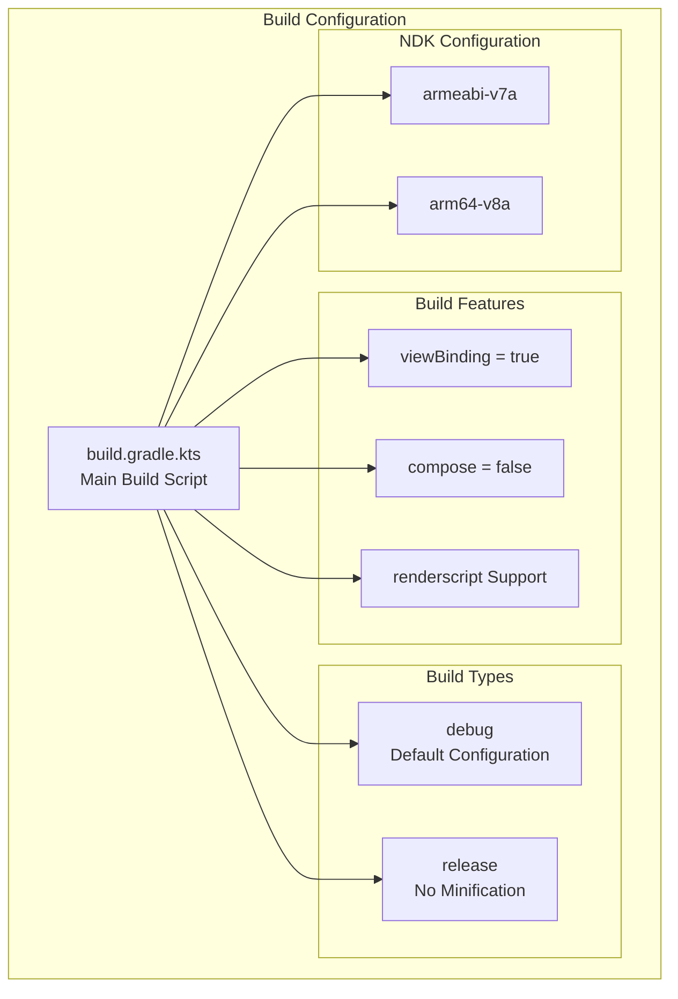
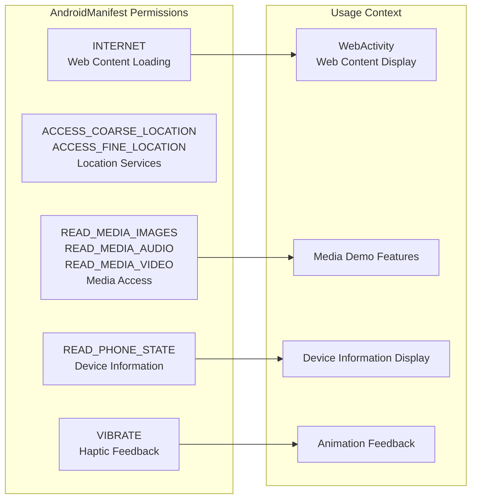
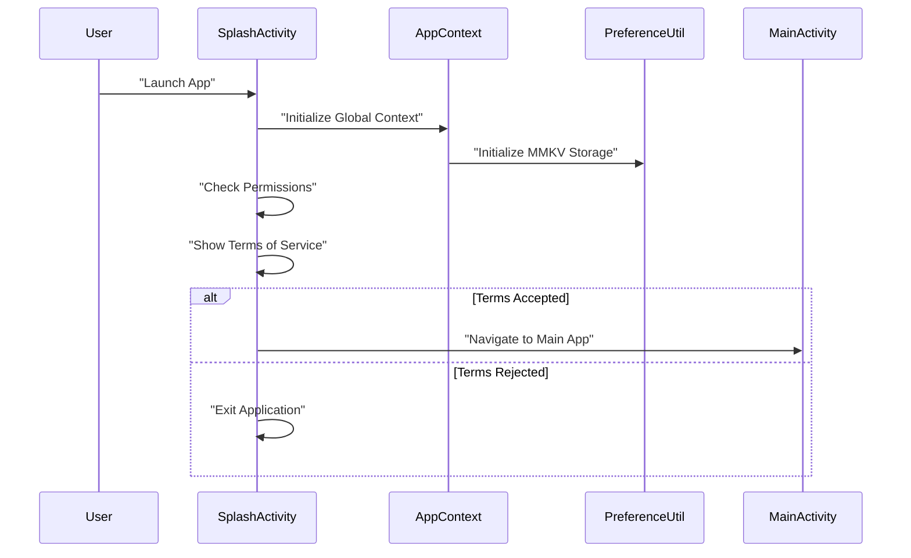
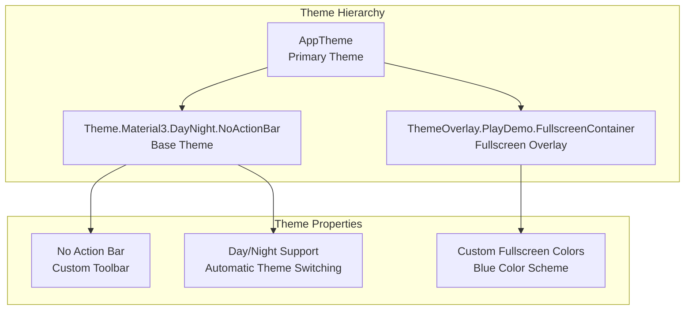

# Getting Started

Relevant source files

The following files were used as context for generating this wiki page:

- [app/build.gradle.kts](app/build.gradle.kts)
- [app/src/main/AndroidManifest.xml](app/src/main/AndroidManifest.xml)
- [app/src/main/res/values/strings.xml](app/src/main/res/values/strings.xml)
- [app/src/main/res/values/themes.xml](app/src/main/res/values/themes.xml)

## Purpose and Scope

This document covers the initial setup, configuration, and build requirements necessary to run the
PlayDemo Android application. It includes build system configuration, required permissions, app
initialization flow, and the first-time user experience.

For detailed information about the application's overall architecture,
see [Application Architecture](#3). For specific BRVAH demonstration features,
see [BRVAH Demo System](#4).

## System Requirements and Prerequisites

The PlayDemo application has specific Android platform requirements and dependencies that must be
met before building and running the application.

### Android Platform Requirements

| Requirement       | Value | Location                       |
|-------------------|-------|--------------------------------|
| Compile SDK       | 34    | [app/build.gradle.kts:8]()     |
| Minimum SDK       | 33    | [app/build.gradle.kts:12]()    |
| Target SDK        | 33    | [app/build.gradle.kts:13]()    |
| Java Version      | 1.8   | [app/build.gradle.kts:42-43]() |
| Kotlin JVM Target | 1.8   | [app/build.gradle.kts:46]()    |

### Supported Architectures

The application supports the following CPU architectures as defined in the NDK configuration:

- `armeabi-v7a` (32-bit ARM)
- `arm64-v8a` (64-bit ARM)

Sources: [app/build.gradle.kts:22-25](https://github.com/SuZhelevel6/PlayDemo/blob/a2338414/app/build.gradle.kts#L22-L25)

## Build Configuration

### Gradle Build Setup

The application uses Kotlin DSL for Gradle configuration with several key build features enabled:

### Key Build Features

- **ViewBinding**: Enabled for type-safe view references ([app/build.gradle.kts:50]())
- **Compose**: Disabled as the app uses traditional Android Views ([app/build.gradle.kts:49]())
- **RenderScript**: Enabled to support DialogX real-time blur
  effects ([app/build.gradle.kts:28-29]())

### Major Dependencies

The application integrates several significant third-party libraries:

| Library                        | Version       | Purpose                            |
|--------------------------------|---------------|------------------------------------|
| BaseRecyclerViewAdapterHelper4 | 4.1.4         | Core RecyclerView enhancement      |
| QMUI                           | 2.1.0         | UI framework                       |
| MMKV                           | 1.2.16        | High-performance key-value storage |
| DialogX                        | 0.0.50.beta33 | Dialog framework                   |
| XCrash                         | 3.1.0         | Crash reporting                    |
| DslTabLayout                   | 3.5.3         | Custom tab layout components       |

Sources: [app/build.gradle.kts:62-131](https://github.com/SuZhelevel6/PlayDemo/blob/a2338414/app/build.gradle.kts#L62-L131)

## Application Permissions and Security

### Required Permissions

The application requests several permissions that are essential for its demonstration features:

### App Security Configuration

The application includes comprehensive backup and data extraction rules:

- **Backup Rules**: Defined in `@xml/backup_rules` ([app/src/main/AndroidManifest.xml:18]())
- **Data Extraction Rules**: Defined in
  `@xml/data_extraction_rules` ([app/src/main/AndroidManifest.xml:17]())
- **RTL Support**: Enabled for internationalization ([app/src/main/AndroidManifest.xml:22]())

Sources: [app/src/main/AndroidManifest.xml:5-13](https://github.com/SuZhelevel6/PlayDemo/blob/a2338414/app/src/main/AndroidManifest.xml#L5-L13), [app/src/main/AndroidManifest.xml:16-24](https://github.com/SuZhelevel6/PlayDemo/blob/a2338414/app/src/main/AndroidManifest.xml#L16-L24)

## Initial Launch Flow

### App Initialization Sequence

The application follows a structured initialization process that ensures proper setup before
allowing user interaction:

### Application Entry Point

The application is configured with `SplashActivity` as the main launcher activity:

- **Launcher Activity**: `SplashActivity` ([app/src/main/AndroidManifest.xml:58-65]())
- **Application Class**: `AppContext` ([app/src/main/AndroidManifest.xml:15]())
- **Main Activity**: `MainActivity` for primary app
  functionality ([app/src/main/AndroidManifest.xml:67-70]())

### Terms of Service and Privacy Policy

The application includes a comprehensive terms of service and privacy policy that users must accept
on first launch. The terms cover:

- Information collection and usage policies
- Data storage and security measures
- Service scope and user obligations
- Privacy protection measures

The full terms are defined in the string resource `term_service_privacy_content` and reference
external policy documents.

Sources: [app/src/main/AndroidManifest.xml:58-70](https://github.com/SuZhelevel6/PlayDemo/blob/a2338414/app/src/main/AndroidManifest.xml#L58-L70), [app/src/main/res/values/strings.xml:9-41](https://github.com/SuZhelevel6/PlayDemo/blob/a2338414/app/src/main/res/values/strings.xml#L9-L41)

## Application Theme and Styling

### Theme Configuration

The application uses Material Design 3 with a day/night theme configuration:

### Application Branding

- **App Name**: "PlayDemo" ([app/src/main/res/values/strings.xml:2]())
- **App Icon**: `@mipmap/ic_launcher` and
  `@mipmap/ic_launcher_round` ([app/src/main/AndroidManifest.xml:19-21]())
- **Primary Theme**: Material3 with NoActionBar for custom
  navigation ([app/src/main/res/values/themes.xml:4]())

Sources: [app/src/main/res/values/themes.xml:1-10](https://github.com/SuZhelevel6/PlayDemo/blob/a2338414/app/src/main/res/values/themes.xml#L1-L10), [app/src/main/res/values/strings.xml:1-8](https://github.com/SuZhelevel6/PlayDemo/blob/a2338414/app/src/main/res/values/strings.xml#L1-L8), [app/src/main/AndroidManifest.xml:19-23](https://github.com/SuZhelevel6/PlayDemo/blob/a2338414/app/src/main/AndroidManifest.xml#L19-L23)

## Quick Start Summary

To get started with the PlayDemo application:

1. **Environment Setup**: Ensure Android Studio with SDK 34 and minimum API 33 support
2. **Build**: Run `./gradlew assembleDebug` or build through Android Studio
3. **Install**: Install the APK on a device running Android 13 (API 33) or higher
4. **First Launch**: Accept terms of service and grant required permissions
5. **Explore**: Navigate through the main tabbed interface to access BRVAH demonstrations

The application will initialize through `SplashActivity`, handle permission requests, present terms
of service, and then proceed to `MainActivity` where the main demonstration features are accessible
through a tabbed navigation interface.

Sources: [app/build.gradle.kts:6-60](https://github.com/SuZhelevel6/PlayDemo/blob/a2338414/app/build.gradle.kts#L6-L60), [app/src/main/AndroidManifest.xml:58-70](https://github.com/SuZhelevel6/PlayDemo/blob/a2338414/app/src/main/AndroidManifest.xml#L58-L70)