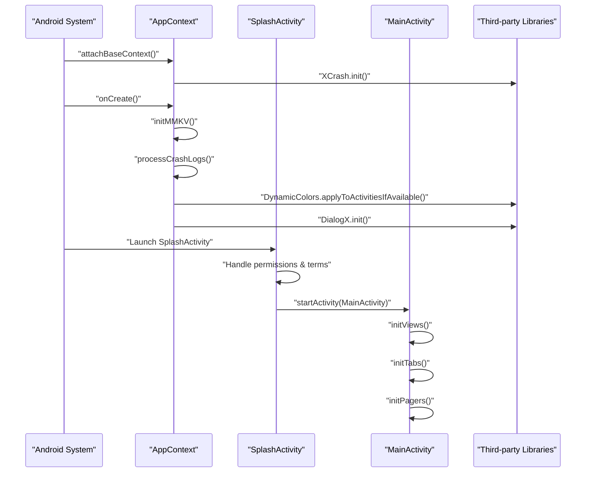
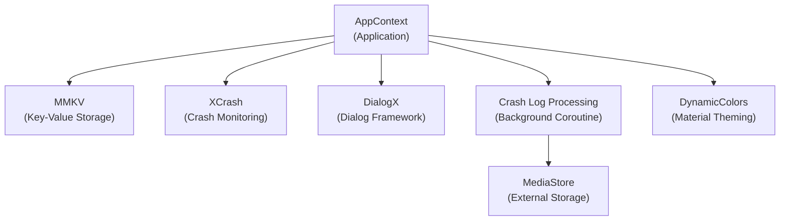
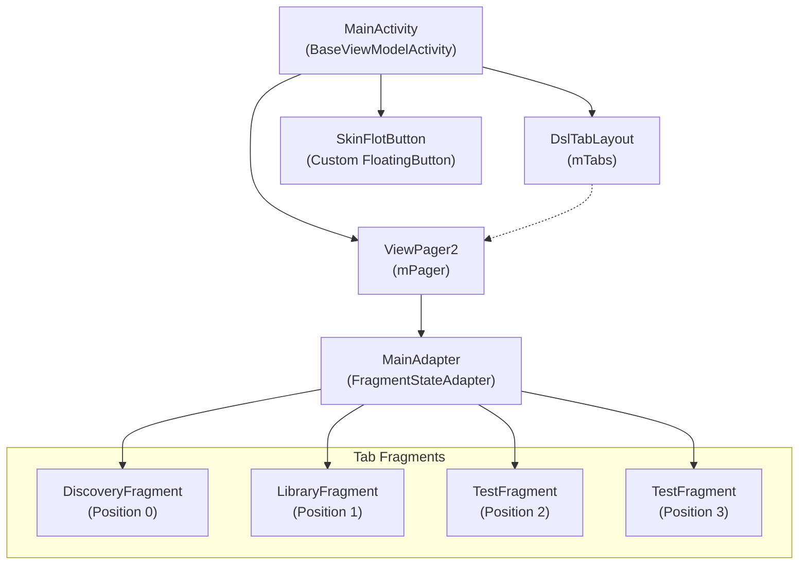
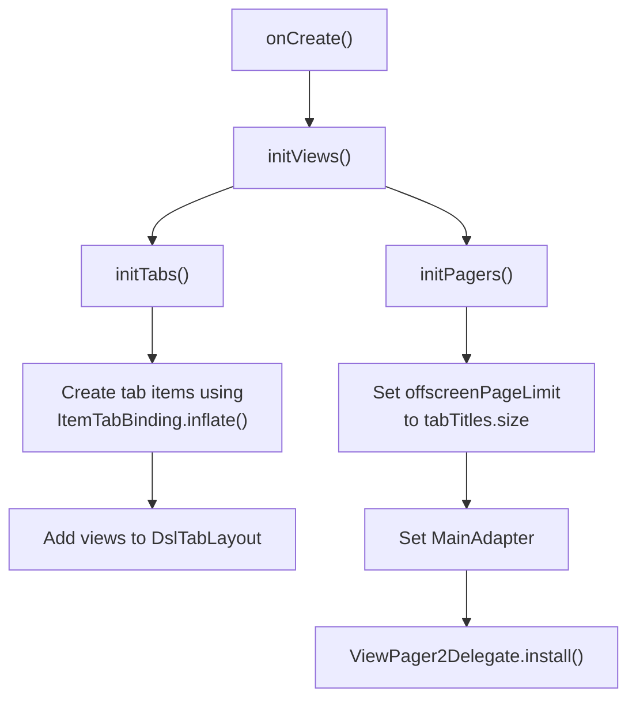
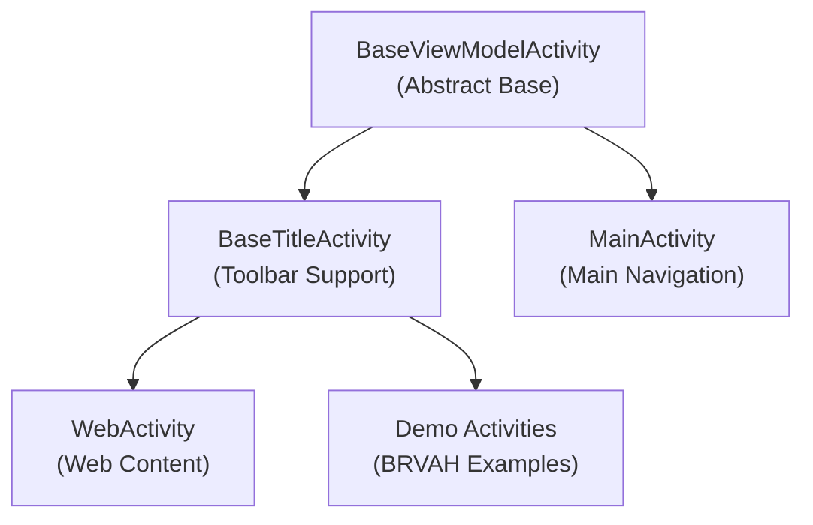
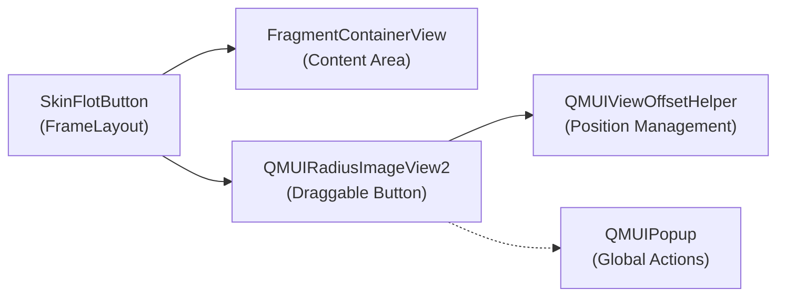
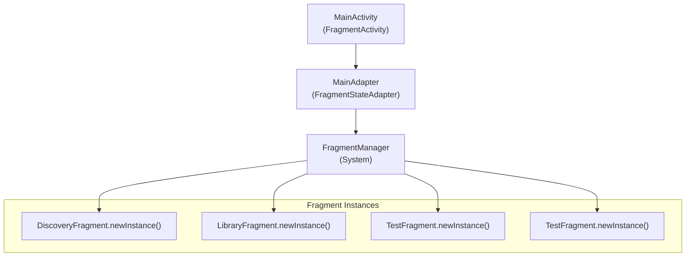
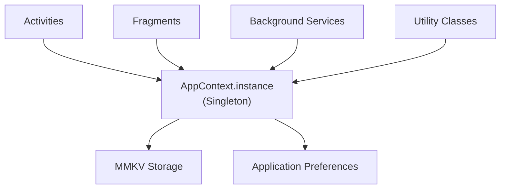
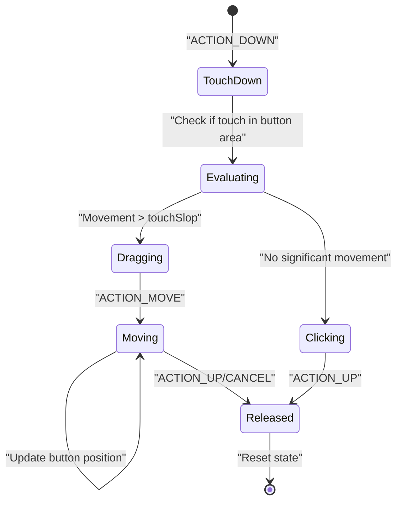

# Application Architecture

Relevant source files

The following files were used as context for generating this wiki page:

- [app/src/main/java/com/suzhe/playdemo/AppContext.kt](app/src/main/java/com/suzhe/playdemo/AppContext.kt)
- [app/src/main/java/com/suzhe/playdemo/component/main/MainActivity.kt](app/src/main/java/com/suzhe/playdemo/component/main/MainActivity.kt)
- [app/src/main/java/com/suzhe/playdemo/component/main/MainAdapter.kt](app/src/main/java/com/suzhe/playdemo/component/main/MainAdapter.kt)
- [app/src/main/res/drawable/sun.png](app/src/main/res/drawable/sun.png)
- [settings.gradle.kts](settings.gradle.kts)

This document explains the overall architecture of the PlayDemo Android application, including the
initialization flow, navigation patterns, and core architectural components. It covers the
high-level structure and relationships between major system components that form the foundation of
the application.

For specific information about BRVAH demo implementations, see [BRVAH Demo System](#4). For details
about individual UI components and patterns, see [UI Components and Patterns](#5).

## Application Initialization Flow

The PlayDemo application follows a structured initialization sequence that sets up global services,
handles permissions, and establishes the main navigation framework.

### Initialization Sequence

The `AppContext` class serves as the global application entry point, responsible for initializing
core libraries and services. Key initialization components include:

| Component     | Purpose                            | Implementation       |
|---------------|------------------------------------|----------------------|
| XCrash        | Crash monitoring and reporting     | [AppContext.kt:35]() |
| MMKV          | High-performance key-value storage | [AppContext.kt:44]() |
| DialogX       | Dialog framework initialization    | [AppContext.kt:50]() |
| DynamicColors | Material Design dynamic theming    | [AppContext.kt:48]() |

Sources: [AppContext.kt:23-102](https://github.com/SuZhelevel6/PlayDemo/blob/a2338414/AppContext.kt#L23-L102)

### Global Context Management

The `AppContext` maintains a singleton instance accessible throughout the application and manages
background crash log processing using coroutines with a 5-second delay to avoid interfering with app
startup performance.

Sources: [AppContext.kt:23-102](https://github.com/SuZhelevel6/PlayDemo/blob/a2338414/AppContext.kt#L23-L102)

## Main Navigation Architecture

The main navigation system is built around a tabbed interface using `ViewPager2` and `DslTabLayout`,
managed by the `MainActivity` class.

### Navigation Component Structure

The navigation system implements a four-tab interface with the following structure:

| Tab Index | Title      | Fragment            | Icon Resource                       |
|-----------|------------|---------------------|-------------------------------------|
| 0         | "Discover" | `DiscoveryFragment` | `R.drawable.selector_tab_discovery` |
| 1         | "Library"  | `LibraryFragment`   | `R.drawable.selector_tab_library`   |
| 2         | "Category" | `TestFragment`      | `R.drawable.selector_tab_category`  |
| 3         | "Me"       | `TestFragment`      | `R.drawable.selector_tab_me`        |

Sources: [MainActivity.kt:36-48](https://github.com/SuZhelevel6/PlayDemo/blob/a2338414/MainActivity.kt#L36-L48), [MainAdapter.kt:16-23](https://github.com/SuZhelevel6/PlayDemo/blob/a2338414/MainAdapter.kt#L16-L23)

### Tab and Pager Initialization

The `MainActivity` initializes its navigation components through a two-stage process:

The `ViewPager2` is configured with `offscreenPageLimit` set to the total number of tabs to keep all
fragments in memory, and uses `ViewPager2Delegate` to synchronize with the tab layout.

Sources: [MainActivity.kt:57-81](https://github.com/SuZhelevel6/PlayDemo/blob/a2338414/MainActivity.kt#L57-L81)

## Core Architectural Components

### Base Activity Framework

The application uses a layered activity hierarchy that provides common functionality:

This hierarchy provides:

- View binding and lifecycle management (`BaseViewModelActivity`)
- Toolbar and title bar functionality (`BaseTitleActivity`)
- Navigation-specific features (`MainActivity`)

Sources: [MainActivity.kt:29](https://github.com/SuZhelevel6/PlayDemo/blob/a2338414/MainActivity.kt#L29)

### Custom UI Components

The `MainActivity` includes a custom draggable floating action button implemented as an inner class:

The `SkinFlotButton` component features:

- Touch event interception and drag handling
- Boundary constraint enforcement
- Popup menu integration for global actions
- Dynamic positioning with offset helpers

Sources: [MainActivity.kt:131-306](https://github.com/SuZhelevel6/PlayDemo/blob/a2338414/MainActivity.kt#L131-L306)

### Fragment Management Pattern

The application uses `FragmentStateAdapter` for efficient fragment lifecycle management:

The `MainAdapter` uses factory methods (`newInstance()`) to create fragment instances, ensuring
proper argument passing and state management.

Sources: [MainAdapter.kt:10-24](https://github.com/SuZhelevel6/PlayDemo/blob/a2338414/MainAdapter.kt#L10-L24)

## Component Interaction Patterns

### Global State Access

The application provides global context access through a singleton pattern:

The `AppContext.instance` provides centralized access to global services and utilities throughout
the application lifecycle.

Sources: [AppContext.kt:96-101](https://github.com/SuZhelevel6/PlayDemo/blob/a2338414/AppContext.kt#L96-L101)

### Event Handling Architecture

The main activity implements a comprehensive event handling system for touch interactions:

The touch handling system uses `ViewConfiguration.scaledTouchSlop` to distinguish between drag and
click gestures, with boundary enforcement to keep the draggable button within screen bounds.

Sources: [MainActivity.kt:237-304](https://github.com/SuZhelevel6/PlayDemo/blob/a2338414/MainActivity.kt#L237-L304)