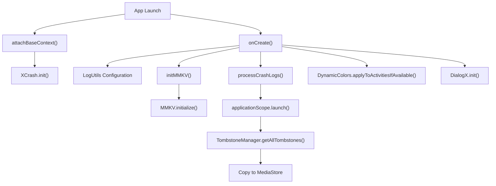
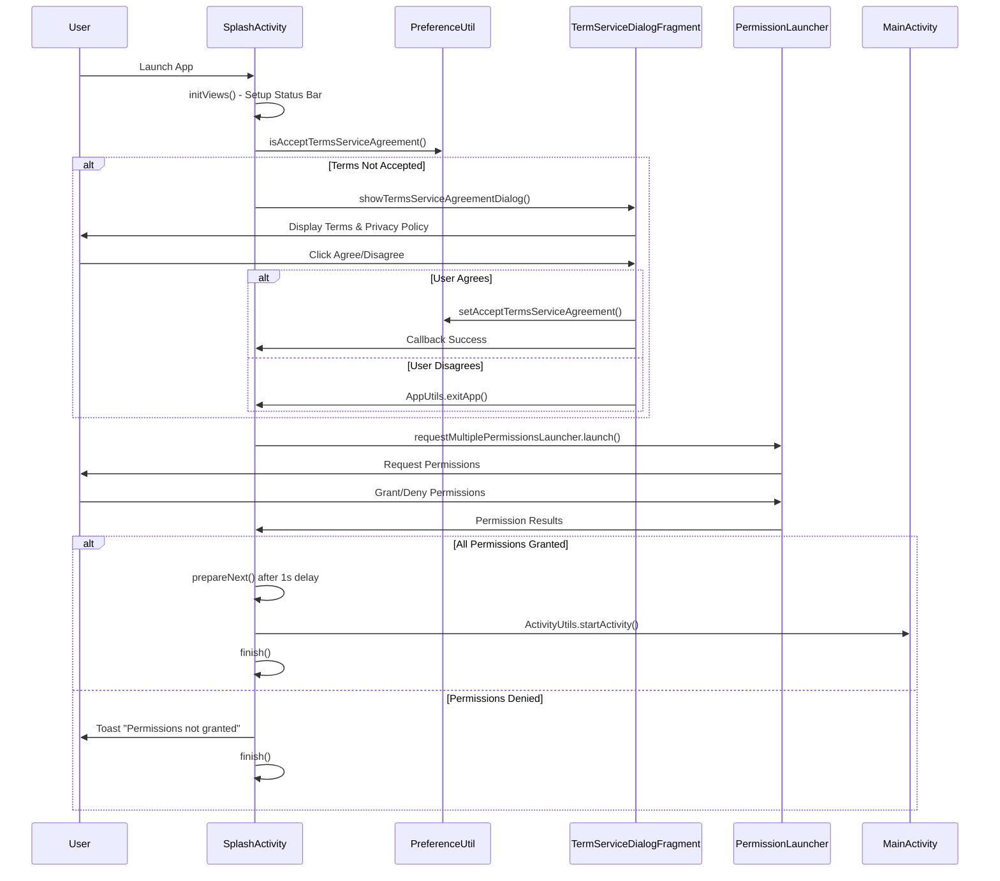
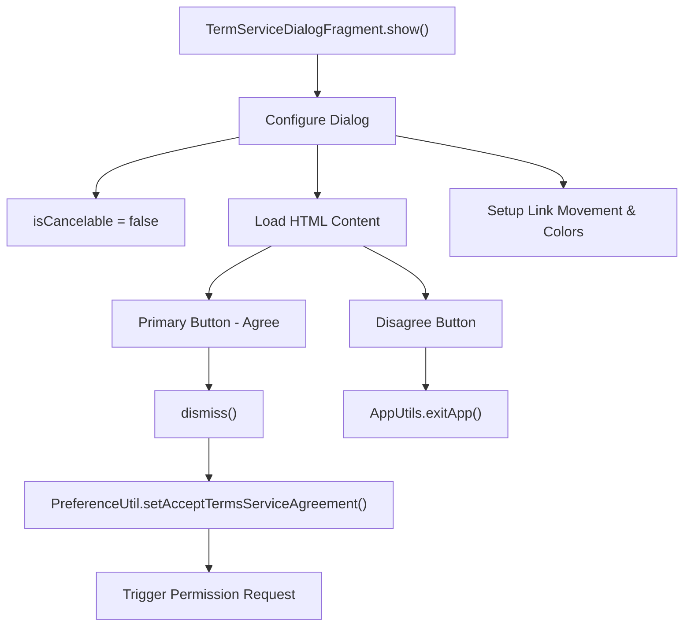
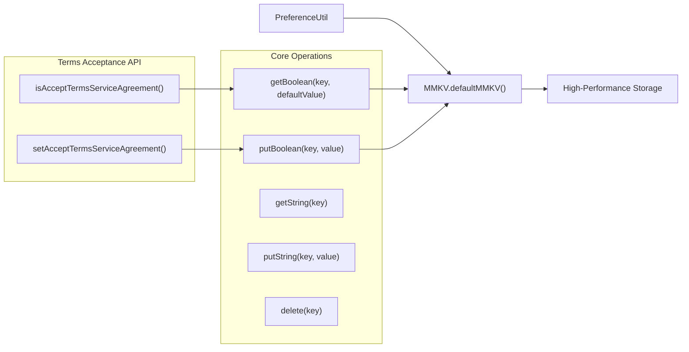

# App Initialization

<details>
<summary>Relevant source files</summary>

The following files were used as context for generating this wiki page:

- [app/src/main/java/com/suzhe/playdemo/AppContext.kt](app/src/main/java/com/suzhe/playdemo/AppContext.kt)
- [app/src/main/java/com/suzhe/playdemo/component/splash/SplashActivity.kt](app/src/main/java/com/suzhe/playdemo/component/splash/SplashActivity.kt)
- [app/src/main/java/com/suzhe/playdemo/component/splash/TermServiceDialogFragment.kt](app/src/main/java/com/suzhe/playdemo/component/splash/TermServiceDialogFragment.kt)
- [app/src/main/java/com/suzhe/playdemo/utils/PreferenceUtil.kt](app/src/main/java/com/suzhe/playdemo/utils/PreferenceUtil.kt)
- [app/src/main/res/drawable/sun.png](app/src/main/res/drawable/sun.png)
- [settings.gradle.kts](settings.gradle.kts)

</details>


This document covers the startup and initialization process of the PlayDemo Android application,
including global context setup, splash screen handling, permission requests, and terms of service
acceptance. For information about the main navigation system that follows initialization,
see [Main Navigation System](#3.2).

## Purpose and Scope

The app initialization system handles the critical startup sequence that occurs when the PlayDemo
application launches. This includes global application context configuration, crash monitoring
setup, storage initialization, permissions handling, user agreement flows, and transition to the
main application interface.

## Global Application Context

The `AppContext` class serves as the global `Application` subclass that manages system-wide
initialization and configuration.

### Core Initialization Components



Sources: [app/src/main/java/com/suzhe/playdemo/AppContext.kt:23-102](https://github.com/SuZhelevel6/PlayDemo/blob/a2338414/app/src/main/java/com/suzhe/playdemo/AppContext.kt#L23-L102)

### Initialization Sequence

| Component       | Purpose                                   | Implementation                                    |
|-----------------|-------------------------------------------|---------------------------------------------------|
| `XCrash`        | Crash monitoring and tombstone generation | Initialized in `attachBaseContext()`              |
| `LogUtils`      | Application-wide logging framework        | Configured with app package name as global tag    |
| `MMKV`          | High-performance key-value storage        | Replaces SharedPreferences for better performance |
| `DialogX`       | Dialog framework initialization           | Enables consistent dialog styling                 |
| `DynamicColors` | Material You dynamic theming              | Applies system color theming to activities        |

The `AppContext` also manages a coroutine scope for background operations and crash log processing
that automatically copies crash files to the device's media store after a 5-second delay.

Sources: [app/src/main/java/com/suzhe/playdemo/AppContext.kt:38-51](https://github.com/SuZhelevel6/PlayDemo/blob/a2338414/app/src/main/java/com/suzhe/playdemo/AppContext.kt#L38-L51), [app/src/main/java/com/suzhe/playdemo/AppContext.kt:60-85](https://github.com/SuZhelevel6/PlayDemo/blob/a2338414/app/src/main/java/com/suzhe/playdemo/AppContext.kt#L60-L85)

## Splash Screen Flow

The `SplashActivity` manages the initial user experience, including permission requests and terms of
service acceptance.

### Splash Activity Initialization Flow



Sources: [app/src/main/java/com/suzhe/playdemo/component/splash/SplashActivity.kt:17-100](https://github.com/SuZhelevel6/PlayDemo/blob/a2338414/app/src/main/java/com/suzhe/playdemo/component/splash/SplashActivity.kt#L17-L100)

### Required Permissions

The app requests the following permissions during startup:

```kotlin
private val requiredPermissions = arrayOf(
    Manifest.permission.ACCESS_COARSE_LOCATION,
    Manifest.permission.ACCESS_FINE_LOCATION,
    Manifest.permission.READ_PHONE_STATE,
    Manifest.permission.READ_MEDIA_AUDIO,
    Manifest.permission.READ_MEDIA_IMAGES,
    Manifest.permission.READ_MEDIA_VIDEO
)
```

The permission handling uses the modern `ActivityResultContracts.RequestMultiplePermissions()` API
rather than the deprecated permission request methods.

Sources: [app/src/main/java/com/suzhe/playdemo/component/splash/SplashActivity.kt:19-26](https://github.com/SuZhelevel6/PlayDemo/blob/a2338414/app/src/main/java/com/suzhe/playdemo/component/splash/SplashActivity.kt#L19-L26), [app/src/main/java/com/suzhe/playdemo/component/splash/SplashActivity.kt:28-53](https://github.com/SuZhelevel6/PlayDemo/blob/a2338414/app/src/main/java/com/suzhe/playdemo/component/splash/SplashActivity.kt#L28-L53)

## Terms of Service System

### TermServiceDialogFragment Implementation

The `TermServiceDialogFragment` presents a non-dismissible dialog that users must interact with
before proceeding.



Sources: [app/src/main/java/com/suzhe/playdemo/component/splash/TermServiceDialogFragment.kt:16-71](https://github.com/SuZhelevel6/PlayDemo/blob/a2338414/app/src/main/java/com/suzhe/playdemo/component/splash/TermServiceDialogFragment.kt#L16-L71)

### Dialog Configuration

The dialog implements several important UI behaviors:

| Feature        | Implementation                       | Purpose                                |
|----------------|--------------------------------------|----------------------------------------|
| Non-cancelable | `isCancelable = false`               | Prevents dismissal without user choice |
| Link support   | `LinkMovementMethod.getInstance()`   | Enables clickable links in content     |
| Custom width   | `ScreenUtils.getScreenWidth() * 0.9` | Better visual appearance               |
| HTML content   | `Html.fromHtml()`                    | Rich text formatting support           |

Sources: [app/src/main/java/com/suzhe/playdemo/component/splash/TermServiceDialogFragment.kt:19-37](https://github.com/SuZhelevel6/PlayDemo/blob/a2338414/app/src/main/java/com/suzhe/playdemo/component/splash/TermServiceDialogFragment.kt#L19-L37), [app/src/main/java/com/suzhe/playdemo/component/splash/TermServiceDialogFragment.kt:54-62](https://github.com/SuZhelevel6/PlayDemo/blob/a2338414/app/src/main/java/com/suzhe/playdemo/component/splash/TermServiceDialogFragment.kt#L54-L62)

## Preference Management

### PreferenceUtil Storage System

The `PreferenceUtil` class provides a wrapper around MMKV for managing application preferences with
better performance than `SharedPreferences`.



Sources: [app/src/main/java/com/suzhe/playdemo/utils/PreferenceUtil.kt:8-44](https://github.com/SuZhelevel6/PlayDemo/blob/a2338414/app/src/main/java/com/suzhe/playdemo/utils/PreferenceUtil.kt#L8-L44)

### Key Management

The preference system uses constants for key management to prevent typos and maintain consistency:

```kotlin
private const val ACCEPT_TERM = "Accept_Term"
```

This approach ensures type safety and makes preference key management maintainable across the
application.

Sources: [app/src/main/java/com/suzhe/playdemo/utils/PreferenceUtil.kt:13-21](https://github.com/SuZhelevel6/PlayDemo/blob/a2338414/app/src/main/java/com/suzhe/playdemo/utils/PreferenceUtil.kt#L13-L21)

## Status Bar and Theme Configuration

The `SplashActivity` configures the status bar appearance based on the current theme:

```kotlin
override fun initViews() {
    super.initViews()
    //设置沉浸式状态栏
    QMUIStatusBarHelper.translucent(this)

    if (SuperDarkUtil.isDark(this)) {
        //状态栏文字白色
        QMUIStatusBarHelper.setStatusBarDarkMode(this)
    } else {
        //状态栏文字黑色
        QMUIStatusBarHelper.setStatusBarLightMode(this)
    }
}
```

This ensures consistent status bar styling that adapts to both light and dark themes before the user
sees any content.

Sources: [app/src/main/java/com/suzhe/playdemo/component/splash/SplashActivity.kt:55-67](https://github.com/SuZhelevel6/PlayDemo/blob/a2338414/app/src/main/java/com/suzhe/playdemo/component/splash/SplashActivity.kt#L55-L67)

## Initialization Dependencies

### Project Configuration

The app initialization relies on several external dependencies configured in the build system:

- **MMKV**: Tencent's high-performance key-value storage
- **XCrash**: Native crash monitoring and reporting
- **DialogX**: Modern dialog framework
- **QMUI**: UI utilities including status bar helpers
- **UtilCode**: Android utility library for common operations

Sources: [settings.gradle.kts:8-15](https://github.com/SuZhelevel6/PlayDemo/blob/a2338414/settings.gradle.kts#L8-L15)

The initialization system creates a robust foundation for the rest of the application, ensuring
proper permissions, user agreements, crash monitoring, and theme configuration before transitioning
to the main application interface handled by `MainActivity`.