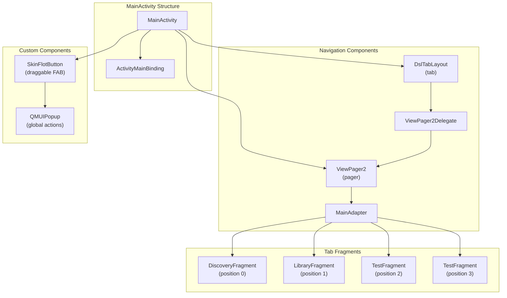
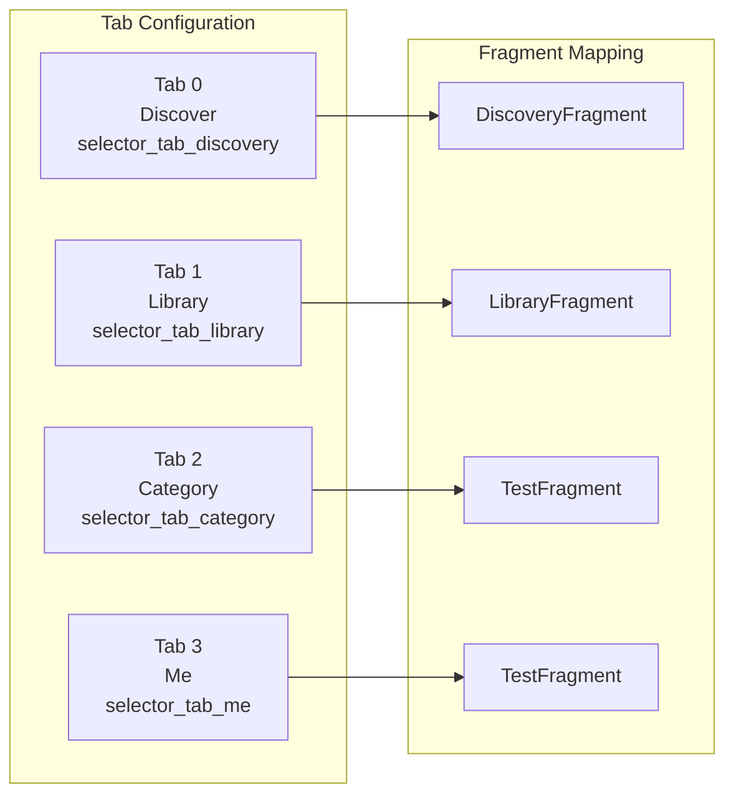
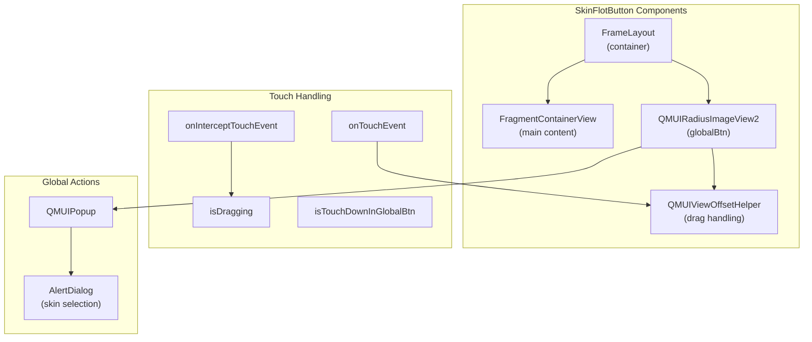
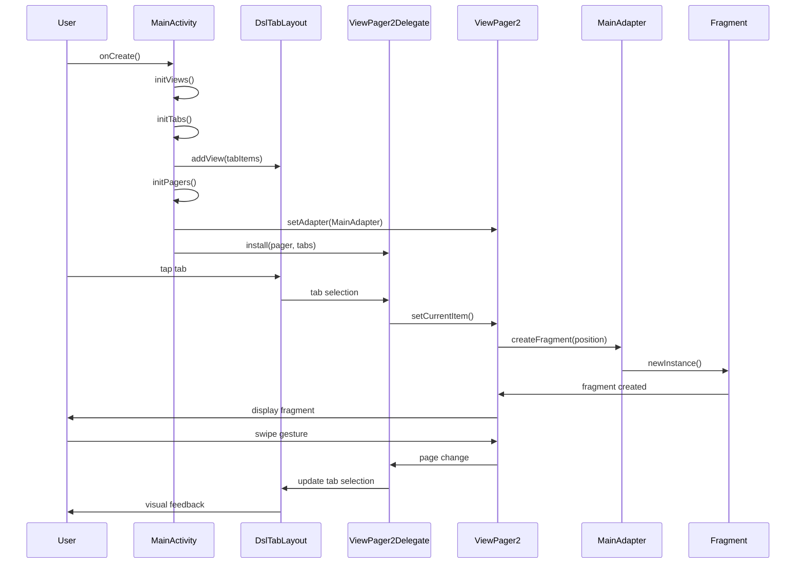

# Main Navigation System

<details>
<summary>Relevant source files</summary>

The following files were used as context for generating this wiki page:

- [app/src/main/java/com/suzhe/playdemo/component/main/MainActivity.kt](app/src/main/java/com/suzhe/playdemo/component/main/MainActivity.kt)
- [app/src/main/java/com/suzhe/playdemo/component/main/MainAdapter.kt](app/src/main/java/com/suzhe/playdemo/component/main/MainAdapter.kt)
- [app/src/main/res/drawable/rounded_background.xml](app/src/main/res/drawable/rounded_background.xml)
- [app/src/main/res/layout/activity_main.xml](app/src/main/res/layout/activity_main.xml)
- [app/src/main/res/layout/simple_list_item.xml](app/src/main/res/layout/simple_list_item.xml)
- [app/src/main/res/values/style.xml](app/src/main/res/values/style.xml)

</details>

## Purpose and Scope

This document covers the main navigation system implemented in `MainActivity`, which provides the
primary tabbed interface for the PlayDemo application. The system manages four main application
sections through a bottom tab navigation pattern using ViewPager2 and DslTabLayout components.

For information about app initialization and startup flow, see [App Initialization](#3.1). For
details about individual fragment implementations and base fragment patterns,
see [Fragment Architecture](#3.3). For specific coverage of the LibraryFragment's role as a demo
navigation hub, see [Library Navigation Hub](#4.1).

## Navigation Architecture Overview

The main navigation system follows a standard Android tabbed interface pattern with several key
components working together:



**MainActivity Navigation Flow**
The navigation system centers around `MainActivity` which coordinates the tabbed interface through
ViewPager2 and DslTabLayout synchronization.

Sources: [app/src/main/java/com/suzhe/playdemo/component/main/MainActivity.kt:29-82](https://github.com/SuZhelevel6/PlayDemo/blob/a2338414/app/src/main/java/com/suzhe/playdemo/component/main/MainActivity.kt#L29-L82), [app/src/main/java/com/suzhe/playdemo/component/main/MainAdapter.kt:10-24](https://github.com/SuZhelevel6/PlayDemo/blob/a2338414/app/src/main/java/com/suzhe/playdemo/component/main/MainAdapter.kt#L10-L24)

## MainActivity Structure

The `MainActivity` class extends `BaseViewModelActivity<ActivityMainBinding>` and serves as the
primary navigation controller for the application.

### Core Components

| Component       | Type           | Purpose                                  |
|-----------------|----------------|------------------------------------------|
| `mTabs`         | `DslTabLayout` | Bottom tab bar UI component              |
| `mPager`        | `ViewPager2`   | Fragment container with swipe navigation |
| `mGlobalAction` | `QMUIPopup`    | Global action popup menu                 |
| `tabIcons`      | `IntArray`     | Tab icon resources                       |

### Layout Structure

The main layout uses a FrameLayout root containing:

- LinearLayout with vertical orientation
- ViewPager2 (weight=1, fills available space)
- Divider (thin horizontal line)
- DslTabLayout (fixed 50dp height)
- SkinFlotButton (overlay floating action button)

Sources: [app/src/main/java/com/suzhe/playdemo/component/main/MainActivity.kt:36-48](https://github.com/SuZhelevel6/PlayDemo/blob/a2338414/app/src/main/java/com/suzhe/playdemo/component/main/MainActivity.kt#L36-L48), [app/src/main/res/layout/activity_main.xml:8-41](https://github.com/SuZhelevel6/PlayDemo/blob/a2338414/app/src/main/res/layout/activity_main.xml#L8-L41)

## Tab Configuration

The tab system is configured with four predefined tabs, each with corresponding titles and icon
resources:



**Tab Initialization Process**
The `initTabs()` method dynamically creates tab items using `ItemTabBinding.inflate()` for each tab
definition, setting the text and icon resources before adding to the DslTabLayout.

### Tab Styling

The DslTabLayout is configured with Material Design theming:

- Selected color: `?attr/colorPrimary`
- Deselected color: `?attr/colorOnSurface`
- Indicator height: 3dp
- Equal width tabs enabled
- Badge drawing enabled

Sources: [app/src/main/java/com/suzhe/playdemo/component/main/MainActivity.kt:72-81](https://github.com/SuZhelevel6/PlayDemo/blob/a2338414/app/src/main/java/com/suzhe/playdemo/component/main/MainActivity.kt#L72-L81), [app/src/main/res/layout/activity_main.xml:27-39](https://github.com/SuZhelevel6/PlayDemo/blob/a2338414/app/src/main/res/layout/activity_main.xml#L27-L39)

## Fragment Management

Fragment management is handled through the `MainAdapter` class, which extends
`FragmentStateAdapter`:

### Adapter Implementation

The `MainAdapter` maps tab positions to specific fragment instances:

```kotlin
override fun createFragment(position: Int): Fragment {
    return when (position) {
        1 -> LibraryFragment.newInstance()
        2 -> TestFragment.newInstance()
        3 -> TestFragment.newInstance()
        else -> DiscoveryFragment.newInstance()
    }
}
```

### ViewPager2 Configuration

The ViewPager2 is configured with:

- `offscreenPageLimit` set to the total number of tabs for optimal performance
- `ViewPager2Delegate.install()` to synchronize with DslTabLayout
- Fragment state management through FragmentStateAdapter

Sources: [app/src/main/java/com/suzhe/playdemo/component/main/MainAdapter.kt:16-23](https://github.com/SuZhelevel6/PlayDemo/blob/a2338414/app/src/main/java/com/suzhe/playdemo/component/main/MainAdapter.kt#L16-L23), [app/src/main/java/com/suzhe/playdemo/component/main/MainActivity.kt:63-70](https://github.com/SuZhelevel6/PlayDemo/blob/a2338414/app/src/main/java/com/suzhe/playdemo/component/main/MainActivity.kt#L63-L70)

## Floating Action Button System

The navigation system includes a custom `SkinFlotButton` inner class that provides a draggable
floating action button with global action capabilities.

### SkinFlotButton Architecture



**Drag Functionality**
The button implements custom touch handling with drag threshold detection using
`ViewConfiguration.scaledTouchSlop` and boundary collision detection to keep the button within
screen bounds.

### Global Action Menu

The floating action button triggers a popup menu with skin selection options:

- "Change Skin" option displays AlertDialog with theme choices
- Popup positioning with edge protection and shadow effects
- Built using QMUI popup framework

Sources: [app/src/main/java/com/suzhe/playdemo/component/main/MainActivity.kt:131-306](https://github.com/SuZhelevel6/PlayDemo/blob/a2338414/app/src/main/java/com/suzhe/playdemo/component/main/MainActivity.kt#L131-L306), [app/src/main/java/com/suzhe/playdemo/component/main/MainActivity.kt:84-129](https://github.com/SuZhelevel6/PlayDemo/blob/a2338414/app/src/main/java/com/suzhe/playdemo/component/main/MainActivity.kt#L84-L129)

## Component Interaction Flow

The following diagram illustrates the complete interaction flow between navigation components:



**Navigation Synchronization**
The `ViewPager2Delegate.install()` method creates bidirectional synchronization between tab
selection and page swiping, ensuring consistent navigation state across both interaction methods.

Sources: [app/src/main/java/com/suzhe/playdemo/component/main/MainActivity.kt:57-70](https://github.com/SuZhelevel6/PlayDemo/blob/a2338414/app/src/main/java/com/suzhe/playdemo/component/main/MainActivity.kt#L57-L70), [app/src/main/java/com/suzhe/playdemo/component/main/MainAdapter.kt:10-24](https://github.com/SuZhelevel6/PlayDemo/blob/a2338414/app/src/main/java/com/suzhe/playdemo/component/main/MainAdapter.kt#L10-L24)