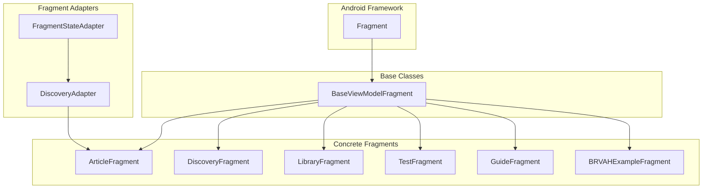
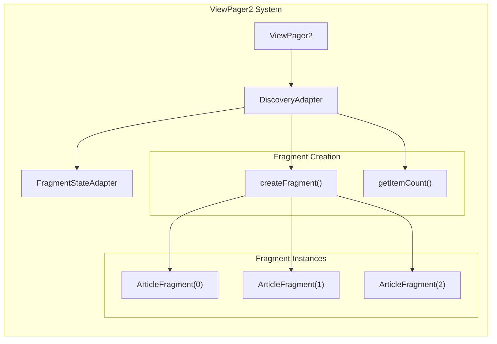
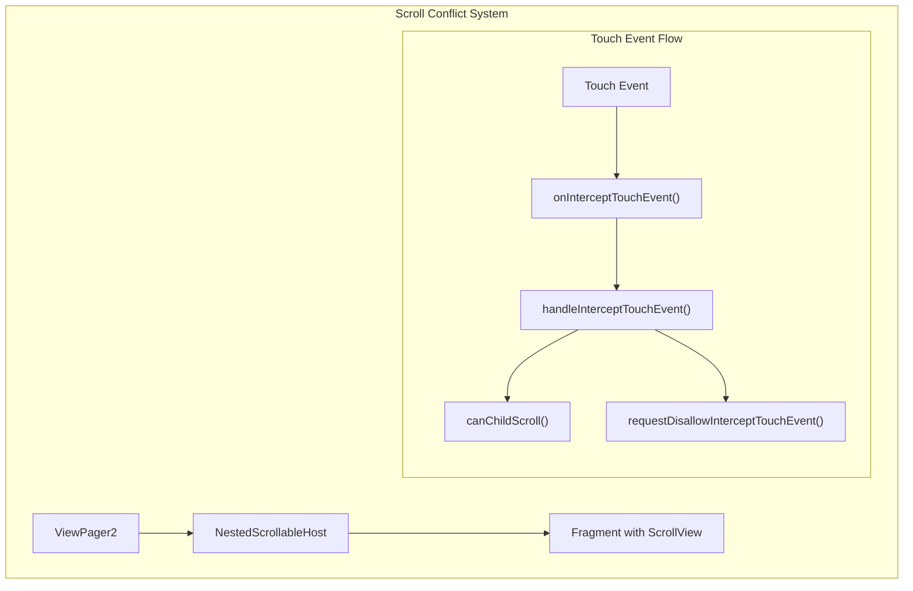
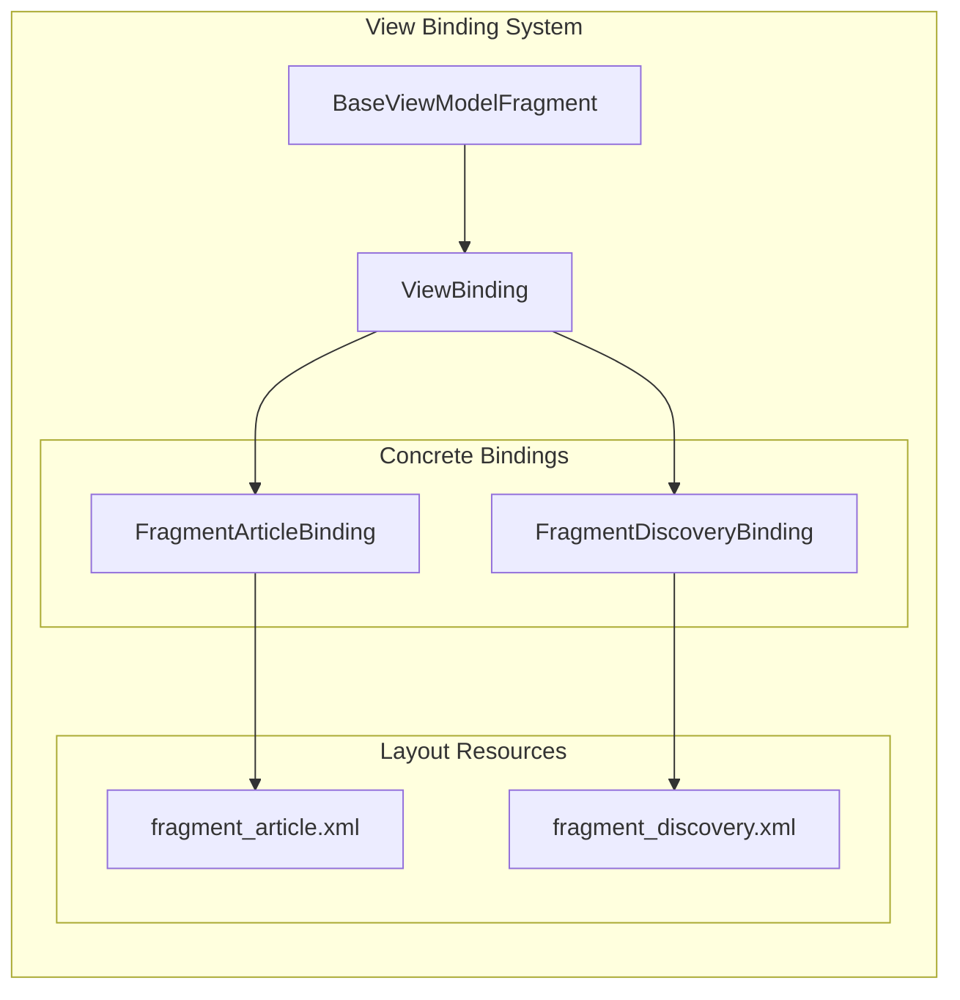

# Fragment Architecture

Relevant source files

The following files were used as context for generating this wiki page:

- [.idea/compiler.xml](.idea/compiler.xml)
- [app/src/main/java/com/suzhe/playdemo/base/activity/BaseTitleActivity.kt](app/src/main/java/com/suzhe/playdemo/base/activity/BaseTitleActivity.kt)
- [app/src/main/java/com/suzhe/playdemo/component/article/ArticleFragment.kt](app/src/main/java/com/suzhe/playdemo/component/article/ArticleFragment.kt)
- [app/src/main/java/com/suzhe/playdemo/component/discovery/DiscoveryAdapter.kt](app/src/main/java/com/suzhe/playdemo/component/discovery/DiscoveryAdapter.kt)
- [app/src/main/java/com/suzhe/playdemo/component/discovery/DiscoveryFragment.kt](app/src/main/java/com/suzhe/playdemo/component/discovery/DiscoveryFragment.kt)
- [app/src/main/java/com/suzhe/playdemo/view/NestedScrollableHost.kt](app/src/main/java/com/suzhe/playdemo/view/NestedScrollableHost.kt)
- [app/src/main/res/drawable/github.png](app/src/main/res/drawable/github.png)
- [app/src/main/res/drawable/shape_edit_text_surface.xml](app/src/main/res/drawable/shape_edit_text_surface.xml)
- [app/src/main/res/layout/fragment_article.xml](app/src/main/res/layout/fragment_article.xml)

This document covers the fragment architecture patterns used throughout the PlayDemo application,
including base fragment classes, fragment management strategies, and integration with ViewPager2.
This focuses on the structural and lifecycle aspects of fragments as UI components.

For information about specific fragment implementations in the BRVAH demo system,
see [BRVAH Demo System](#4). For main navigation patterns that utilize fragments,
see [Main Navigation System](#3.2).

## Base Fragment Infrastructure

The PlayDemo application uses a structured fragment hierarchy built on top of Android's Fragment
framework. The foundation is established through base classes that provide common functionality and
consistent patterns across all fragments.

### Fragment Class Hierarchy

The `BaseViewModelFragment<VB>` class serves as the foundation for all fragments in the application,
providing generic view binding support and common lifecycle management. All concrete fragments
extend this base class to inherit consistent initialization patterns and view binding capabilities.

Sources: [app/src/main/java/com/suzhe/playdemo/component/article/ArticleFragment.kt:4-13](https://github.com/SuZhelevel6/PlayDemo/blob/a2338414/app/src/main/java/com/suzhe/playdemo/component/article/ArticleFragment.kt#L4-L13), [app/src/main/java/com/suzhe/playdemo/component/discovery/DiscoveryFragment.kt:7-11](https://github.com/SuZhelevel6/PlayDemo/blob/a2338414/app/src/main/java/com/suzhe/playdemo/component/discovery/DiscoveryFragment.kt#L7-L11)

### Fragment Implementation Patterns

The application follows consistent patterns for fragment implementation:

| Pattern             | Description                                                                    | Example                                         |
|---------------------|--------------------------------------------------------------------------------|-------------------------------------------------|
| View Binding        | All fragments use type-safe view binding through generic base class            | `BaseViewModelFragment<FragmentArticleBinding>` |
| Factory Methods     | Fragments provide static factory methods for instantiation                     | `DiscoveryFragment.newInstance()`               |
| Page Identification | Fragments implement unique page identifiers for analytics/tracking             | `pageId()` method                               |
| Lifecycle Hooks     | Common initialization methods: `initViews()`, `initDatum()`, `initListeners()` |                                                 |

**ArticleFragment Implementation:**
The `ArticleFragment` demonstrates the basic fragment pattern with WebView integration:

[app/src/main/java/com/suzhe/playdemo/component/article/ArticleFragment.kt:12-23]()

**DiscoveryFragment Implementation:**
The `DiscoveryFragment` shows a more complex pattern with ViewPager2 and TabLayout integration:

[app/src/main/java/com/suzhe/playdemo/component/discovery/DiscoveryFragment.kt:20-50]()

Sources: [app/src/main/java/com/suzhe/playdemo/component/article/ArticleFragment.kt:12-23](https://github.com/SuZhelevel6/PlayDemo/blob/a2338414/app/src/main/java/com/suzhe/playdemo/component/article/ArticleFragment.kt#L12-L23), [app/src/main/java/com/suzhe/playdemo/component/discovery/DiscoveryFragment.kt:11-70](https://github.com/SuZhelevel6/PlayDemo/blob/a2338414/app/src/main/java/com/suzhe/playdemo/component/discovery/DiscoveryFragment.kt#L11-L70)

## ViewPager2 Fragment Management

The application extensively uses ViewPager2 for fragment management, particularly in tabbed
interfaces and content carousels. This requires specialized adapters and scroll conflict resolution.

### Fragment State Adapter Pattern

The `DiscoveryAdapter` extends `FragmentStateAdapter` to manage fragment creation and lifecycle
within ViewPager2:

[app/src/main/java/com/suzhe/playdemo/component/discovery/DiscoveryAdapter.kt:8-17]()

**Key Methods:**

- `getItemCount()`: Returns the total number of fragments to create
- `createFragment(position: Int)`: Factory method for creating fragments at specific positions

Sources: [app/src/main/java/com/suzhe/playdemo/component/discovery/DiscoveryAdapter.kt:8-17](https://github.com/SuZhelevel6/PlayDemo/blob/a2338414/app/src/main/java/com/suzhe/playdemo/component/discovery/DiscoveryAdapter.kt#L8-L17)

### TabLayout Integration

The `DiscoveryFragment` demonstrates the standard pattern for integrating TabLayout with ViewPager2:

**Tab Setup and Binding:**
[app/src/main/java/com/suzhe/playdemo/component/discovery/DiscoveryFragment.kt:22-49]()

The implementation includes:

- Dynamic tab creation based on title arrays
- Bidirectional synchronization between TabLayout and ViewPager2
- Page change callbacks for maintaining tab selection state

Sources: [app/src/main/java/com/suzhe/playdemo/component/discovery/DiscoveryFragment.kt:22-49](https://github.com/SuZhelevel6/PlayDemo/blob/a2338414/app/src/main/java/com/suzhe/playdemo/component/discovery/DiscoveryFragment.kt#L22-L49)

## Scroll Conflict Resolution

A critical aspect of fragment architecture in this application is handling scroll conflicts when
fragments contain scrollable content within ViewPager2.

### NestedScrollableHost Implementation

The `NestedScrollableHost` class provides a sophisticated solution for scroll conflict resolution:

[app/src/main/java/com/suzhe/playdemo/view/NestedScrollableHost.kt:23-42]()

**Core Conflict Resolution Logic:**
[app/src/main/java/com/suzhe/playdemo/view/NestedScrollableHost.kt:62-99]()

**Key Features:**

- Detects ViewPager2 orientation dynamically
- Implements touch slop-based direction detection
- Uses scaled sensitivity for improved gesture recognition
- Dynamically adjusts parent touch event interception

Sources: [app/src/main/java/com/suzhe/playdemo/view/NestedScrollableHost.kt:23-99](https://github.com/SuZhelevel6/PlayDemo/blob/a2338414/app/src/main/java/com/suzhe/playdemo/view/NestedScrollableHost.kt#L23-L99)

## Fragment Lifecycle and View Binding

The fragment architecture emphasizes consistent lifecycle management and type-safe view access
through Android's view binding system.

### Lifecycle Method Patterns

The base fragment architecture defines standard lifecycle hooks that all fragments implement:

| Method            | Purpose                        | Implementation Notes                       |
|-------------------|--------------------------------|--------------------------------------------|
| `initViews()`     | UI component initialization    | Called after view binding is established   |
| `initDatum()`     | Data loading and adapter setup | Called after view initialization           |
| `initListeners()` | Event listener attachment      | Called after data initialization           |
| `pageId()`        | Unique fragment identifier     | Used for analytics and navigation tracking |

### View Binding Integration

All fragments use generic view binding through the base class pattern:

This pattern ensures type-safe access to views and eliminates the need for `findViewById()` calls.
The binding is established automatically by the base class and made available through the `binding`
property.

**Layout Example:**
[app/src/main/res/layout/fragment_article.xml:1-20]()

Sources: [app/src/main/java/com/suzhe/playdemo/component/article/ArticleFragment.kt:4-23](https://github.com/SuZhelevel6/PlayDemo/blob/a2338414/app/src/main/java/com/suzhe/playdemo/component/article/ArticleFragment.kt#L4-L23), [app/src/main/res/layout/fragment_article.xml:1-20](https://github.com/SuZhelevel6/PlayDemo/blob/a2338414/app/src/main/res/layout/fragment_article.xml#L1-L20)

## Fragment Navigation Patterns

Fragments in the PlayDemo application primarily serve as content containers within larger navigation
structures, rather than implementing complex internal navigation.

### Factory Method Pattern

The application consistently uses static factory methods for fragment creation:

[app/src/main/java/com/suzhe/playdemo/component/discovery/DiscoveryFragment.kt:61-69]()

This pattern provides:

- Consistent fragment instantiation
- Proper argument bundle handling
- Type safety for fragment parameters
- Clear contract for fragment creation

### Page Identification System

Fragments implement a `pageId()` method for tracking and analytics:

[app/src/main/java/com/suzhe/playdemo/component/discovery/DiscoveryFragment.kt:57-59]()

This enables centralized tracking of user navigation patterns and fragment usage analytics
throughout the application.

Sources: [app/src/main/java/com/suzhe/playdemo/component/discovery/DiscoveryFragment.kt:57-69](https://github.com/SuZhelevel6/PlayDemo/blob/a2338414/app/src/main/java/com/suzhe/playdemo/component/discovery/DiscoveryFragment.kt#L57-L69)