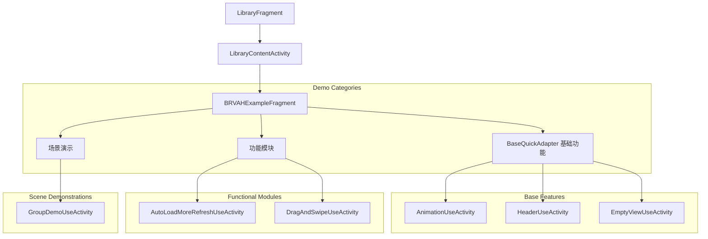
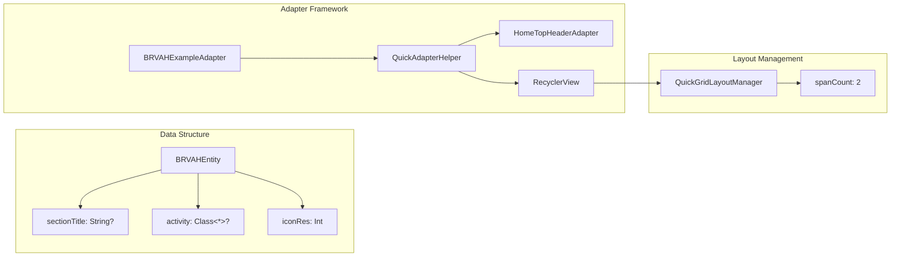
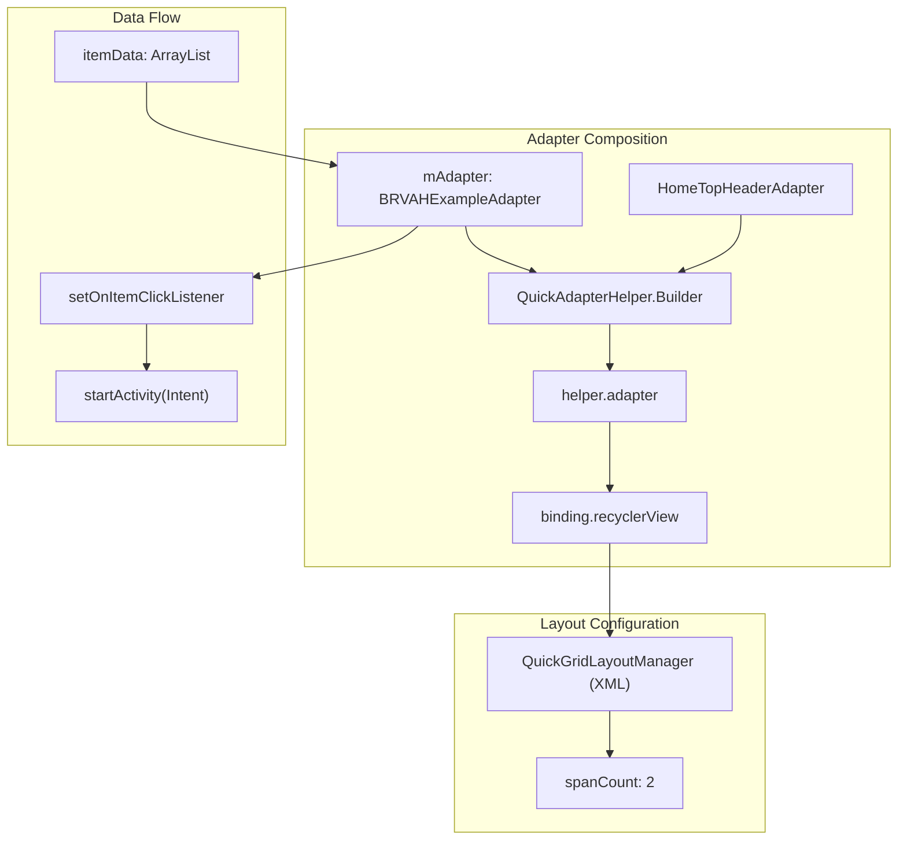
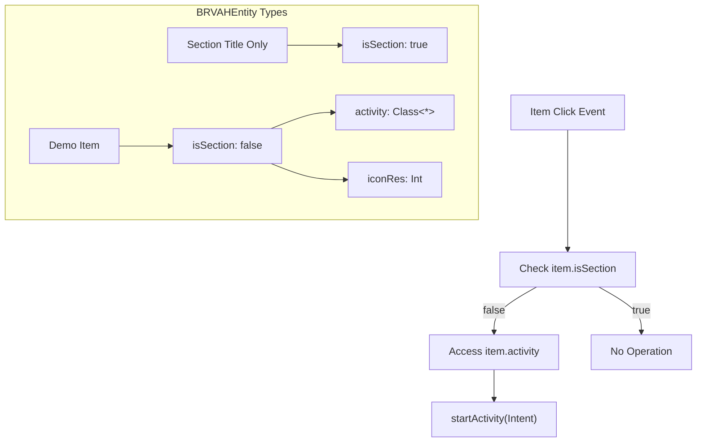

# BRVAH Demo System

<details>
<summary>Relevant source files</summary>

The following files were used as context for generating this wiki page:

- [app/src/main/java/com/suzhe/playdemo/component/brvah/BRVAHExampleFragment.kt](app/src/main/java/com/suzhe/playdemo/component/brvah/BRVAHExampleFragment.kt)
- [app/src/main/java/com/suzhe/playdemo/component/library/LibraryContentActivity.kt](app/src/main/java/com/suzhe/playdemo/component/library/LibraryContentActivity.kt)
- [app/src/main/java/com/suzhe/playdemo/component/library/LibraryFragment.kt](app/src/main/java/com/suzhe/playdemo/component/library/LibraryFragment.kt)
- [app/src/main/res/drawable/icon_animation.webp](app/src/main/res/drawable/icon_animation.webp)
- [app/src/main/res/layout/activity_library_content.xml](app/src/main/res/layout/activity_library_content.xml)
- [app/src/main/res/layout/fragment_brvah_example.xml](app/src/main/res/layout/fragment_brvah_example.xml)
- [app/src/main/res/layout/fragment_dialog_example.xml](app/src/main/res/layout/fragment_dialog_example.xml)
- [app/src/main/res/layout/fragment_library.xml](app/src/main/res/layout/fragment_library.xml)

</details>


The BRVAH Demo System is the core demonstration framework for showcasing
BaseRecyclerViewAdapterHelper (BRVAH) library features within the PlayDemo application. This system
provides a comprehensive catalog of RecyclerView patterns, advanced interactions, and dynamic
content management examples.

This document covers the navigation hub, demo activities, and adapter patterns used in the BRVAH
demonstration system. For information about basic RecyclerView patterns without BRVAH,
see [Basic RecyclerView Patterns](#4.2). For the overall application navigation system,
see [Main Navigation System](#3.2).

## Demo Navigation Architecture

The BRVAH demonstration system uses a three-tier navigation architecture that progressively drills
down from general library navigation to specific feature demonstrations.



**
Sources: ** [app/src/main/java/com/suzhe/playdemo/component/library/LibraryFragment.kt:35-39](https://github.com/SuZhelevel6/PlayDemo/blob/a2338414/app/src/main/java/com/suzhe/playdemo/component/library/LibraryFragment.kt#L35-L39), [app/src/main/java/com/suzhe/playdemo/component/library/LibraryContentActivity.kt:24-28](https://github.com/SuZhelevel6/PlayDemo/blob/a2338414/app/src/main/java/com/suzhe/playdemo/component/library/LibraryContentActivity.kt#L24-L28), [app/src/main/java/com/suzhe/playdemo/component/brvah/BRVAHExampleFragment.kt:18-45](https://github.com/SuZhelevel6/PlayDemo/blob/a2338414/app/src/main/java/com/suzhe/playdemo/component/brvah/BRVAHExampleFragment.kt#L18-L45)

### Navigation Entry Point

The `LibraryFragment` serves as the primary entry point to BRVAH demonstrations through a Material
Card button that launches the content activity with the "BRVAH" fragment identifier:

| Component                | Function               | Code Location                                                                              |
|--------------------------|------------------------|--------------------------------------------------------------------------------------------|
| `btnBRVAH`               | BRVAH Demo Launcher    | [app/src/main/java/com/suzhe/playdemo/component/library/LibraryFragment.kt:35-39]()        |
| `LibraryContentActivity` | Fragment Host Activity | [app/src/main/java/com/suzhe/playdemo/component/library/LibraryContentActivity.kt:24-28]() |
| `BRVAHExampleFragment`   | Demo Catalog Fragment  | [app/src/main/java/com/suzhe/playdemo/component/brvah/BRVAHExampleFragment.kt:16]()        |

**
Sources: ** [app/src/main/res/layout/fragment_library.xml:105-118](https://github.com/SuZhelevel6/PlayDemo/blob/a2338414/app/src/main/res/layout/fragment_library.xml#L105-L118), [app/src/main/java/com/suzhe/playdemo/component/library/LibraryContentActivity.kt:18-34](https://github.com/SuZhelevel6/PlayDemo/blob/a2338414/app/src/main/java/com/suzhe/playdemo/component/library/LibraryContentActivity.kt#L18-L34)

## Demo Catalog Structure

The `BRVAHExampleFragment` implements a categorized demonstration catalog using a hybrid adapter
pattern that combines section headers with interactive demo items.



**
Sources: ** [app/src/main/java/com/suzhe/playdemo/component/brvah/BRVAHExampleFragment.kt:18-56](https://github.com/SuZhelevel6/PlayDemo/blob/a2338414/app/src/main/java/com/suzhe/playdemo/component/brvah/BRVAHExampleFragment.kt#L18-L56), [app/src/main/res/layout/fragment_brvah_example.xml:8-13](https://github.com/SuZhelevel6/PlayDemo/blob/a2338414/app/src/main/res/layout/fragment_brvah_example.xml#L8-L13)

### Demo Categories and Activities

The demonstration catalog organizes BRVAH features into three logical categories with specific demo
activities:

| Category                  | Demo Activity                    | Feature Demonstrated | Icon Resource               |
|---------------------------|----------------------------------|----------------------|-----------------------------|
| **BaseQuickAdapter 基础功能** | `AnimationUseActivity`           | RV动画效果               | `R.drawable.icon_animation` |
|                           | `HeaderUseActivity`              | Header/Footer        | `R.drawable.icon_header`    |
|                           | `EmptyViewUseActivity`           | EmptyView            | `R.drawable.empty`          |
| **功能模块**                  | `AutoLoadMoreRefreshUseActivity` | LoadMore(Auto)       | `R.drawable.icon_load`      |
|                           | `DragAndSwipeUseActivity`        | DragAndSwipe         | `R.drawable.icon_drag`      |
| **场景演示**                  | `GroupDemoUseActivity`           | Group                | `R.drawable.icon_list`      |

**
Sources: ** [app/src/main/java/com/suzhe/playdemo/component/brvah/BRVAHExampleFragment.kt:20-44](https://github.com/SuZhelevel6/PlayDemo/blob/a2338414/app/src/main/java/com/suzhe/playdemo/component/brvah/BRVAHExampleFragment.kt#L20-L44)

## Adapter Composition Pattern

The BRVAH demonstration system showcases advanced adapter composition using `QuickAdapterHelper` to
combine multiple adapter types into a single RecyclerView presentation.



**
Sources: ** [app/src/main/java/com/suzhe/playdemo/component/brvah/BRVAHExampleFragment.kt:47-56](https://github.com/SuZhelevel6/PlayDemo/blob/a2338414/app/src/main/java/com/suzhe/playdemo/component/brvah/BRVAHExampleFragment.kt#L47-L56), [app/src/main/java/com/suzhe/playdemo/component/brvah/BRVAHExampleFragment.kt:62-76](https://github.com/SuZhelevel6/PlayDemo/blob/a2338414/app/src/main/java/com/suzhe/playdemo/component/brvah/BRVAHExampleFragment.kt#L62-L76)

### Helper Configuration

The `QuickAdapterHelper` configuration demonstrates the library's adapter composition capabilities:

```kotlin
private val helper by lazy(LazyThreadSafetyMode.NONE) {
    QuickAdapterHelper.Builder(mAdapter)
        .build()
        .addBeforeAdapter(HomeTopHeaderAdapter())
}
```

This pattern shows how BRVAH enables:

- **Primary Adapter**: `BRVAHExampleAdapter` handles the main demo catalog items
- **Header Adapter**: `HomeTopHeaderAdapter` provides banner/header content
- **Unified Interface**: Single adapter reference manages the composed view hierarchy

**
Sources: ** [app/src/main/java/com/suzhe/playdemo/component/brvah/BRVAHExampleFragment.kt:52-56](https://github.com/SuZhelevel6/PlayDemo/blob/a2338414/app/src/main/java/com/suzhe/playdemo/component/brvah/BRVAHExampleFragment.kt#L52-L56)

## Item Interaction System

The demo catalog implements a conditional navigation system that distinguishes between section
headers and interactive demo items.



**
Sources: ** [app/src/main/java/com/suzhe/playdemo/component/brvah/BRVAHExampleFragment.kt:68-75](https://github.com/SuZhelevel6/PlayDemo/blob/a2338414/app/src/main/java/com/suzhe/playdemo/component/brvah/BRVAHExampleFragment.kt#L68-L75)

The click handler implementation demonstrates BRVAH's item interaction patterns:

| Event      | Condition         | Action          | Code Reference                    |
|------------|-------------------|-----------------|-----------------------------------|
| Item Click | `!item.isSection` | Launch Activity | [BRVAHExampleFragment.kt:69-74]() |
| Item Click | `item.isSection`  | No Action       | Implicit fall-through             |

**
Sources: ** [app/src/main/java/com/suzhe/playdemo/component/brvah/BRVAHExampleFragment.kt:66-76](https://github.com/SuZhelevel6/PlayDemo/blob/a2338414/app/src/main/java/com/suzhe/playdemo/component/brvah/BRVAHExampleFragment.kt#L66-L76)

## Layout Configuration

The BRVAH demonstration uses XML-configured layout management to showcase grid-based RecyclerView
presentations without programmatic layout manager setup.

| Configuration      | Value                    | Purpose                     |
|--------------------|--------------------------|-----------------------------|
| `layoutManager`    | `QuickGridLayoutManager` | Grid-based item arrangement |
| `spanCount`        | `2`                      | Two-column grid layout      |
| Adapter Assignment | `helper.adapter`         | Composed adapter hierarchy  |

**
Sources: ** [app/src/main/res/layout/fragment_brvah_example.xml:8-13](https://github.com/SuZhelevel6/PlayDemo/blob/a2338414/app/src/main/res/layout/fragment_brvah_example.xml#L8-L13), [app/src/main/java/com/suzhe/playdemo/component/brvah/BRVAHExampleFragment.kt:60-63](https://github.com/SuZhelevel6/PlayDemo/blob/a2338414/app/src/main/java/com/suzhe/playdemo/component/brvah/BRVAHExampleFragment.kt#L60-L63)