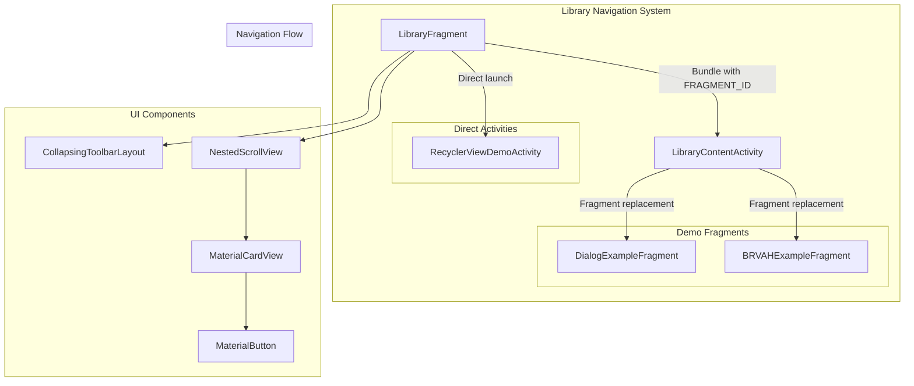
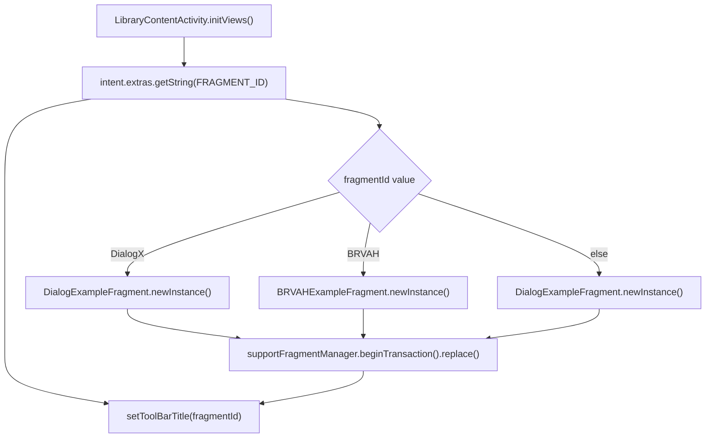
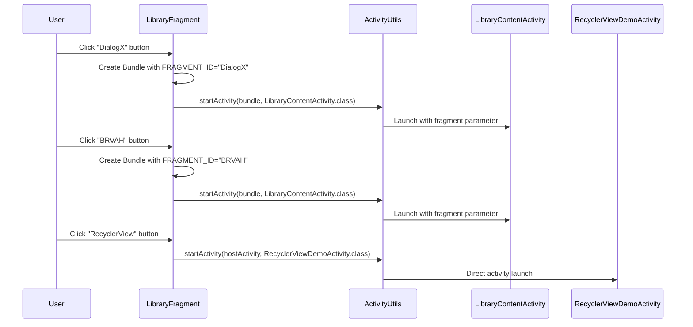
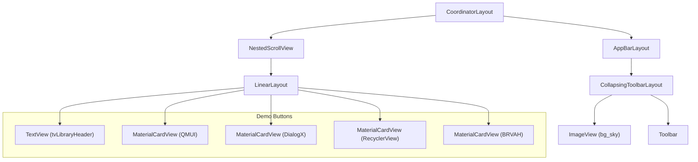
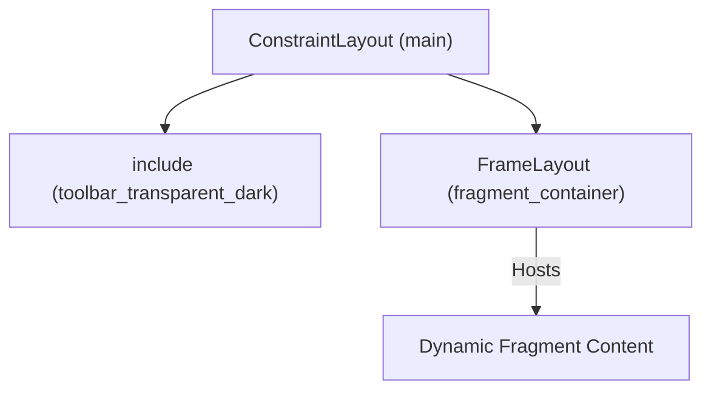

# Library Navigation Hub

Relevant source files

The following files were used as context for generating this wiki page:

- [app/src/main/java/com/suzhe/playdemo/component/library/LibraryContentActivity.kt](app/src/main/java/com/suzhe/playdemo/component/library/LibraryContentActivity.kt)
- [app/src/main/java/com/suzhe/playdemo/component/library/LibraryFragment.kt](app/src/main/java/com/suzhe/playdemo/component/library/LibraryFragment.kt)
- [app/src/main/res/layout/activity_library_content.xml](app/src/main/res/layout/activity_library_content.xml)
- [app/src/main/res/layout/fragment_dialog_example.xml](app/src/main/res/layout/fragment_dialog_example.xml)
- [app/src/main/res/layout/fragment_library.xml](app/src/main/res/layout/fragment_library.xml)

## Purpose and Scope

The Library Navigation Hub is the central navigation system for accessing demonstration modules
within the PlayDemo application. It consists of the `LibraryFragment` and `LibraryContentActivity`
components that provide a organized interface for browsing and launching various library
demonstrations, including BRVAH, DialogX, and RecyclerView examples.

For information about the specific demo implementations accessed through this hub,
see [Basic RecyclerView Patterns](#4.2), [Dialog and Popup System](#5.2),
and [Advanced List Features](#4.5).

## System Architecture

The Library Navigation Hub operates as a two-tier navigation system where `LibraryFragment` serves
as the main menu and `LibraryContentActivity` hosts specific demonstration fragments.

Sources: [app/src/main/java/com/suzhe/playdemo/component/library/LibraryFragment.kt:1-58](https://github.com/SuZhelevel6/PlayDemo/blob/a2338414/app/src/main/java/com/suzhe/playdemo/component/library/LibraryFragment.kt#L1-L58), [app/src/main/java/com/suzhe/playdemo/component/library/LibraryContentActivity.kt:1-40](https://github.com/SuZhelevel6/PlayDemo/blob/a2338414/app/src/main/java/com/suzhe/playdemo/component/library/LibraryContentActivity.kt#L1-L40)

## Navigation Architecture

The navigation system uses a parameter-based routing mechanism where the `FRAGMENT_ID` constant
determines which demonstration fragment to load.

| Navigation Target  | Fragment ID   | Destination                |
|--------------------|---------------|----------------------------|
| DialogX Demos      | `"DialogX"`   | `DialogExampleFragment`    |
| BRVAH Demos        | `"BRVAH"`     | `BRVAHExampleFragment`     |
| RecyclerView Demos | Direct launch | `RecyclerViewDemoActivity` |

### Fragment Routing Implementation

The routing logic in `LibraryContentActivity` implements a simple switch-based fragment selection:

Sources: [app/src/main/java/com/suzhe/playdemo/component/library/LibraryContentActivity.kt:19-34](https://github.com/SuZhelevel6/PlayDemo/blob/a2338414/app/src/main/java/com/suzhe/playdemo/component/library/LibraryContentActivity.kt#L19-L34)

## Click Handler Implementation

The `LibraryFragment` implements button click handlers that launch different demonstration modules
through intent-based navigation:

Sources: [app/src/main/java/com/suzhe/playdemo/component/library/LibraryFragment.kt:25-39](https://github.com/SuZhelevel6/PlayDemo/blob/a2338414/app/src/main/java/com/suzhe/playdemo/component/library/LibraryFragment.kt#L25-L39)

## UI Layout Structure

The `LibraryFragment` uses a Material Design layout with a collapsing toolbar and scrollable content
area containing demo category buttons.

### Layout Hierarchy

### Button Configuration

Each demo category is presented as a `MaterialButton` within a `MaterialCardView` using the outlined
button style:

| Button ID         | Text           | Click Handler     | Navigation Target          |
|-------------------|----------------|-------------------|----------------------------|
| `btnQMUI`         | "QMUI"         | Not implemented   | -                          |
| `btnDialogX`      | "DialogX"      | Bundle navigation | `LibraryContentActivity`   |
| `btnRecyclerView` | "RecyclerView" | Direct navigation | `RecyclerViewDemoActivity` |
| `btnBRVAH`        | "BRVAH"        | Bundle navigation | `LibraryContentActivity`   |

Sources: [app/src/main/res/layout/fragment_library.xml:1-126](https://github.com/SuZhelevel6/PlayDemo/blob/a2338414/app/src/main/res/layout/fragment_library.xml#L1-L126), [app/src/main/java/com/suzhe/playdemo/component/library/LibraryFragment.kt:19-42](https://github.com/SuZhelevel6/PlayDemo/blob/a2338414/app/src/main/java/com/suzhe/playdemo/component/library/LibraryFragment.kt#L19-L42)

## Activity Container Layout

The `LibraryContentActivity` uses a simple container layout with a transparent toolbar and fragment
container:

The container layout provides:

- Transparent dark toolbar at the top
- Fragment container with 50dp top margin
- Full-width, full-height layout for hosted fragments

Sources: [app/src/main/res/layout/activity_library_content.xml:1-17](https://github.com/SuZhelevel6/PlayDemo/blob/a2338414/app/src/main/res/layout/activity_library_content.xml#L1-L17)

## Integration Points

The Library Navigation Hub integrates with the main application navigation through the
`MainActivity` tab system and provides access points to:

1. **DialogX Demonstrations** - Comprehensive dialog component showcase
2. **BRVAH Examples** - BaseRecyclerViewAdapterHelper feature catalog
3. **RecyclerView Patterns** - Direct access to basic RecyclerView implementations

The system extends `BaseViewModelFragment` and `BaseTitleActivity` to inherit common functionality
like lifecycle management and toolbar configuration.

Sources: [app/src/main/java/com/suzhe/playdemo/component/library/LibraryFragment.kt:10](https://github.com/SuZhelevel6/PlayDemo/blob/a2338414/app/src/main/java/com/suzhe/playdemo/component/library/LibraryFragment.kt#L10), [app/src/main/java/com/suzhe/playdemo/component/library/LibraryContentActivity.kt:11](https://github.com/SuZhelevel6/PlayDemo/blob/a2338414/app/src/main/java/com/suzhe/playdemo/component/library/LibraryContentActivity.kt#L11)