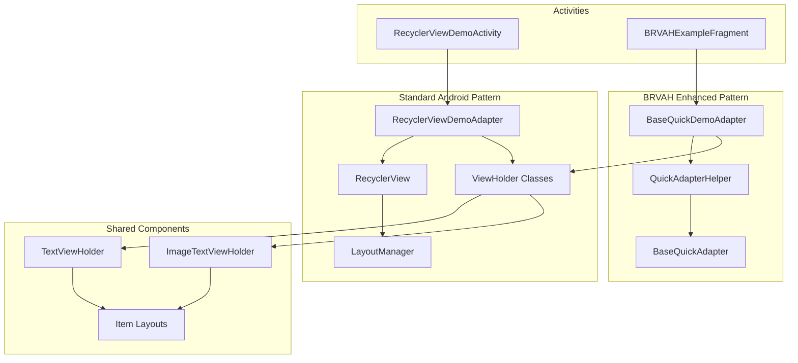
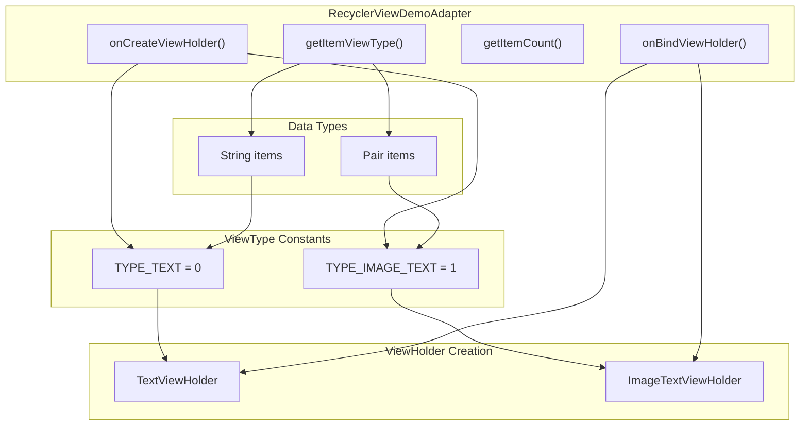
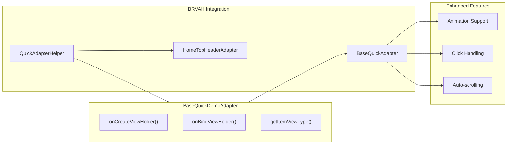
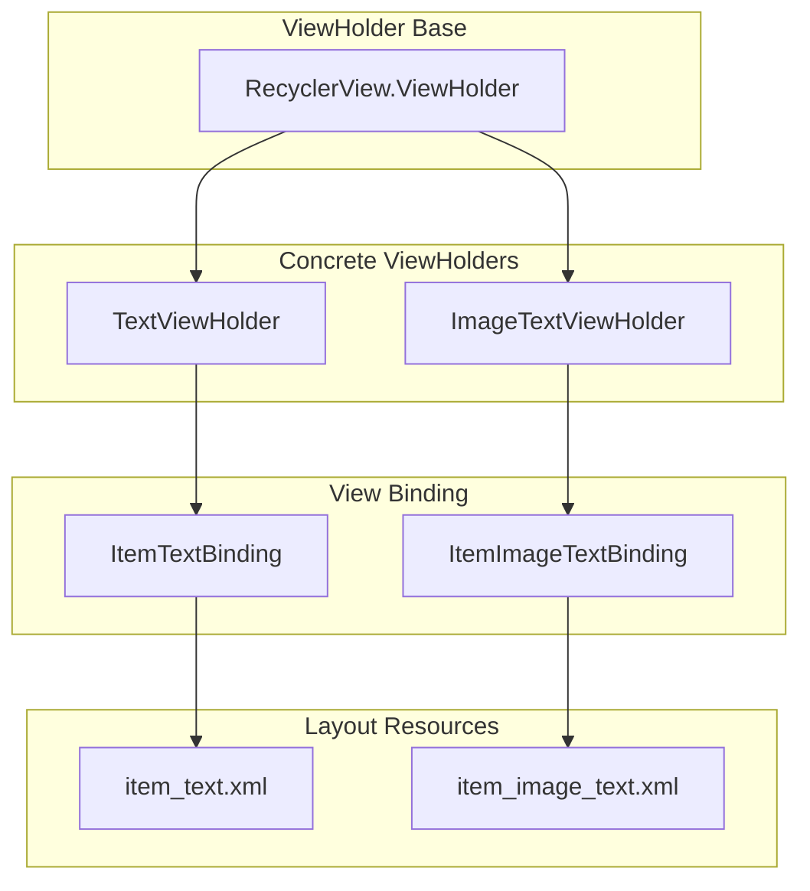
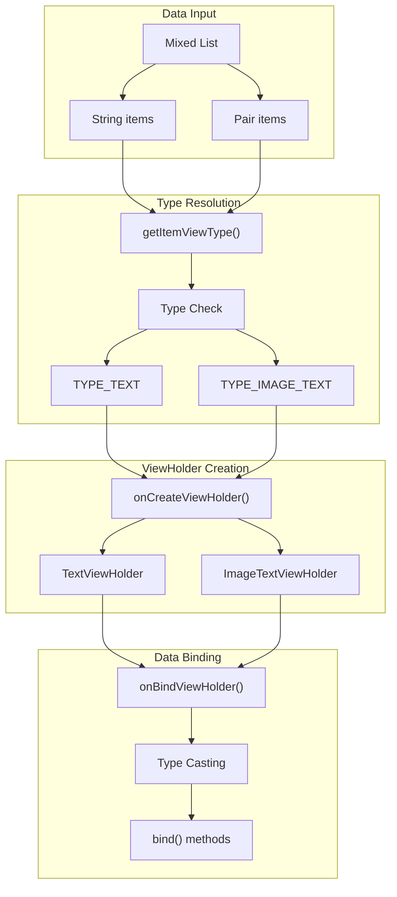

# Basic RecyclerView Patterns

<details>
<summary>Relevant source files</summary>

The following files were used as context for generating this wiki page:

- [app/src/main/java/com/suzhe/playdemo/component/brvah/BRVAHExampleFragment.kt](app/src/main/java/com/suzhe/playdemo/component/brvah/BRVAHExampleFragment.kt)
- [app/src/main/java/com/suzhe/playdemo/component/recyclerView/BaseQuickDemoAdapter.kt](app/src/main/java/com/suzhe/playdemo/component/recyclerView/BaseQuickDemoAdapter.kt)
- [app/src/main/java/com/suzhe/playdemo/component/recyclerView/RecyclerViewDemoActivity.kt](app/src/main/java/com/suzhe/playdemo/component/recyclerView/RecyclerViewDemoActivity.kt)
- [app/src/main/java/com/suzhe/playdemo/component/recyclerView/RecyclerViewDemoAdapter.kt](app/src/main/java/com/suzhe/playdemo/component/recyclerView/RecyclerViewDemoAdapter.kt)
- [app/src/main/java/com/suzhe/playdemo/component/recyclerView/ViewHolders.kt](app/src/main/java/com/suzhe/playdemo/component/recyclerView/ViewHolders.kt)
- [app/src/main/res/drawable/icon_animation.webp](app/src/main/res/drawable/icon_animation.webp)
- [app/src/main/res/layout/fragment_brvah_example.xml](app/src/main/res/layout/fragment_brvah_example.xml)
- [app/src/main/res/layout/item_image_text.xml](app/src/main/res/layout/item_image_text.xml)
- [app/src/main/res/layout/item_text.xml](app/src/main/res/layout/item_text.xml)

</details>


This document covers fundamental RecyclerView usage patterns, basic adapter implementations, and
multi-view-type handling within the PlayDemo application. It focuses on the core patterns and
components needed to implement RecyclerView-based lists, including both standard Android approaches
and BRVAH library enhancements.

For advanced RecyclerView features like animations and scrolling effects,
see [Animation and Scrolling](#4.3). For interactive features like drag-and-drop and swipe gestures,
see [Interactive Features](#4.4). For pagination and dynamic content loading,
see [Advanced List Features](#4.5).

## Core RecyclerView Architecture

The PlayDemo application demonstrates RecyclerView implementation through two primary approaches:
standard Android RecyclerView patterns and enhanced patterns using the
BaseRecyclerViewAdapterHelper (BRVAH) library.

### Component Relationship Overview



**
Sources: ** [app/src/main/java/com/suzhe/playdemo/component/recyclerView/RecyclerViewDemoActivity.kt:1-170](https://github.com/SuZhelevel6/PlayDemo/blob/a2338414/app/src/main/java/com/suzhe/playdemo/component/recyclerView/RecyclerViewDemoActivity.kt#L1-L170), [app/src/main/java/com/suzhe/playdemo/component/brvah/BRVAHExampleFragment.kt:1-87](https://github.com/SuZhelevel6/PlayDemo/blob/a2338414/app/src/main/java/com/suzhe/playdemo/component/brvah/BRVAHExampleFragment.kt#L1-L87), [app/src/main/java/com/suzhe/playdemo/component/recyclerView/BaseQuickDemoAdapter.kt:1-51](https://github.com/SuZhelevel6/PlayDemo/blob/a2338414/app/src/main/java/com/suzhe/playdemo/component/recyclerView/BaseQuickDemoAdapter.kt#L1-L51)

## Standard RecyclerView Adapter Pattern

The application implements the standard Android RecyclerView pattern through
`RecyclerViewDemoAdapter`, which extends `RecyclerView.Adapter<RecyclerView.ViewHolder>`.

### Adapter Implementation Structure



The adapter handles two distinct view types by implementing type-specific logic in key methods:

| Method                 | Purpose                                      | Implementation Details                                     |
|------------------------|----------------------------------------------|------------------------------------------------------------|
| `onCreateViewHolder()` | Creates appropriate ViewHolder based on type | Returns `TextViewHolder` or `ImageTextViewHolder`          |
| `onBindViewHolder()`   | Binds data to ViewHolder                     | Casts data to appropriate type (`String` or `Pair`)        |
| `getItemViewType()`    | Determines view type for position            | Returns `TYPE_TEXT` for String, `TYPE_IMAGE_TEXT` for Pair |
| `getItemCount()`       | Returns total item count                     | Simple `items.size` implementation                         |

**
Sources: ** [app/src/main/java/com/suzhe/playdemo/component/recyclerView/RecyclerViewDemoAdapter.kt:10-50](https://github.com/SuZhelevel6/PlayDemo/blob/a2338414/app/src/main/java/com/suzhe/playdemo/component/recyclerView/RecyclerViewDemoAdapter.kt#L10-L50)

## BRVAH Enhanced Adapter Pattern

The `BaseQuickDemoAdapter` demonstrates the BRVAH library approach, extending
`BaseQuickAdapter<Any, RecyclerView.ViewHolder>`. This pattern provides enhanced functionality while
maintaining similar multi-view-type handling.

### BRVAH Adapter Architecture



The BRVAH pattern provides several enhancements over standard RecyclerView adapters:

- Built-in animation support through `animationEnable` and `setItemAnimation()`
- Simplified click listener setup with `setOnItemClickListener()`
- Helper integration through `QuickAdapterHelper.Builder()`
- Automatic data management with `submitList()` and `add()` methods

**
Sources: ** [app/src/main/java/com/suzhe/playdemo/component/recyclerView/BaseQuickDemoAdapter.kt:16-51](https://github.com/SuZhelevel6/PlayDemo/blob/a2338414/app/src/main/java/com/suzhe/playdemo/component/recyclerView/BaseQuickDemoAdapter.kt#L16-L51), [app/src/main/java/com/suzhe/playdemo/component/brvah/BRVAHExampleFragment.kt:47-64](https://github.com/SuZhelevel6/PlayDemo/blob/a2338414/app/src/main/java/com/suzhe/playdemo/component/brvah/BRVAHExampleFragment.kt#L47-L64)

## ViewHolder Implementation Patterns

Both adapter patterns utilize the same ViewHolder implementations, demonstrating reusable view
binding patterns.

### ViewHolder Class Structure



### ViewHolder Implementation Details

The ViewHolder classes follow a consistent pattern:

| ViewHolder            | Data Type           | Binding Method                  | Layout                |
|-----------------------|---------------------|---------------------------------|-----------------------|
| `TextViewHolder`      | `String`            | `bind(text: String)`            | `item_text.xml`       |
| `ImageTextViewHolder` | `Pair<Int, String>` | `bind(item: Pair<Int, String>)` | `item_image_text.xml` |

Each ViewHolder constructor takes a `ViewGroup parent` parameter and uses `LayoutInflater` to create
the binding instance. The `bind()` methods handle type-safe data assignment to view components.

**
Sources: ** [app/src/main/java/com/suzhe/playdemo/component/recyclerView/ViewHolders.kt:15-40](https://github.com/SuZhelevel6/PlayDemo/blob/a2338414/app/src/main/java/com/suzhe/playdemo/component/recyclerView/ViewHolders.kt#L15-L40), [app/src/main/res/layout/item_text.xml:1-46](https://github.com/SuZhelevel6/PlayDemo/blob/a2338414/app/src/main/res/layout/item_text.xml#L1-L46), [app/src/main/res/layout/item_image_text.xml:1-43](https://github.com/SuZhelevel6/PlayDemo/blob/a2338414/app/src/main/res/layout/item_image_text.xml#L1-L43)

## Multi-View Type Data Flow

The application handles heterogeneous data through a unified approach that works across both adapter
patterns.

### Type Resolution Flow



The data flow ensures type safety through explicit casting in `onBindViewHolder()`:

```kotlin
// Standard adapter pattern
when (getItemViewType(position)) {
    TYPE_TEXT -> (holder as TextViewHolder).bind(items[position] as String)
    TYPE_IMAGE_TEXT -> (holder as ImageTextViewHolder).bind(items[position] as Pair<Int, String>)
}

// BRVAH adapter pattern  
when (getItemViewType(position)) {
    TYPE_TEXT -> (holder as TextViewHolder).bind(items[position] as String)
    TYPE_IMAGE_TEXT -> (holder as ImageTextViewHolder).bind(items[position] as Pair<Int, String>)
}
```

**
Sources: ** [app/src/main/java/com/suzhe/playdemo/component/recyclerView/RecyclerViewDemoAdapter.kt:26-32](https://github.com/SuZhelevel6/PlayDemo/blob/a2338414/app/src/main/java/com/suzhe/playdemo/component/recyclerView/RecyclerViewDemoAdapter.kt#L26-L32), [app/src/main/java/com/suzhe/playdemo/component/recyclerView/BaseQuickDemoAdapter.kt:30-36](https://github.com/SuZhelevel6/PlayDemo/blob/a2338414/app/src/main/java/com/suzhe/playdemo/component/recyclerView/BaseQuickDemoAdapter.kt#L30-L36)

## Layout Manager Configuration

The `RecyclerViewDemoActivity` demonstrates dynamic layout manager switching, showing how the same
adapter can work with different presentation modes.

### Layout Manager Types

| Layout Manager               | Behavior                    | Configuration                             |
|------------------------------|-----------------------------|-------------------------------------------|
| `LinearLayoutManager`        | Single-column vertical list | `LinearLayoutManager(this)`               |
| `GridLayoutManager`          | Multi-column grid           | `GridLayoutManager(this, 2)`              |
| `StaggeredGridLayoutManager` | Staggered grid layout       | `StaggeredGridLayoutManager(2, VERTICAL)` |

The activity provides a `switchLayoutManager()` method that cycles through these layout types,
demonstrating the flexibility of the RecyclerView system. The adapter remains unchanged while the
presentation adapts to different layout requirements.

**
Sources: ** [app/src/main/java/com/suzhe/playdemo/component/recyclerView/RecyclerViewDemoActivity.kt:145-163](https://github.com/SuZhelevel6/PlayDemo/blob/a2338414/app/src/main/java/com/suzhe/playdemo/component/recyclerView/RecyclerViewDemoActivity.kt#L145-L163), [app/src/main/res/layout/fragment_brvah_example.xml:8-13](https://github.com/SuZhelevel6/PlayDemo/blob/a2338414/app/src/main/res/layout/fragment_brvah_example.xml#L8-L13)

## Integration Patterns

The basic RecyclerView patterns integrate with the broader application architecture through
consistent initialization and configuration approaches.

### Activity Integration

Both demonstration approaches follow similar initialization patterns:

1. **Data Setup**: Create mixed-type data collections
2. **Adapter Creation**: Initialize with data and configure options
3. **RecyclerView Configuration**: Set adapter and layout manager
4. **Event Handling**: Configure click listeners and interactions

The `BRVAHExampleFragment` demonstrates the enhanced pattern by using `QuickAdapterHelper` to
compose multiple adapters, including a header adapter (`HomeTopHeaderAdapter`) for additional
functionality.

**
Sources: ** [app/src/main/java/com/suzhe/playdemo/component/recyclerView/RecyclerViewDemoActivity.kt:81-120](https://github.com/SuZhelevel6/PlayDemo/blob/a2338414/app/src/main/java/com/suzhe/playdemo/component/recyclerView/RecyclerViewDemoActivity.kt#L81-L120), [app/src/main/java/com/suzhe/playdemo/component/brvah/BRVAHExampleFragment.kt:52-64](https://github.com/SuZhelevel6/PlayDemo/blob/a2338414/app/src/main/java/com/suzhe/playdemo/component/brvah/BRVAHExampleFragment.kt#L52-L64)