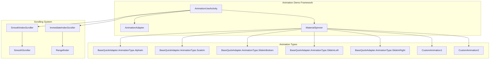
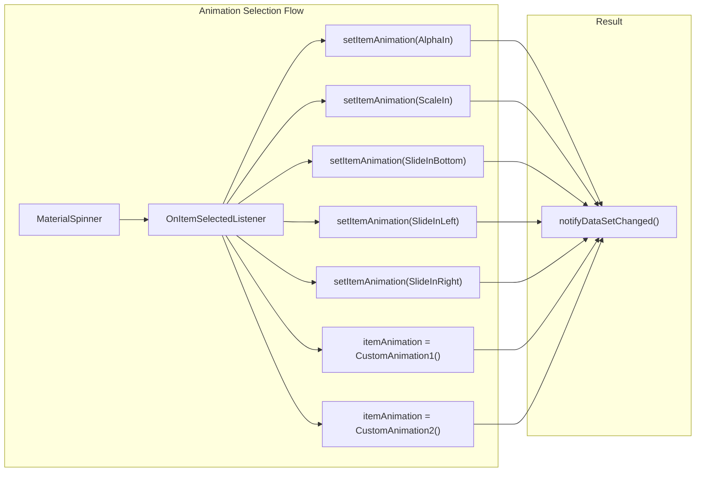
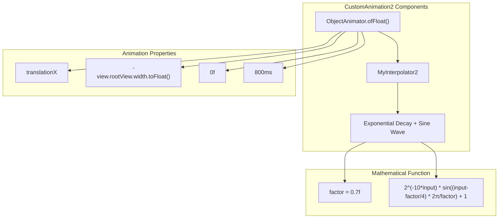
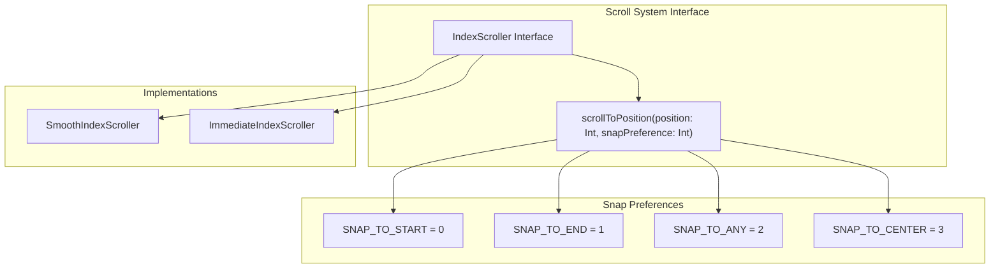
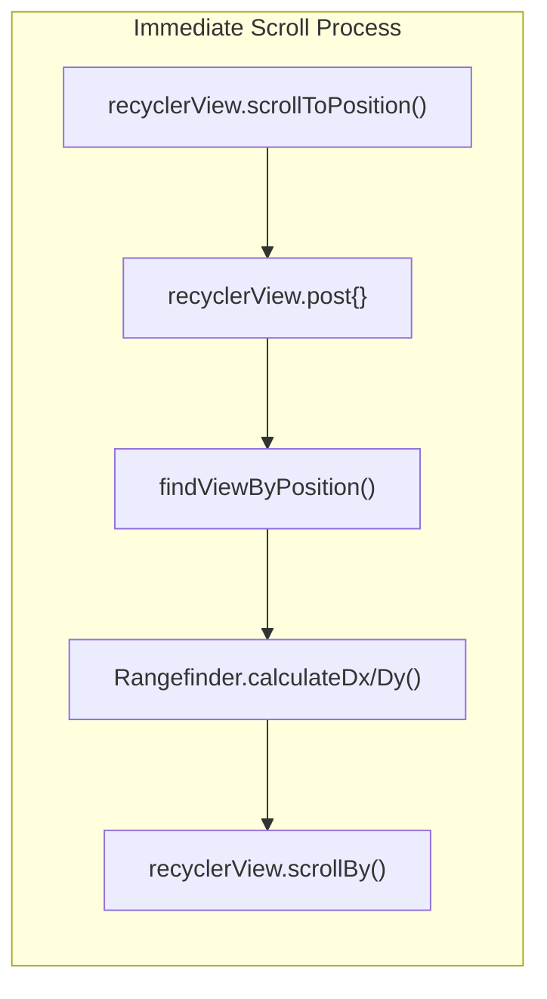
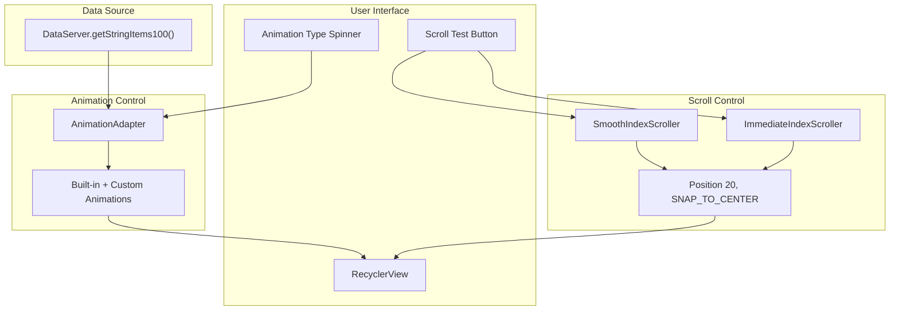

# Animation and Scrolling

<details>
<summary>Relevant source files</summary>

The following files were used as context for generating this wiki page:

- [app/src/main/java/com/suzhe/playdemo/component/brvah/animation/AnimationUseActivity.kt](app/src/main/java/com/suzhe/playdemo/component/brvah/animation/AnimationUseActivity.kt)
- [app/src/main/java/com/suzhe/playdemo/component/brvah/animation/CustomAnimation1.kt](app/src/main/java/com/suzhe/playdemo/component/brvah/animation/CustomAnimation1.kt)
- [app/src/main/java/com/suzhe/playdemo/component/brvah/animation/CustomAnimation2.kt](app/src/main/java/com/suzhe/playdemo/component/brvah/animation/CustomAnimation2.kt)
- [app/src/main/java/com/suzhe/playdemo/component/brvah/animation/SmoothScroller.kt](app/src/main/java/com/suzhe/playdemo/component/brvah/animation/SmoothScroller.kt)
- [app/src/main/res/layout/activity_animation_use.xml](app/src/main/res/layout/activity_animation_use.xml)

</details>


This page covers the animation and scrolling system within the BRVAH demo framework, specifically
focusing on RecyclerView item animations, custom scrolling behaviors, and smooth scrolling
implementations. The system demonstrates how to enhance user experience through visual feedback and
precise navigation controls in list-based interfaces.

For information about basic RecyclerView patterns and adapter setup,
see [Basic RecyclerView Patterns](#4.2). For other interactive features like drag-and-drop,
see [Interactive Features](#4.4).

## Animation System Overview

The animation system is centered around the `AnimationUseActivity` which serves as a comprehensive
demonstration of both item animations and scrolling behaviors. The system integrates BRVAH's
built-in animation capabilities with custom implementations.



**
Sources: ** [app/src/main/java/com/suzhe/playdemo/component/brvah/animation/AnimationUseActivity.kt:1-84](https://github.com/SuZhelevel6/PlayDemo/blob/a2338414/app/src/main/java/com/suzhe/playdemo/component/brvah/animation/AnimationUseActivity.kt#L1-L84), [app/src/main/res/layout/activity_animation_use.xml:1-64](https://github.com/SuZhelevel6/PlayDemo/blob/a2338414/app/src/main/res/layout/activity_animation_use.xml#L1-L64)

## Animation Configuration

The `AnimationUseActivity` configures the animation system through the `AnimationAdapter` with
specific settings that control when and how animations are displayed.

| Configuration Property | Purpose                                           | Default Value |
|------------------------|---------------------------------------------------|---------------|
| `animationEnable`      | Enables/disables adapter animations               | `true`        |
| `isAnimationFirstOnly` | Controls if animations only play on first display | `false`       |

The animation selection is handled through a `MaterialSpinner` that allows runtime switching between
different animation types:



**
Sources: ** [app/src/main/java/com/suzhe/playdemo/component/brvah/animation/AnimationUseActivity.kt:60-83](https://github.com/SuZhelevel6/PlayDemo/blob/a2338414/app/src/main/java/com/suzhe/playdemo/component/brvah/animation/AnimationUseActivity.kt#L60-L83), [app/src/main/res/layout/activity_animation_use.xml:24-30](https://github.com/SuZhelevel6/PlayDemo/blob/a2338414/app/src/main/res/layout/activity_animation_use.xml#L24-L30)

## Custom Animation Implementation

The system includes two custom animation implementations that demonstrate advanced animation
techniques beyond the built-in BRVAH options.

### CustomAnimation1 - Combined Effects

`CustomAnimation1` creates a sophisticated entrance animation by combining multiple animation
properties:

| Animation Component | Property | Values         | Interpolator             |
|---------------------|----------|----------------|--------------------------|
| Alpha Animation     | `alpha`  | `0f` to `1f`   | Default                  |
| Scale Y Animation   | `scaleY` | `1.3f` to `1f` | `DecelerateInterpolator` |
| Scale X Animation   | `scaleX` | `1.3f` to `1f` | `DecelerateInterpolator` |

The animation uses an `AnimatorSet` with a duration of 350ms to coordinate all three effects
simultaneously.

**
Sources: ** [app/src/main/java/com/suzhe/playdemo/component/brvah/animation/CustomAnimation1.kt:1-38](https://github.com/SuZhelevel6/PlayDemo/blob/a2338414/app/src/main/java/com/suzhe/playdemo/component/brvah/animation/CustomAnimation1.kt#L1-L38)

### CustomAnimation2 - Physics-Based Motion

`CustomAnimation2` implements a slide-in effect with a custom physics-based interpolator:



**
Sources: ** [app/src/main/java/com/suzhe/playdemo/component/brvah/animation/CustomAnimation2.kt:1-50](https://github.com/SuZhelevel6/PlayDemo/blob/a2338414/app/src/main/java/com/suzhe/playdemo/component/brvah/animation/CustomAnimation2.kt#L1-L50)

## Scrolling System Architecture

The scrolling system provides precise navigation capabilities with different alignment options and
animation behaviors.

### Scroll Interface Design



**
Sources: ** [app/src/main/java/com/suzhe/playdemo/component/brvah/animation/SmoothScroller.kt:18-32](https://github.com/SuZhelevel6/PlayDemo/blob/a2338414/app/src/main/java/com/suzhe/playdemo/component/brvah/animation/SmoothScroller.kt#L18-L32)

### Smooth Scrolling Implementation

The `SmoothIndexScroller` extends Android's `LinearSmoothScroller` to provide animated scrolling
with custom alignment:

| Component              | Responsibility           | Key Method                      |
|------------------------|--------------------------|---------------------------------|
| `SmoothScroller`       | Custom scroll behavior   | `calculateDtToFit()`            |
| `SmoothIndexScroller`  | Interface implementation | `scrollToPosition()`            |
| Center Alignment Logic | Position calculation     | Custom center point calculation |

The center alignment calculation uses the formula:

```
boxCenter - viewCenter = (boxStart + (boxEnd - boxStart) / 2) - (viewStart + (viewEnd - viewStart) / 2)
```

**
Sources: ** [app/src/main/java/com/suzhe/playdemo/component/brvah/animation/SmoothScroller.kt:34-78](https://github.com/SuZhelevel6/PlayDemo/blob/a2338414/app/src/main/java/com/suzhe/playdemo/component/brvah/animation/SmoothScroller.kt#L34-L78)

### Immediate Scrolling Implementation

The `ImmediateIndexScroller` provides instant positioning without animation, using a post-scroll
adjustment mechanism:



The `Rangefinder` class handles the precise positioning calculations by determining the required
offset to achieve the desired alignment.

**
Sources: ** [app/src/main/java/com/suzhe/playdemo/component/brvah/animation/SmoothScroller.kt:80-174](https://github.com/SuZhelevel6/PlayDemo/blob/a2338414/app/src/main/java/com/suzhe/playdemo/component/brvah/animation/SmoothScroller.kt#L80-L174)

## Integration with Demo Activity

The `AnimationUseActivity` integrates both animation and scrolling systems through a unified
interface:



**
Sources: ** [app/src/main/java/com/suzhe/playdemo/component/brvah/animation/AnimationUseActivity.kt:30-48](https://github.com/SuZhelevel6/PlayDemo/blob/a2338414/app/src/main/java/com/suzhe/playdemo/component/brvah/animation/AnimationUseActivity.kt#L30-L48), [app/src/main/res/layout/activity_animation_use.xml:47-55](https://github.com/SuZhelevel6/PlayDemo/blob/a2338414/app/src/main/res/layout/activity_animation_use.xml#L47-L55)

## Technical Implementation Details

### Animation Lifecycle

The animation system follows BRVAH's standard lifecycle where animations are triggered during
adapter operations:

1. **Initialization**: `animationEnable = true` activates the animation system
2. **Configuration**: `isAnimationFirstOnly = false` ensures animations play on every data change
3. **Triggering**: `notifyDataSetChanged()` initiates animation cycles
4. **Execution**: Individual `ItemAnimator.animator()` methods create animation objects

### Scroll Precision

The scrolling system achieves pixel-perfect alignment through coordinate calculation:

| Calculation Type    | Method                         | Purpose                 |
|---------------------|--------------------------------|-------------------------|
| Horizontal Distance | `calculateDxToMakeVisible()`   | X-axis positioning      |
| Vertical Distance   | `calculateDyToMakeVisible()`   | Y-axis positioning      |
| Box Boundaries      | `getBoxStart()`, `getBoxEnd()` | Visible area detection  |
| View Boundaries     | `view.left/right/top/bottom`   | Target item coordinates |

**
Sources: ** [app/src/main/java/com/suzhe/playdemo/component/brvah/animation/SmoothScroller.kt:103-174](https://github.com/SuZhelevel6/PlayDemo/blob/a2338414/app/src/main/java/com/suzhe/playdemo/component/brvah/animation/SmoothScroller.kt#L103-L174)