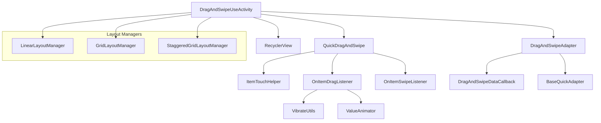
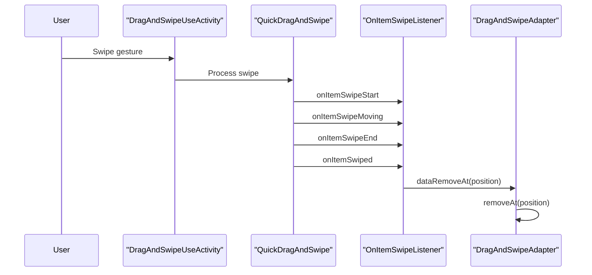
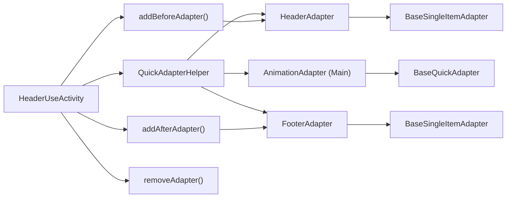
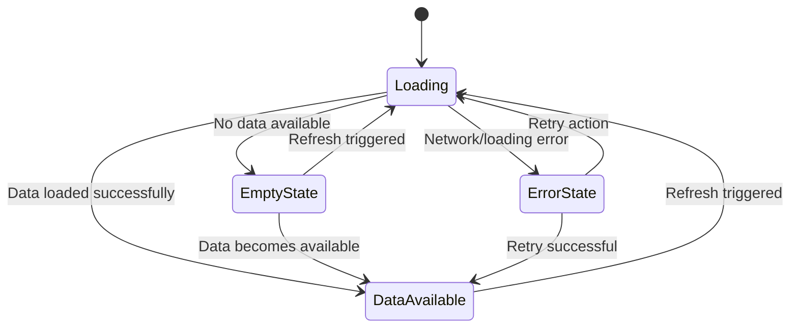
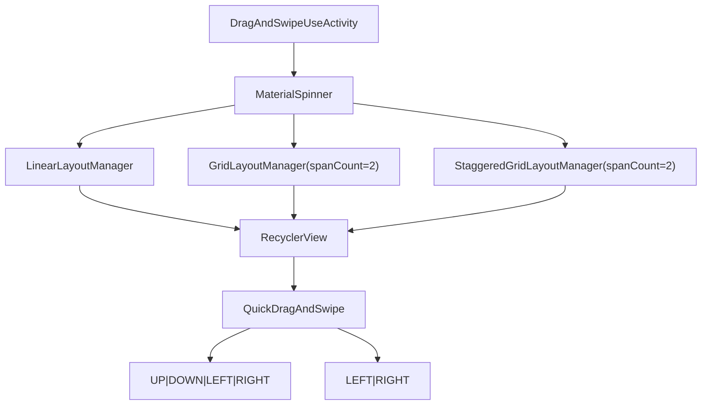

# Interactive Features

Relevant source files

The following files were used as context for generating this wiki page:

- [app/src/main/java/com/suzhe/playdemo/component/brvah/animation/AnimationAdapter.kt](app/src/main/java/com/suzhe/playdemo/component/brvah/animation/AnimationAdapter.kt)
- [app/src/main/java/com/suzhe/playdemo/component/brvah/drag/DragAndSwipeAdapter.kt](app/src/main/java/com/suzhe/playdemo/component/brvah/drag/DragAndSwipeAdapter.kt)
- [app/src/main/java/com/suzhe/playdemo/component/brvah/drag/DragAndSwipeUseActivity.kt](app/src/main/java/com/suzhe/playdemo/component/brvah/drag/DragAndSwipeUseActivity.kt)
- [app/src/main/java/com/suzhe/playdemo/component/brvah/empty/EmptyViewUseActivity.kt](app/src/main/java/com/suzhe/playdemo/component/brvah/empty/EmptyViewUseActivity.kt)
- [app/src/main/java/com/suzhe/playdemo/component/brvah/header/FooterAdapter.kt](app/src/main/java/com/suzhe/playdemo/component/brvah/header/FooterAdapter.kt)
- [app/src/main/java/com/suzhe/playdemo/component/brvah/header/HeaderAdapter.kt](app/src/main/java/com/suzhe/playdemo/component/brvah/header/HeaderAdapter.kt)
- [app/src/main/java/com/suzhe/playdemo/component/brvah/header/HeaderUseActivity.kt](app/src/main/java/com/suzhe/playdemo/component/brvah/header/HeaderUseActivity.kt)
- [app/src/main/java/com/suzhe/playdemo/utils/VibrateUtils.kt](app/src/main/java/com/suzhe/playdemo/utils/VibrateUtils.kt)
- [app/src/main/res/drawable/icon_drag.png](app/src/main/res/drawable/icon_drag.png)
- [app/src/main/res/drawable/icon_header.png](app/src/main/res/drawable/icon_header.png)
- [app/src/main/res/layout/activity_drag_and_swipe_use.xml](app/src/main/res/layout/activity_drag_and_swipe_use.xml)
- [app/src/main/res/layout/activity_header_use.xml](app/src/main/res/layout/activity_header_use.xml)

This document covers the interactive RecyclerView features implemented in the BRVAH demo system,
including drag-and-drop functionality, swipe-to-dismiss actions, dynamic header/footer management,
and empty state handling. These features demonstrate advanced user interaction patterns that enhance
the user experience in list-based interfaces.

For basic RecyclerView patterns and adapters, see [Basic RecyclerView Patterns](#4.2). For
animation-related features, see [Animation and Scrolling](#4.3).

## Drag and Drop System

The drag-and-drop functionality is implemented through the `QuickDragAndSwipe` class from the BRVAH
library, providing comprehensive touch-based item manipulation capabilities.

### Drag Configuration

The drag functionality is configured with specific movement flags and callbacks:

- **Drag Flags
  **: [app/src/main/java/com/suzhe/playdemo/component/brvah/drag/DragAndSwipeUseActivity.kt:34-37]()
- **Swipe Flags
  **: [app/src/main/java/com/suzhe/playdemo/component/brvah/drag/DragAndSwipeUseActivity.kt:38]()
- **Attachment to RecyclerView
  **: [app/src/main/java/com/suzhe/playdemo/component/brvah/drag/DragAndSwipeUseActivity.kt:144-147]()

### Drag Event Handling

The system provides comprehensive event handling throughout the drag lifecycle:

| Event  | Method             | Purpose                                     |
|--------|--------------------|---------------------------------------------|
| Start  | `onItemDragStart`  | Haptic feedback, visual feedback initiation |
| Moving | `onItemDragMoving` | Position tracking, logging                  |
| End    | `onItemDragEnd`    | Visual feedback restoration                 |

**
Sources: ** [app/src/main/java/com/suzhe/playdemo/component/brvah/drag/DragAndSwipeUseActivity.kt:57-106](https://github.com/SuZhelevel6/PlayDemo/blob/a2338414/app/src/main/java/com/suzhe/playdemo/component/brvah/drag/DragAndSwipeUseActivity.kt#L57-L106)

### Visual and Haptic Feedback

The drag system includes sophisticated feedback mechanisms:

- **Haptic Feedback**: Provided through `VibrateUtils.vibrate()` at drag start
- **Visual Feedback**: Background color animation using `ValueAnimator`
- **Cross-platform Support**: Different vibration implementations for various Android versions

**
Sources: ** [app/src/main/java/com/suzhe/playdemo/utils/VibrateUtils.kt:16-31](https://github.com/SuZhelevel6/PlayDemo/blob/a2338414/app/src/main/java/com/suzhe/playdemo/utils/VibrateUtils.kt#L16-L31), [app/src/main/java/com/suzhe/playdemo/component/brvah/drag/DragAndSwipeUseActivity.kt:59-60](https://github.com/SuZhelevel6/PlayDemo/blob/a2338414/app/src/main/java/com/suzhe/playdemo/component/brvah/drag/DragAndSwipeUseActivity.kt#L59-L60)

## Swipe-to-Dismiss Implementation

The swipe functionality enables users to remove items through gesture-based interactions with
comprehensive event tracking.

### Swipe Event Lifecycle

The swipe implementation tracks the complete gesture lifecycle:

- **Start
  **: [app/src/main/java/com/suzhe/playdemo/component/brvah/drag/DragAndSwipeUseActivity.kt:110-115]()
- **Moving
  **: [app/src/main/java/com/suzhe/playdemo/component/brvah/drag/DragAndSwipeUseActivity.kt:132-140]()
- **End
  **: [app/src/main/java/com/suzhe/playdemo/component/brvah/drag/DragAndSwipeUseActivity.kt:117-122]()
- **Completion
  **: [app/src/main/java/com/suzhe/playdemo/component/brvah/drag/DragAndSwipeUseActivity.kt:124-130]()

### Data Integration

The adapter implements `DragAndSwipeDataCallback` to handle data modifications:

- **Move Operation
  **: [app/src/main/java/com/suzhe/playdemo/component/brvah/drag/DragAndSwipeAdapter.kt:33-35]()
- **Remove Operation
  **: [app/src/main/java/com/suzhe/playdemo/component/brvah/drag/DragAndSwipeAdapter.kt:37-39]()

**
Sources: ** [app/src/main/java/com/suzhe/playdemo/component/brvah/drag/DragAndSwipeAdapter.kt:12](https://github.com/SuZhelevel6/PlayDemo/blob/a2338414/app/src/main/java/com/suzhe/playdemo/component/brvah/drag/DragAndSwipeAdapter.kt#L12)

## Header and Footer Management

The header/footer system uses `QuickAdapterHelper` to compose multiple adapters into a single
RecyclerView, enabling dynamic content sections.

### Dynamic Adapter Composition

The system enables runtime addition and removal of header/footer sections:

| Operation     | Method                                 | Implementation                                                                             |
|---------------|----------------------------------------|--------------------------------------------------------------------------------------------|
| Add Header    | `addBeforeAdapter(0, HeaderAdapter())` | [app/src/main/java/com/suzhe/playdemo/component/brvah/header/HeaderUseActivity.kt:72]()    |
| Add Footer    | `addAfterAdapter(FooterAdapter())`     | [app/src/main/java/com/suzhe/playdemo/component/brvah/header/HeaderUseActivity.kt:76]()    |
| Remove Header | `removeAdapter(targetAdapter)`         | [app/src/main/java/com/suzhe/playdemo/component/brvah/header/HeaderUseActivity.kt:54-58]() |
| Remove Footer | `removeAdapter(targetAdapter)`         | [app/src/main/java/com/suzhe/playdemo/component/brvah/header/HeaderUseActivity.kt:62-67]() |

### Adapter Implementation

Both header and footer adapters extend `BaseSingleItemAdapter` for single-item sections:

- **HeaderAdapter
  **: [app/src/main/java/com/suzhe/playdemo/component/brvah/header/HeaderAdapter.kt:11-21]()
- **FooterAdapter
  **: [app/src/main/java/com/suzhe/playdemo/component/brvah/header/FooterAdapter.kt:9-21]()

**
Sources: ** [app/src/main/java/com/suzhe/playdemo/component/brvah/header/HeaderUseActivity.kt:20-23](https://github.com/SuZhelevel6/PlayDemo/blob/a2338414/app/src/main/java/com/suzhe/playdemo/component/brvah/header/HeaderUseActivity.kt#L20-L23)

## Empty State Management

The empty state system provides user feedback when no content is available, with support for custom
error views and loading states.

### State Configuration

The empty view system is enabled and configured through adapter properties:

- **Enable State Views
  **: [app/src/main/java/com/suzhe/playdemo/component/brvah/empty/EmptyViewUseActivity.kt:39]()
- **Custom Error View
  **: [app/src/main/java/com/suzhe/playdemo/component/brvah/empty/EmptyViewUseActivity.kt:26-31]()
- **State Application
  **: [app/src/main/java/com/suzhe/playdemo/component/brvah/empty/EmptyViewUseActivity.kt:69-76]()

### Loading Flow Integration

The system integrates with dialog-based loading indicators:

- **Loading Dialog
  **: [app/src/main/java/com/suzhe/playdemo/component/brvah/empty/EmptyViewUseActivity.kt:54-62]()
- **Completion Handling
  **: [app/src/main/java/com/suzhe/playdemo/component/brvah/empty/EmptyViewUseActivity.kt:65-77]()

**
Sources: ** [app/src/main/java/com/suzhe/playdemo/component/brvah/empty/EmptyViewUseActivity.kt:15-24](https://github.com/SuZhelevel6/PlayDemo/blob/a2338414/app/src/main/java/com/suzhe/playdemo/component/brvah/empty/EmptyViewUseActivity.kt#L15-L24)

## Layout Manager Support

The interactive features support multiple RecyclerView layout configurations, enabling consistent
behavior across different display patterns.

### Layout Configuration

The system provides a dropdown interface for switching between layout managers:

- **Spinner Setup
  **: [app/src/main/java/com/suzhe/playdemo/component/brvah/drag/DragAndSwipeUseActivity.kt:160-164]()
- **Layout Switching
  **: [app/src/main/java/com/suzhe/playdemo/component/brvah/drag/DragAndSwipeUseActivity.kt:165-174]()

### Supported Layouts

| Layout Type | Configuration                             | Use Case                |
|-------------|-------------------------------------------|-------------------------|
| Linear      | `LinearLayoutManager(context)`            | Single-column lists     |
| Grid        | `GridLayoutManager(context, 2)`           | Multi-column grids      |
| Staggered   | `StaggeredGridLayoutManager(2, VERTICAL)` | Pinterest-style layouts |

**
Sources: ** [app/src/main/java/com/suzhe/playdemo/component/brvah/drag/DragAndSwipeUseActivity.kt:159-175](https://github.com/SuZhelevel6/PlayDemo/blob/a2338414/app/src/main/java/com/suzhe/playdemo/component/brvah/drag/DragAndSwipeUseActivity.kt#L159-L175), [app/src/main/res/layout/activity_drag_and_swipe_use.xml:24-31](https://github.com/SuZhelevel6/PlayDemo/blob/a2338414/app/src/main/res/layout/activity_drag_and_swipe_use.xml#L24-L31)

## Integration Patterns

The interactive features follow consistent integration patterns that can be applied across different
use cases in the BRVAH system.

### Common Setup Pattern

All interactive features follow a similar initialization pattern:

1. **Adapter Creation**: Extend appropriate base adapter class
2. **Helper Configuration**: Use `QuickAdapterHelper.Builder` for composition
3. **Feature Attachment**: Attach interactive components to RecyclerView
4. **Event Handling**: Implement relevant listener interfaces

### Data Server Integration

Interactive features integrate with the mock data system:

- **Data Source
  **: [app/src/main/java/com/suzhe/playdemo/component/brvah/drag/DragAndSwipeUseActivity.kt:51]()
- **Data Volume**: Configurable item counts for testing scenarios

**
Sources: ** [app/src/main/java/com/suzhe/playdemo/component/brvah/drag/DragAndSwipeUseActivity.kt:49-52](https://github.com/SuZhelevel6/PlayDemo/blob/a2338414/app/src/main/java/com/suzhe/playdemo/component/brvah/drag/DragAndSwipeUseActivity.kt#L49-L52), [app/src/main/java/com/suzhe/playdemo/component/brvah/header/HeaderUseActivity.kt:33-36](https://github.com/SuZhelevel6/PlayDemo/blob/a2338414/app/src/main/java/com/suzhe/playdemo/component/brvah/header/HeaderUseActivity.kt#L33-L36), [app/src/main/java/com/suzhe/playdemo/component/brvah/empty/EmptyViewUseActivity.kt:74](https://github.com/SuZhelevel6/PlayDemo/blob/a2338414/app/src/main/java/com/suzhe/playdemo/component/brvah/empty/EmptyViewUseActivity.kt#L74)