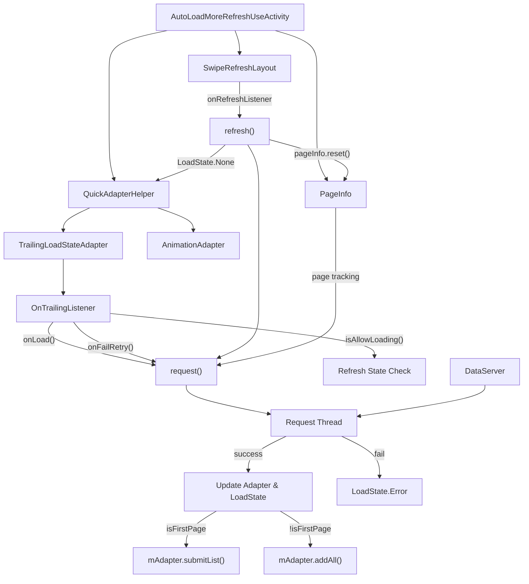
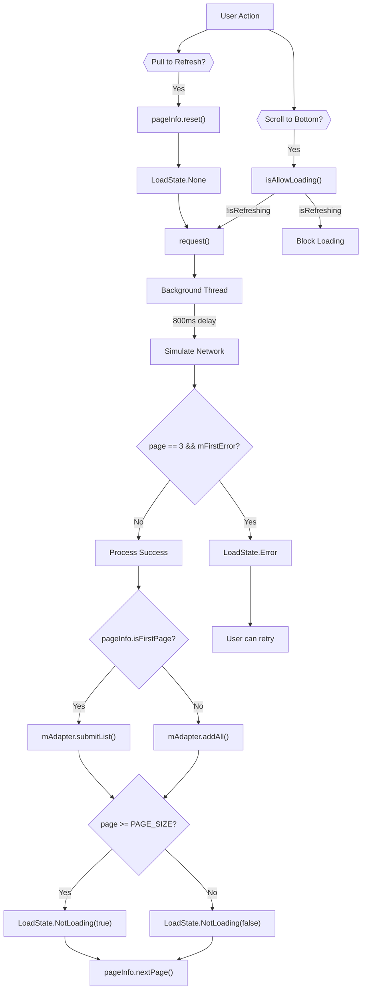
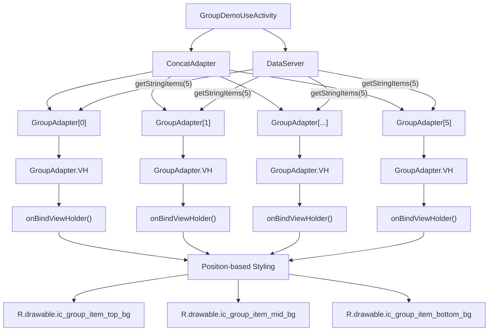
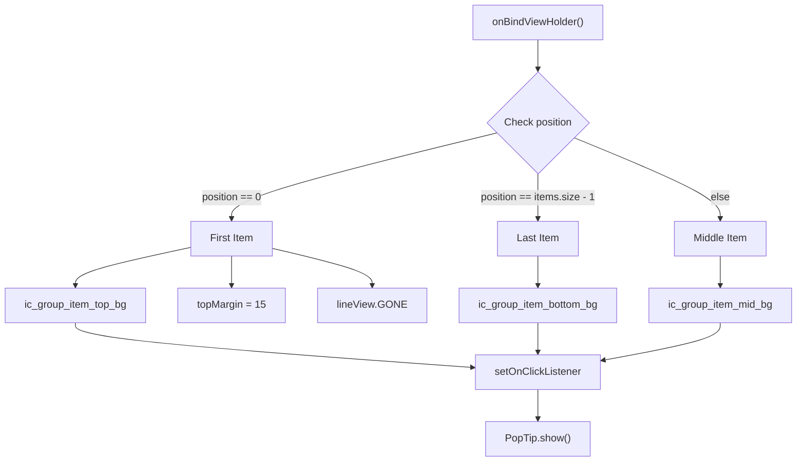
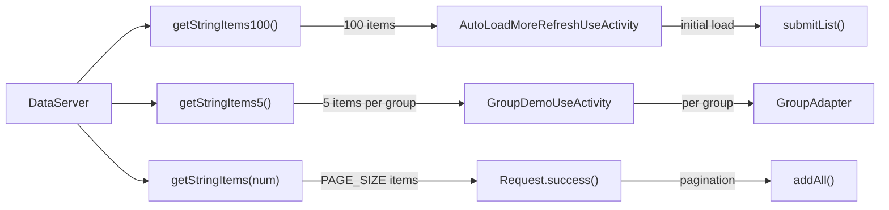

# Advanced List Features

Relevant source files

The following files were used as context for generating this wiki page:

- [app/src/main/java/com/suzhe/playdemo/component/brvah/autoLoad/AutoLoadMoreRefreshUseActivity.kt](app/src/main/java/com/suzhe/playdemo/component/brvah/autoLoad/AutoLoadMoreRefreshUseActivity.kt)
- [app/src/main/java/com/suzhe/playdemo/component/brvah/group/GroupAdapter.kt](app/src/main/java/com/suzhe/playdemo/component/brvah/group/GroupAdapter.kt)
- [app/src/main/java/com/suzhe/playdemo/component/brvah/group/GroupDemoUseActivity.kt](app/src/main/java/com/suzhe/playdemo/component/brvah/group/GroupDemoUseActivity.kt)
- [app/src/main/java/com/suzhe/playdemo/data/DataServer.kt](app/src/main/java/com/suzhe/playdemo/data/DataServer.kt)
- [app/src/main/res/drawable/ic_group_item_bottom_bg.9.png](app/src/main/res/drawable/ic_group_item_bottom_bg.9.png)
- [app/src/main/res/drawable/ic_group_item_mid_bg.9.png](app/src/main/res/drawable/ic_group_item_mid_bg.9.png)
- [app/src/main/res/drawable/ic_group_item_top_bg.9.png](app/src/main/res/drawable/ic_group_item_top_bg.9.png)
- [app/src/main/res/drawable/icon_list.png](app/src/main/res/drawable/icon_list.png)
- [app/src/main/res/drawable/icon_load.png](app/src/main/res/drawable/icon_load.png)
- [app/src/main/res/layout/activity_auto_load_more_refresh_use.xml](app/src/main/res/layout/activity_auto_load_more_refresh_use.xml)
- [app/src/main/res/layout/activity_group_demo_use.xml](app/src/main/res/layout/activity_group_demo_use.xml)
- [app/src/main/res/layout/item_group_type.xml](app/src/main/res/layout/item_group_type.xml)

This document covers the advanced RecyclerView features implemented in the PlayDemo application,
specifically focusing on auto-loading with pagination, grouped list displays, and sophisticated load
state management. These features demonstrate advanced usage patterns of the BRVAH (
BaseRecyclerViewAdapterHelper) library beyond basic list operations.

For basic RecyclerView patterns and multi-view-type implementations,
see [Basic RecyclerView Patterns](#4.2). For interactive features like drag-and-drop and swipe
actions, see [Interactive Features](#4.4).

## Auto-Loading and Pagination System

The auto-loading system provides seamless infinite scrolling with pull-to-refresh capabilities
through the `AutoLoadMoreRefreshUseActivity` implementation. This system uses `QuickAdapterHelper`
to manage load states and coordinate between refresh and pagination operations.

### Auto-Loading Architecture

**Pagination Flow Control**

The pagination system uses a `PageInfo` class to manage page state and coordinate between initial
loads and subsequent page requests.

Sources: [app/src/main/java/com/suzhe/playdemo/component/brvah/autoLoad/AutoLoadMoreRefreshUseActivity.kt:24-36](https://github.com/SuZhelevel6/PlayDemo/blob/a2338414/app/src/main/java/com/suzhe/playdemo/component/brvah/autoLoad/AutoLoadMoreRefreshUseActivity.kt#L24-L36)

### Load State Management

The system implements comprehensive load state handling through
`QuickAdapterHelper.trailingLoadState`:

| Load State                    | Purpose        | Trigger Condition              |
|-------------------------------|----------------|--------------------------------|
| `LoadState.None`              | Reset state    | Pull-to-refresh initiated      |
| `LoadState.NotLoading(false)` | Ready for more | Successful load with more data |
| `LoadState.NotLoading(true)`  | No more data   | Reached maximum pages          |
| `LoadState.Error(e)`          | Error state    | Network or loading failure     |

Sources: [app/src/main/java/com/suzhe/playdemo/component/brvah/autoLoad/AutoLoadMoreRefreshUseActivity.kt:41-54](https://github.com/SuZhelevel6/PlayDemo/blob/a2338414/app/src/main/java/com/suzhe/playdemo/component/brvah/autoLoad/AutoLoadMoreRefreshUseActivity.kt#L41-L54), [app/src/main/java/com/suzhe/playdemo/component/brvah/autoLoad/AutoLoadMoreRefreshUseActivity.kt:91-133](https://github.com/SuZhelevel6/PlayDemo/blob/a2338414/app/src/main/java/com/suzhe/playdemo/component/brvah/autoLoad/AutoLoadMoreRefreshUseActivity.kt#L91-L133)

### Implementation Details

The auto-loading system requires specific setup components:

1. **SwipeRefreshLayout Integration
   **: [app/src/main/res/layout/activity_auto_load_more_refresh_use.xml:11-25]()
2. **QuickAdapterHelper Configuration
   **: [app/src/main/java/com/suzhe/playdemo/component/brvah/autoLoad/AutoLoadMoreRefreshUseActivity.kt:41-54]()
3. **Data Differentiation**: Uses `submitList()` for first page and `addAll()` for subsequent
   pages [app/src/main/java/com/suzhe/playdemo/component/brvah/autoLoad/AutoLoadMoreRefreshUseActivity.kt:96-103]()

The mock request system simulates real-world scenarios including network delays and error conditions
through the `Request` thread
class [app/src/main/java/com/suzhe/playdemo/component/brvah/autoLoad/AutoLoadMoreRefreshUseActivity.kt:138-162]().

Sources: [app/src/main/java/com/suzhe/playdemo/component/brvah/autoLoad/AutoLoadMoreRefreshUseActivity.kt:1-184](https://github.com/SuZhelevel6/PlayDemo/blob/a2338414/app/src/main/java/com/suzhe/playdemo/component/brvah/autoLoad/AutoLoadMoreRefreshUseActivity.kt#L1-L184)

## Grouped Lists Implementation

The grouped lists feature demonstrates advanced RecyclerView composition using `ConcatAdapter` to
manage multiple `GroupAdapter` instances, each representing a distinct data group with specialized
styling.

### Group Display Architecture

**Group Styling Logic**

The `GroupAdapter` implements position-aware styling to create visually distinct groups:

Sources: [app/src/main/java/com/suzhe/playdemo/component/brvah/group/GroupAdapter.kt:47-69](https://github.com/SuZhelevel6/PlayDemo/blob/a2338414/app/src/main/java/com/suzhe/playdemo/component/brvah/group/GroupAdapter.kt#L47-L69)

### Group Layout Structure

The group item layout provides the foundation for group styling with separators and content areas:

- **Separator Line**: Conditional visibility based on
  position [app/src/main/res/layout/item_group_type.xml:12-16]()
- **Title and Content**: Standard text display with proper
  spacing [app/src/main/res/layout/item_group_type.xml:18-36]()
- **Background Styling**: Applied programmatically based on
  position [app/src/main/java/com/suzhe/playdemo/component/brvah/group/GroupAdapter.kt:50-68]()

The activity implementation creates multiple `GroupAdapter` instances and combines them using
`ConcatAdapter` [app/src/main/java/com/suzhe/playdemo/component/brvah/group/GroupDemoUseActivity.kt:22-27]().

Sources: [app/src/main/java/com/suzhe/playdemo/component/brvah/group/GroupDemoUseActivity.kt:1-29](https://github.com/SuZhelevel6/PlayDemo/blob/a2338414/app/src/main/java/com/suzhe/playdemo/component/brvah/group/GroupDemoUseActivity.kt#L1-L29), [app/src/main/java/com/suzhe/playdemo/component/brvah/group/GroupAdapter.kt:1-71](https://github.com/SuZhelevel6/PlayDemo/blob/a2338414/app/src/main/java/com/suzhe/playdemo/component/brvah/group/GroupAdapter.kt#L1-L71), [app/src/main/res/layout/item_group_type.xml:1-38](https://github.com/SuZhelevel6/PlayDemo/blob/a2338414/app/src/main/res/layout/item_group_type.xml#L1-L38)

## Data Server Integration

The `DataServer` provides standardized mock data generation for testing advanced list features
across different scenarios.

### Data Generation Methods

| Method                | Purpose       | Usage Context             |
|-----------------------|---------------|---------------------------|
| `getStringItems100()` | Large dataset | Initial auto-load testing |
| `getStringItems5()`   | Small groups  | Group demonstration       |
| `getStringItems(num)` | Flexible size | Pagination chunks         |

The data generation follows a simple pattern of creating `ArrayList<String>` with sequential "Item"
entries [app/src/main/java/com/suzhe/playdemo/data/DataServer.kt:6-11](), [app/src/main/java/com/suzhe/playdemo/data/DataServer.kt:22-28]().

Sources: [app/src/main/java/com/suzhe/playdemo/data/DataServer.kt:1-30](https://github.com/SuZhelevel6/PlayDemo/blob/a2338414/app/src/main/java/com/suzhe/playdemo/data/DataServer.kt#L1-L30)

## Integration with BRVAH System

These advanced features integrate with the broader BRVAH demonstration system through the library
navigation hub covered in [Library Navigation Hub](#4.1). The features showcase `QuickAdapterHelper`
capabilities and demonstrate best practices for complex list management scenarios.

The implementation patterns established here serve as reference implementations for production
applications requiring sophisticated list behaviors, particularly in scenarios involving large
datasets, complex grouping requirements, or advanced user interaction patterns.

Sources: [app/src/main/java/com/suzhe/playdemo/component/brvah/autoLoad/AutoLoadMoreRefreshUseActivity.kt:1-184](https://github.com/SuZhelevel6/PlayDemo/blob/a2338414/app/src/main/java/com/suzhe/playdemo/component/brvah/autoLoad/AutoLoadMoreRefreshUseActivity.kt#L1-L184), [app/src/main/java/com/suzhe/playdemo/component/brvah/group/GroupDemoUseActivity.kt:1-29](https://github.com/SuZhelevel6/PlayDemo/blob/a2338414/app/src/main/java/com/suzhe/playdemo/component/brvah/group/GroupDemoUseActivity.kt#L1-L29)