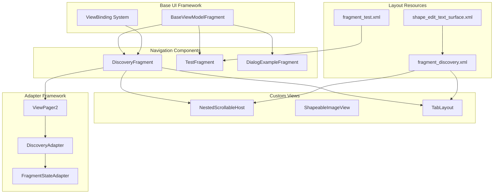
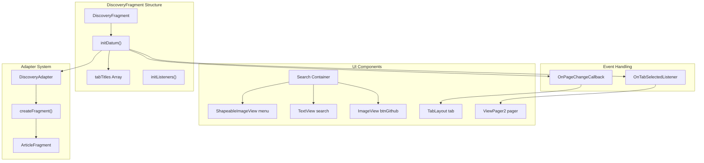
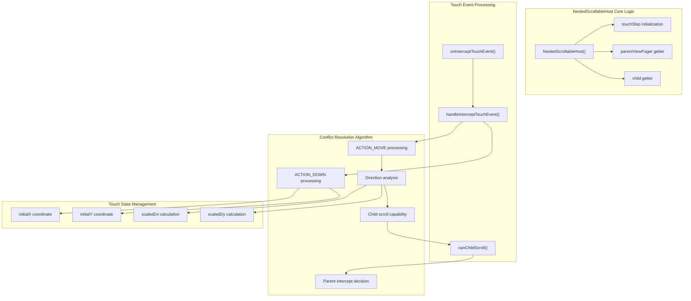
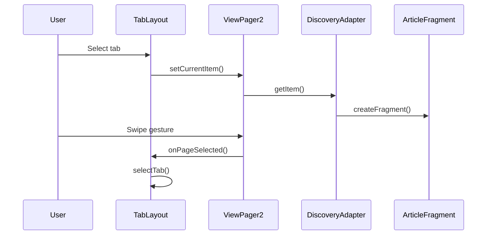
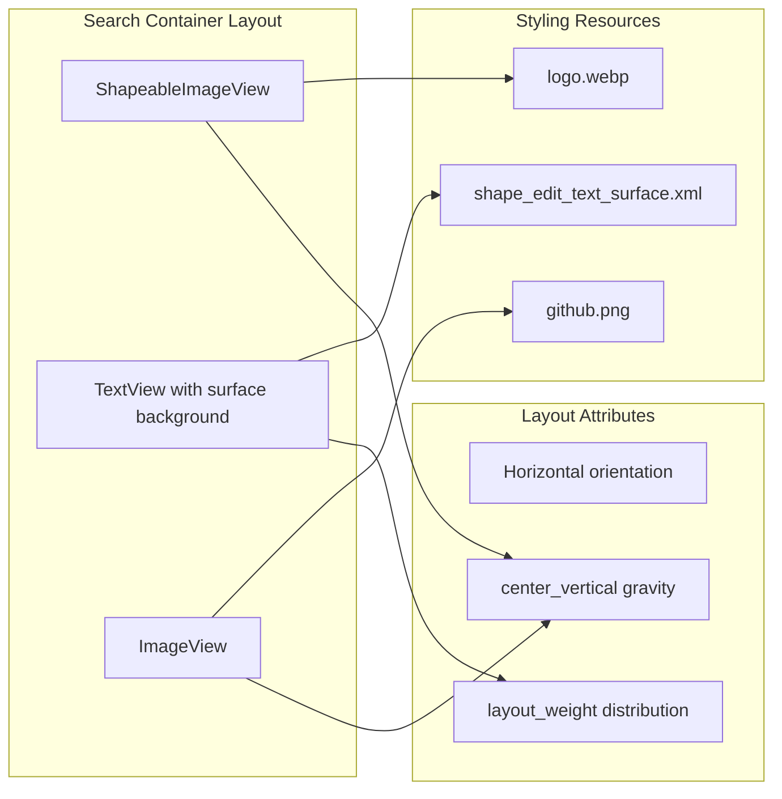
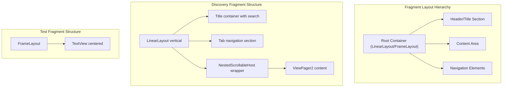

# UI Components and Patterns

<details>
<summary>Relevant source files</summary>

The following files were used as context for generating this wiki page:

- [app/src/main/java/com/suzhe/playdemo/component/dialogX/DialogExampleFragment.kt](app/src/main/java/com/suzhe/playdemo/component/dialogX/DialogExampleFragment.kt)
- [app/src/main/java/com/suzhe/playdemo/component/discovery/DiscoveryAdapter.kt](app/src/main/java/com/suzhe/playdemo/component/discovery/DiscoveryAdapter.kt)
- [app/src/main/java/com/suzhe/playdemo/component/discovery/DiscoveryFragment.kt](app/src/main/java/com/suzhe/playdemo/component/discovery/DiscoveryFragment.kt)
- [app/src/main/java/com/suzhe/playdemo/component/test/TestFragment.kt](app/src/main/java/com/suzhe/playdemo/component/test/TestFragment.kt)
- [app/src/main/java/com/suzhe/playdemo/view/NestedScrollableHost.kt](app/src/main/java/com/suzhe/playdemo/view/NestedScrollableHost.kt)
- [app/src/main/res/drawable/github.png](app/src/main/res/drawable/github.png)
- [app/src/main/res/drawable/logo.webp](app/src/main/res/drawable/logo.webp)
- [app/src/main/res/drawable/shape_edit_text_surface.xml](app/src/main/res/drawable/shape_edit_text_surface.xml)
- [app/src/main/res/drawable/skin.webp](app/src/main/res/drawable/skin.webp)
- [app/src/main/res/layout/fragment_discovery.xml](app/src/main/res/layout/fragment_discovery.xml)
- [app/src/main/res/layout/fragment_test.xml](app/src/main/res/layout/fragment_test.xml)

</details>


This document covers the UI components, custom views, and user interface patterns implemented
throughout the PlayDemo application. It focuses on reusable components, layout patterns, and
interaction mechanisms that support the overall user experience.

For information about web content display, see [Web Content Integration](#5.1). For dialog
management systems, see [Dialog and Popup System](#5.2). For user onboarding flows,
see [Guide and Onboarding](#5.3). For custom view implementations,
see [Custom Views and Utilities](#5.4).

## Core UI Architecture Pattern

The application follows a component-based UI architecture built on Android's Fragment system with
custom view components to handle complex interaction patterns.



**
Sources: ** [app/src/main/java/com/suzhe/playdemo/component/discovery/DiscoveryFragment.kt:11](https://github.com/SuZhelevel6/PlayDemo/blob/a2338414/app/src/main/java/com/suzhe/playdemo/component/discovery/DiscoveryFragment.kt#L11), [app/src/main/java/com/suzhe/playdemo/view/NestedScrollableHost.kt:23](https://github.com/SuZhelevel6/PlayDemo/blob/a2338414/app/src/main/java/com/suzhe/playdemo/view/NestedScrollableHost.kt#L23), [app/src/main/res/layout/fragment_discovery.xml:1-86](https://github.com/SuZhelevel6/PlayDemo/blob/a2338414/app/src/main/res/layout/fragment_discovery.xml#L1-L86)

## Fragment-Based UI Patterns

### Discovery Fragment Architecture

The `DiscoveryFragment` demonstrates a comprehensive tab-based navigation pattern with integrated
search functionality and ViewPager2 content management.



**
Sources: ** [app/src/main/java/com/suzhe/playdemo/component/discovery/DiscoveryFragment.kt:11-70](https://github.com/SuZhelevel6/PlayDemo/blob/a2338414/app/src/main/java/com/suzhe/playdemo/component/discovery/DiscoveryFragment.kt#L11-L70), [app/src/main/java/com/suzhe/playdemo/component/discovery/DiscoveryAdapter.kt:8-17](https://github.com/SuZhelevel6/PlayDemo/blob/a2338414/app/src/main/java/com/suzhe/playdemo/component/discovery/DiscoveryAdapter.kt#L8-L17), [app/src/main/res/layout/fragment_discovery.xml:8-85](https://github.com/SuZhelevel6/PlayDemo/blob/a2338414/app/src/main/res/layout/fragment_discovery.xml#L8-L85)

### Fragment Lifecycle Integration

The fragments implement a standardized lifecycle pattern through the `BaseViewModelFragment`
foundation:

| Fragment                | Purpose                      | Key Methods                      | Layout Resource          |
|-------------------------|------------------------------|----------------------------------|--------------------------|
| `DiscoveryFragment`     | Tab-based content navigation | `initDatum()`, `initListeners()` | `fragment_discovery.xml` |
| `TestFragment`          | Fullscreen placeholder       | Standard lifecycle only          | `fragment_test.xml`      |
| `DialogExampleFragment` | Dialog pattern showcase      | `initViews()`, style methods     | Custom bindings          |

**
Sources: ** [app/src/main/java/com/suzhe/playdemo/component/discovery/DiscoveryFragment.kt:11](https://github.com/SuZhelevel6/PlayDemo/blob/a2338414/app/src/main/java/com/suzhe/playdemo/component/discovery/DiscoveryFragment.kt#L11), [app/src/main/java/com/suzhe/playdemo/component/test/TestFragment.kt:22](https://github.com/SuZhelevel6/PlayDemo/blob/a2338414/app/src/main/java/com/suzhe/playdemo/component/test/TestFragment.kt#L22), [app/src/main/java/com/suzhe/playdemo/component/dialogX/DialogExampleFragment.kt:46](https://github.com/SuZhelevel6/PlayDemo/blob/a2338414/app/src/main/java/com/suzhe/playdemo/component/dialogX/DialogExampleFragment.kt#L46)

## Scroll Conflict Resolution

### NestedScrollableHost Implementation

The `NestedScrollableHost` class provides a sophisticated solution for managing touch event
conflicts between ViewPager2 and nested scrollable elements.



**
Sources: ** [app/src/main/java/com/suzhe/playdemo/view/NestedScrollableHost.kt:23-99](https://github.com/SuZhelevel6/PlayDemo/blob/a2338414/app/src/main/java/com/suzhe/playdemo/view/NestedScrollableHost.kt#L23-L99)

### Scroll Conflict Algorithm Details

The touch event handling implements a sophisticated internal interception approach:

| Event Phase        | Processing Logic                                           | Key Variables                          |
|--------------------|------------------------------------------------------------|----------------------------------------|
| `ACTION_DOWN`      | Initialize coordinates, disable parent intercept           | `initialX`, `initialY`                 |
| `ACTION_MOVE`      | Calculate scaled distances, determine scroll direction     | `scaledDx`, `scaledDy`                 |
| Direction Analysis | Apply sensitivity scaling based on ViewPager2 orientation  | `isVpHorizontal`                       |
| Scroll Capability  | Check child view's ability to scroll in detected direction | `canChildScroll()`                     |
| Intercept Decision | Dynamically allow/prevent parent container interception    | `requestDisallowInterceptTouchEvent()` |

**
Sources: ** [app/src/main/java/com/suzhe/playdemo/view/NestedScrollableHost.kt:62-98](https://github.com/SuZhelevel6/PlayDemo/blob/a2338414/app/src/main/java/com/suzhe/playdemo/view/NestedScrollableHost.kt#L62-L98)

## ViewPager2 Integration Patterns

### Tab-ViewPager2 Synchronization

The discovery interface demonstrates bidirectional synchronization between `TabLayout` and
`ViewPager2`:



**
Sources: ** [app/src/main/java/com/suzhe/playdemo/component/discovery/DiscoveryFragment.kt:29-48](https://github.com/SuZhelevel6/PlayDemo/blob/a2338414/app/src/main/java/com/suzhe/playdemo/component/discovery/DiscoveryFragment.kt#L29-L48)

### Adapter Implementation Pattern

The `DiscoveryAdapter` follows the standard `FragmentStateAdapter` pattern for ViewPager2
integration:

```kotlin
// Implementation pattern from DiscoveryAdapter
class DiscoveryAdapter(fragmentActivity: FragmentActivity, private val datum: Array<String>) :
    FragmentStateAdapter(fragmentActivity) {
    
    override fun getItemCount(): Int = datum.size
    override fun createFragment(position: Int): Fragment = ArticleFragment(position.toString())
}
```

**
Sources: ** [app/src/main/java/com/suzhe/playdemo/component/discovery/DiscoveryAdapter.kt:8-17](https://github.com/SuZhelevel6/PlayDemo/blob/a2338414/app/src/main/java/com/suzhe/playdemo/component/discovery/DiscoveryAdapter.kt#L8-L17)

## Material Design Component Usage

### Search Interface Pattern

The discovery fragment implements a Material Design search interface with integrated branding:



**
Sources: ** [app/src/main/res/layout/fragment_discovery.xml:15-48](https://github.com/SuZhelevel6/PlayDemo/blob/a2338414/app/src/main/res/layout/fragment_discovery.xml#L15-L48), [app/src/main/res/drawable/shape_edit_text_surface.xml:1-7](https://github.com/SuZhelevel6/PlayDemo/blob/a2338414/app/src/main/res/drawable/shape_edit_text_surface.xml#L1-L7)

### Resource Organization Pattern

The application follows a systematic approach to drawable and shape resources:

| Resource Type   | Naming Pattern           | Usage Context  | Example                    |
|-----------------|--------------------------|----------------|----------------------------|
| Brand Assets    | `logo.webp`, `skin.webp` | App identity   | App icon, branding         |
| Platform Icons  | `github.png`             | External links | Social media integration   |
| Shape Drawables | `shape_*_*.xml`          | UI styling     | Background shapes, borders |
| DialogX Icons   | `img_dialogx_demo_*`     | Dialog system  | Action icons in dialogs    |

**
Sources: ** [app/src/main/res/drawable/logo.webp](), [app/src/main/res/drawable/github.png](), [app/src/main/res/drawable/shape_edit_text_surface.xml]()

## Layout Structure Patterns

### Hierarchical Layout Organization

The fragment layouts demonstrate a consistent structural approach:



**
Sources: ** [app/src/main/res/layout/fragment_discovery.xml:2-86](https://github.com/SuZhelevel6/PlayDemo/blob/a2338414/app/src/main/res/layout/fragment_discovery.xml#L2-L86), [app/src/main/res/layout/fragment_test.xml:2-21](https://github.com/SuZhelevel6/PlayDemo/blob/a2338414/app/src/main/res/layout/fragment_test.xml#L2-L21)

### Theme Integration Pattern

The layouts consistently reference theme attributes for adaptive styling:

| Attribute                         | Usage                | Purpose                  |
|-----------------------------------|----------------------|--------------------------|
| `?attr/colorPrimary`              | Headers, indicators  | Brand color consistency  |
| `?android:attr/colorBackground`   | Surfaces, containers | System theme integration |
| `?attr/colorOnSurface`            | Text colors          | Accessibility compliance |
| `?attr/fullscreenBackgroundColor` | Fullscreen modes     | Immersive experiences    |

**
Sources: ** [app/src/main/res/layout/fragment_discovery.xml:12,64](), [app/src/main/res/layout/fragment_test.xml:6](https://github.com/SuZhelevel6/PlayDemo/blob/a2338414/app/src/main/res/layout/fragment_test.xml#L6)