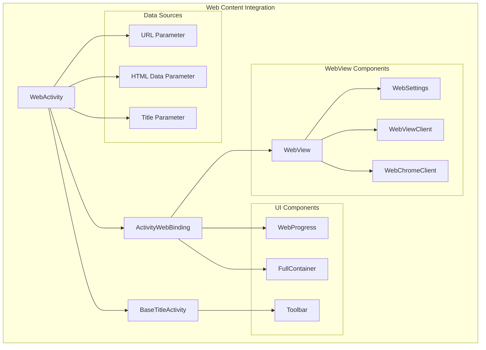
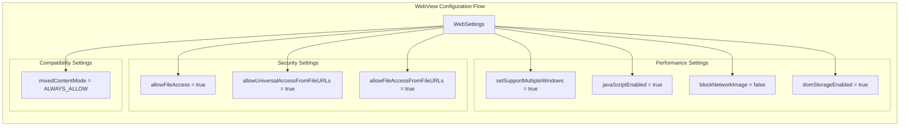
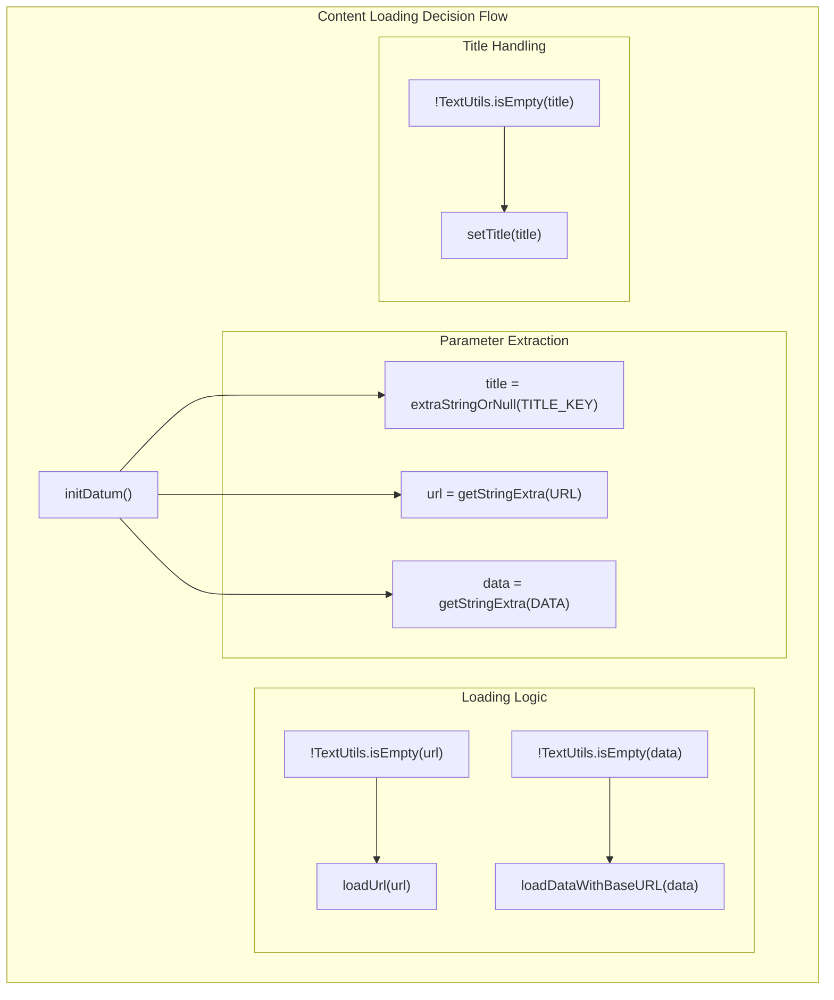
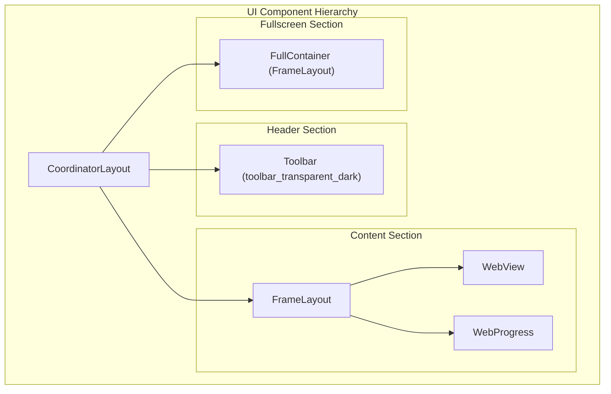
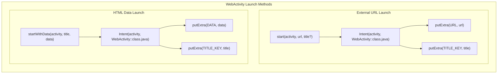
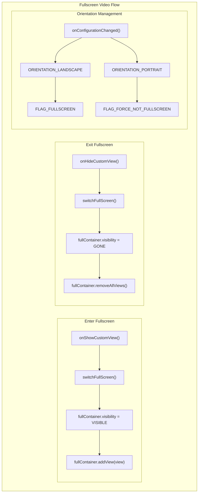

# Web Content Integration

<details>
<summary>Relevant source files</summary>

The following files were used as context for generating this wiki page:

- [.idea/misc.xml](.idea/misc.xml)
- [app/src/main/java/com/suzhe/playdemo/base/activity/WebActivity.kt](app/src/main/java/com/suzhe/playdemo/base/activity/WebActivity.kt)
- [app/src/main/java/com/suzhe/playdemo/utils/Constants.kt](app/src/main/java/com/suzhe/playdemo/utils/Constants.kt)
- [app/src/main/res/layout/activity_web.xml](app/src/main/res/layout/activity_web.xml)

</details>

## Purpose and Scope

This document covers the web content integration system in the PlayDemo application, specifically
focusing on the `WebActivity` class and its supporting components. This system provides a
comprehensive WebView-based solution for displaying web content, handling both external URLs and
inline HTML data. The web content integration supports fullscreen video playback, progress tracking,
and seamless navigation within the app's demo framework.

For information about the overall UI component patterns, see [UI Components and Patterns](#5). For
details about the main navigation system that launches web content,
see [Main Navigation System](#3.2).

## WebActivity Architecture

The web content integration system is built around the `WebActivity` class, which serves as a
comprehensive WebView wrapper with enhanced functionality for the demo application.



**WebActivity System Architecture**

The `WebActivity` extends `BaseTitleActivity` and provides a complete web content viewing solution
with the following key characteristics:

- **Inheritance Structure**: Extends `BaseTitleActivity<ActivityWebBinding>` for consistent toolbar
  and title management
- **WebView Integration**: Comprehensive WebView configuration with security and performance
  optimizations
- **Dual Content Modes**: Supports both external URL loading and inline HTML data display
- **Enhanced User Experience**: Includes progress tracking, fullscreen video support, and adaptive
  orientation handling

**Sources**: [app/src/main/java/com/suzhe/playdemo/base/activity/WebActivity.kt:23-24]()

## WebView Configuration

The WebActivity implements extensive WebView configuration to ensure optimal performance, security,
and compatibility across different Android versions.



**WebView Configuration Process**

The WebView configuration is established in the `initViews()` method with the following key
settings:

| Configuration    | Purpose                         | Code Reference                                                           |
|------------------|---------------------------------|--------------------------------------------------------------------------|
| File Access      | Enables access to local files   | [app/src/main/java/com/suzhe/playdemo/base/activity/WebActivity.kt:32]() |
| JavaScript       | Enables JavaScript execution    | [app/src/main/java/com/suzhe/playdemo/base/activity/WebActivity.kt:38]() |
| Multiple Windows | Supports popup windows          | [app/src/main/java/com/suzhe/playdemo/base/activity/WebActivity.kt:35]() |
| DOM Storage      | Enables HTML5 local storage     | [app/src/main/java/com/suzhe/playdemo/base/activity/WebActivity.kt:50]() |
| Mixed Content    | Allows HTTP/HTTPS mixed content | [app/src/main/java/com/suzhe/playdemo/base/activity/WebActivity.kt:54]() |

**Sources**: [app/src/main/java/com/suzhe/playdemo/base/activity/WebActivity.kt:29-55]()

## Content Loading Modes

The WebActivity supports two distinct content loading modes, determined by the intent parameters
passed during activity launch.



**Content Loading Modes**

### URL Loading Mode

When a URL parameter is provided, the WebActivity loads external web content:

- **Parameter**: `Constants.URL`
- **Method**: `binding.web.loadUrl(url!!)`
- **Use Case**: Loading external websites, documentation, or web-based demos

### Data Loading Mode

When HTML data is provided directly, the WebActivity renders inline content:

- **Parameter**: `Constants.DATA`
- **Method**: `binding.web.loadDataWithBaseURL(null, data!!, "text/html", "utf-8", null)`
- **Use Case**: Displaying formatted text, help content, or dynamically generated HTML

**Sources
**: [app/src/main/java/com/suzhe/playdemo/base/activity/WebActivity.kt:114-132](), [app/src/main/java/com/suzhe/playdemo/utils/Constants.kt:11](), [app/src/main/java/com/suzhe/playdemo/utils/Constants.kt:8]()

## User Interface Components

The WebActivity layout provides a comprehensive user interface optimized for web content display
with progress tracking and fullscreen video support.



**UI Component Structure**

The layout implements a `CoordinatorLayout` as the root container with three main sections:

| Component                  | Purpose                      | Visibility        | Reference                                          |
|----------------------------|------------------------------|-------------------|----------------------------------------------------|
| `toolbar_transparent_dark` | Navigation and title display | Always visible    | [app/src/main/res/layout/activity_web.xml:8]()     |
| `WebView`                  | Primary web content display  | Always visible    | [app/src/main/res/layout/activity_web.xml:17-20]() |
| `WebProgress`              | Loading progress indicator   | Hidden by default | [app/src/main/res/layout/activity_web.xml:22-26]() |
| `FullContainer`            | Fullscreen video container   | Hidden by default | [app/src/main/res/layout/activity_web.xml:29-33]() |

The progress bar is configured with a custom color in the activity:
`binding.progress.setColor(getColor(R.color.light_blue_900))`

**Sources
**: [app/src/main/res/layout/activity_web.xml:1-34](), [app/src/main/java/com/suzhe/playdemo/base/activity/WebActivity.kt:111]()

## Navigation Integration

The WebActivity integrates with the application's navigation system through static factory methods
that provide type-safe launching mechanisms.



**Static Launch Methods**

The WebActivity provides two static methods for launching web content:

### URL Launch Method

```kotlin
WebActivity.start(activity: Activity, url: String, title: String? = null)
```

- **Required**: `activity` context and `url` string
- **Optional**: `title` for custom toolbar text
- **Intent Extras**: `Constants.URL` and optionally `Constants.TITLE_KEY`

### Data Launch Method

```kotlin
WebActivity.startWithData(activity: Activity, title: String, data: String)
```

- **Required**: `activity` context, `title`, and HTML `data` string
- **Intent Extras**: `Constants.TITLE_KEY` and `Constants.DATA`

These methods ensure type safety and provide clear documentation of required parameters for
launching web content from anywhere in the application.

**Sources
**: [app/src/main/java/com/suzhe/playdemo/base/activity/WebActivity.kt:174-188](), [app/src/main/java/com/suzhe/playdemo/base/activity/WebActivity.kt:197-203]()

## Video and Fullscreen Support

The WebActivity implements comprehensive fullscreen video support through custom WebChromeClient
callbacks and orientation management.



**Fullscreen Video Implementation**

The fullscreen video support is implemented through WebChromeClient callbacks:

### Enter Fullscreen Sequence

1. `onShowCustomView()` is triggered when HTML5 video requests fullscreen
2. `switchFullScreen()` changes device orientation to landscape
3. Custom view is added to `fullContainer` FrameLayout
4. Container visibility is set to `View.VISIBLE`

### Exit Fullscreen Sequence

1. `onHideCustomView()` is triggered when fullscreen is exited
2. `switchFullScreen()` returns device orientation to portrait
3. All views are removed from `fullContainer`
4. Container visibility is set to `View.GONE`

### Orientation Management

The `onConfigurationChanged()` method handles window flags based on orientation:

- **Landscape**: Adds `FLAG_FULLSCREEN`, removes `FLAG_FORCE_NOT_FULLSCREEN`
- **Portrait**: Adds `FLAG_FORCE_NOT_FULLSCREEN`, removes `FLAG_FULLSCREEN`

**Sources
**: [app/src/main/java/com/suzhe/playdemo/base/activity/WebActivity.kt:92-107](), [app/src/main/java/com/suzhe/playdemo/base/activity/WebActivity.kt:134-142](), [app/src/main/java/com/suzhe/playdemo/base/activity/WebActivity.kt:144-157]()