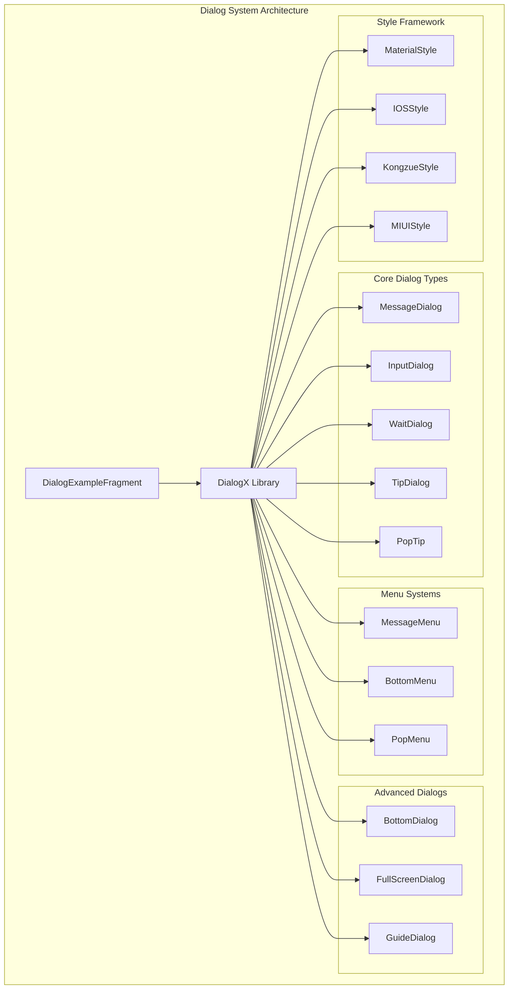
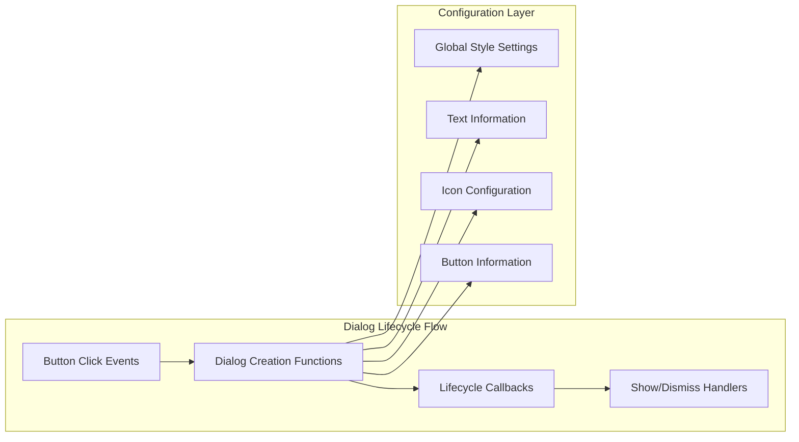
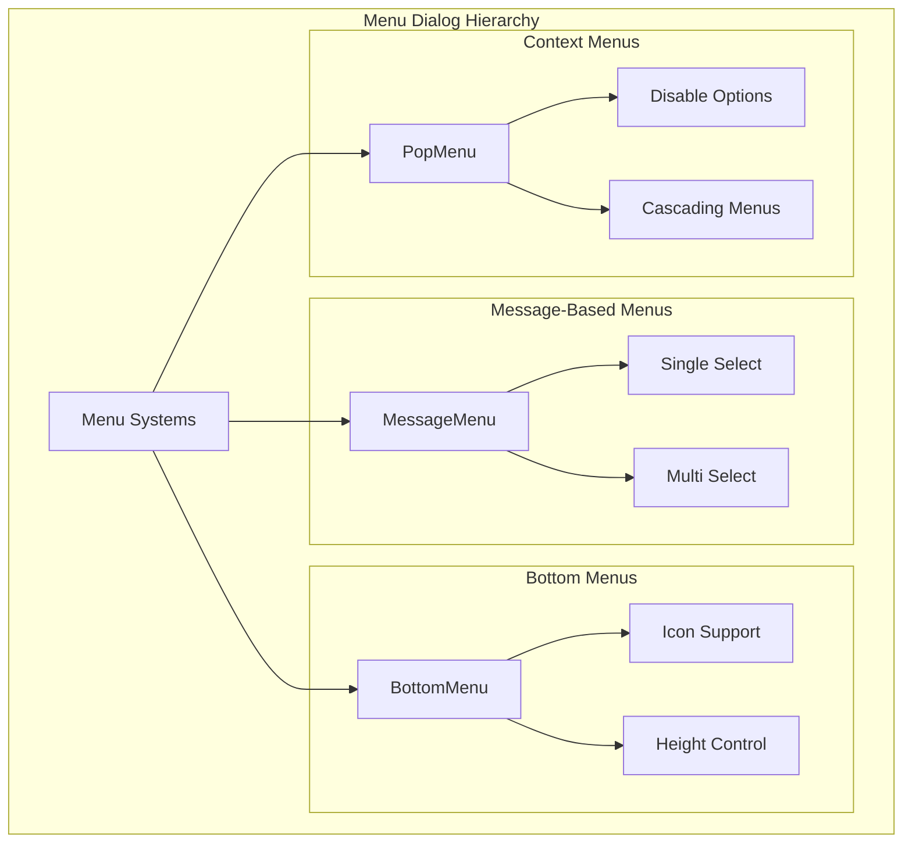
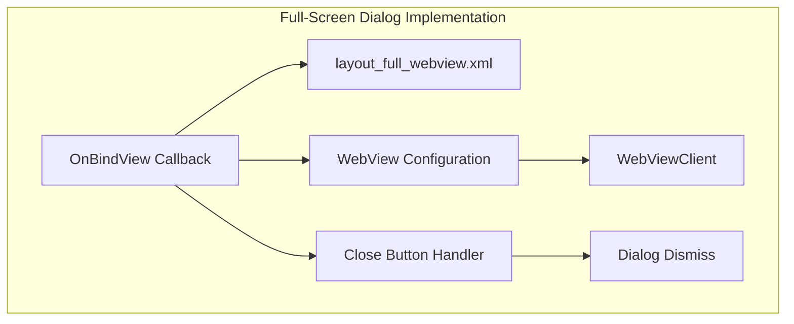
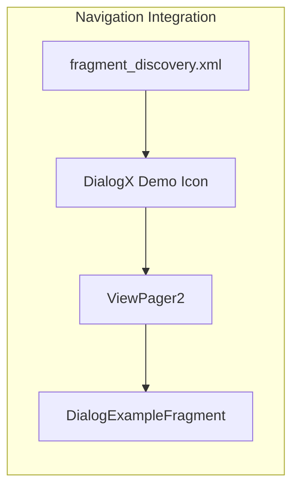

# Dialog and Popup System

Relevant source files

The following files were used as context for generating this wiki page:

- [app/src/main/java/com/suzhe/playdemo/component/dialogX/DialogExampleFragment.kt](app/src/main/java/com/suzhe/playdemo/component/dialogX/DialogExampleFragment.kt)
- [app/src/main/java/com/suzhe/playdemo/component/test/TestFragment.kt](app/src/main/java/com/suzhe/playdemo/component/test/TestFragment.kt)
- [app/src/main/res/drawable/logo.webp](app/src/main/res/drawable/logo.webp)
- [app/src/main/res/drawable/skin.webp](app/src/main/res/drawable/skin.webp)
- [app/src/main/res/layout/fragment_discovery.xml](app/src/main/res/layout/fragment_discovery.xml)
- [app/src/main/res/layout/fragment_test.xml](app/src/main/res/layout/fragment_test.xml)
- [app/src/main/res/layout/layout_full_webview.xml](app/src/main/res/layout/layout_full_webview.xml)

This document covers the comprehensive dialog and popup management system used throughout the
PlayDemo application. The system is built around the DialogX library and provides a centralized
demonstration of various dialog types, styles, and interaction patterns.

For web content integration within dialogs, see [Web Content Integration](#5.1). For general UI
component patterns, see [Custom Views and Utilities](#5.4).

## Purpose and Scope

The dialog system in PlayDemo serves as both a functional component and an educational showcase. It
demonstrates the implementation of various dialog types using the DialogX library, including message
dialogs, input dialogs, menus, tips, and custom full-screen dialogs. The system supports multiple
visual styles and provides examples of complex dialog interactions.

## System Architecture

The dialog system is centralized in `DialogExampleFragment`, which serves as a comprehensive
demonstration hub for all dialog functionality available in the application.

**
Sources: ** [app/src/main/java/com/suzhe/playdemo/component/dialogX/DialogExampleFragment.kt:1-562](https://github.com/SuZhelevel6/PlayDemo/blob/a2338414/app/src/main/java/com/suzhe/playdemo/component/dialogX/DialogExampleFragment.kt#L1-L562)

## DialogX Integration

The application integrates the DialogX library as its primary dialog framework, providing a unified
API for all dialog interactions. The integration supports global style configuration and lifecycle
management.

### Core Dialog Implementation

The `DialogExampleFragment` demonstrates the complete dialog lifecycle through button click handlers
that create, configure, and show various dialog types.

**
Sources: ** [app/src/main/java/com/suzhe/playdemo/component/dialogX/DialogExampleFragment.kt:48-522](https://github.com/SuZhelevel6/PlayDemo/blob/a2338414/app/src/main/java/com/suzhe/playdemo/component/dialogX/DialogExampleFragment.kt#L48-L522)

## Dialog Types and Implementation

### Message and Selection Dialogs

The system implements standard message dialogs with support for custom buttons, titles, and content.
Selection dialogs extend this functionality with single and multi-select capabilities.

| Dialog Type      | Purpose                  | Key Features                            |
|------------------|--------------------------|-----------------------------------------|
| `MessageDialog`  | Basic message display    | Title, message, up to 3 buttons         |
| Selection Dialog | User choice confirmation | Vertical button layout, colored actions |
| `InputDialog`    | Text input collection    | Validation, placeholder text            |

**
Sources: ** [app/src/main/java/com/suzhe/playdemo/component/dialogX/DialogExampleFragment.kt:71-141](https://github.com/SuZhelevel6/PlayDemo/blob/a2338414/app/src/main/java/com/suzhe/playdemo/component/dialogX/DialogExampleFragment.kt#L71-L141)

### Menu Systems

The application implements three distinct menu dialog types for different interaction patterns:

**
Sources: ** [app/src/main/java/com/suzhe/playdemo/component/dialogX/DialogExampleFragment.kt:143-494](https://github.com/SuZhelevel6/PlayDemo/blob/a2338414/app/src/main/java/com/suzhe/playdemo/component/dialogX/DialogExampleFragment.kt#L143-L494)

### Progress and Status Dialogs

The system provides comprehensive progress indication and status notification through specialized
dialog types:

- `WaitDialog`: Loading indicators with optional progress bars
- `TipDialog`: Success, warning, and error notifications
- `PopTip`: Lightweight toast-style notifications

**
Sources: ** [app/src/main/java/com/suzhe/playdemo/component/dialogX/DialogExampleFragment.kt:189-307](https://github.com/SuZhelevel6/PlayDemo/blob/a2338414/app/src/main/java/com/suzhe/playdemo/component/dialogX/DialogExampleFragment.kt#L189-L307)

### Advanced Dialog Types

#### Full-Screen Web Dialog

The application implements custom full-screen dialogs for web content display using a dedicated
layout file.

**
Sources: ** [app/src/main/java/com/suzhe/playdemo/component/dialogX/DialogExampleFragment.kt:426-466](https://github.com/SuZhelevel6/PlayDemo/blob/a2338414/app/src/main/java/com/suzhe/playdemo/component/dialogX/DialogExampleFragment.kt#L426-L466), [app/src/main/res/layout/layout_full_webview.xml:1-35](https://github.com/SuZhelevel6/PlayDemo/blob/a2338414/app/src/main/res/layout/layout_full_webview.xml#L1-L35)

#### Guide Dialogs

Guide dialogs provide user onboarding and feature highlighting with stage lighting effects:

- General guide overlays
- Target-specific highlighting (circular and rectangular)
- Interactive stage light areas

**
Sources: ** [app/src/main/java/com/suzhe/playdemo/component/dialogX/DialogExampleFragment.kt:496-521](https://github.com/SuZhelevel6/PlayDemo/blob/a2338414/app/src/main/java/com/suzhe/playdemo/component/dialogX/DialogExampleFragment.kt#L496-L521)

## Style System

The dialog system supports four distinct visual styles with dynamic switching capabilities:

| Style           | Description                    | Cancel Button Text |
|-----------------|--------------------------------|--------------------|
| `MaterialStyle` | Material Design compliance     | Empty string       |
| `IOSStyle`      | iOS native appearance          | "取消"               |
| `KongzueStyle`  | Custom Kongzue framework style | "取消"               |
| `MIUIStyle`     | MIUI system style              | "取消"               |

The style switching is implemented through global configuration methods that update both the visual
appearance and default button text.

**
Sources: ** [app/src/main/java/com/suzhe/playdemo/component/dialogX/DialogExampleFragment.kt:525-551](https://github.com/SuZhelevel6/PlayDemo/blob/a2338414/app/src/main/java/com/suzhe/playdemo/component/dialogX/DialogExampleFragment.kt#L525-L551)

## Integration with Application Navigation

The dialog system integrates with the main application navigation through the discovery fragment,
which includes a dedicated DialogX demonstration icon and access point.

**
Sources: ** [app/src/main/res/layout/fragment_discovery.xml:69-74](https://github.com/SuZhelevel6/PlayDemo/blob/a2338414/app/src/main/res/layout/fragment_discovery.xml#L69-L74)

## Custom Dialog Layouts

The system supports custom dialog layouts through the `OnBindView` interface, enabling complex UI
implementations within dialog containers. This is demonstrated in the full-screen web dialog
implementation, which provides a complete WebView interface with navigation controls.

**
Sources: ** [app/src/main/res/layout/layout_full_webview.xml:1-35](https://github.com/SuZhelevel6/PlayDemo/blob/a2338414/app/src/main/res/layout/layout_full_webview.xml#L1-L35)