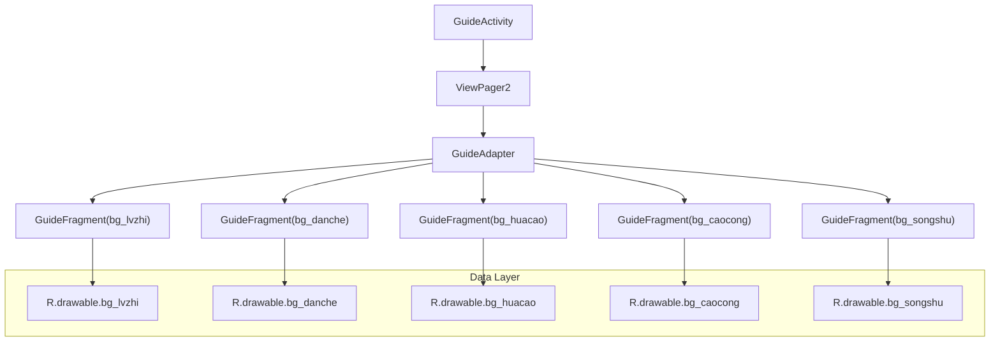
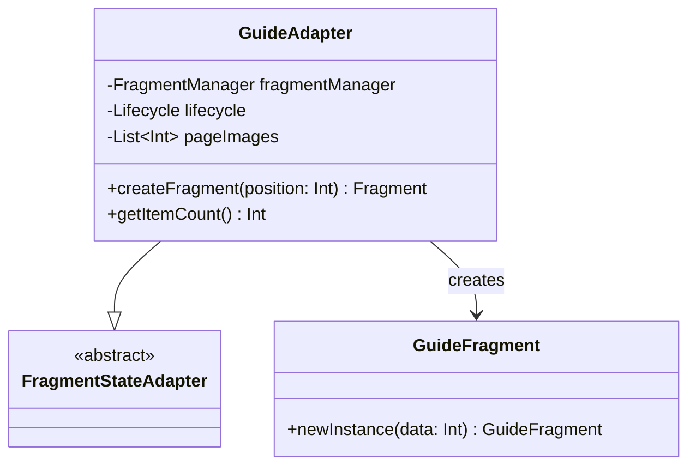
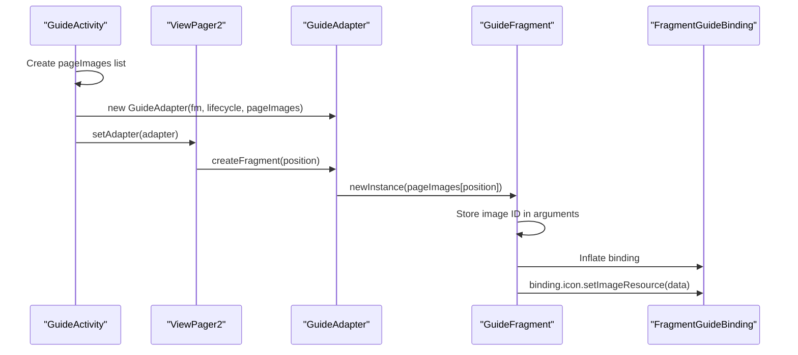

# Guide and Onboarding

Relevant source files

The following files were used as context for generating this wiki page:

- [app/src/main/java/com/suzhe/playdemo/component/guid/GuideActivity.kt](app/src/main/java/com/suzhe/playdemo/component/guid/GuideActivity.kt)
- [app/src/main/java/com/suzhe/playdemo/component/guid/GuideAdapter.kt](app/src/main/java/com/suzhe/playdemo/component/guid/GuideAdapter.kt)
- [app/src/main/java/com/suzhe/playdemo/component/guid/GuideFragment.kt](app/src/main/java/com/suzhe/playdemo/component/guid/GuideFragment.kt)
- [app/src/main/res/drawable/bg_caocong.png](app/src/main/res/drawable/bg_caocong.png)
- [app/src/main/res/drawable/bg_danche.png](app/src/main/res/drawable/bg_danche.png)
- [app/src/main/res/drawable/bg_huacao.png](app/src/main/res/drawable/bg_huacao.png)
- [app/src/main/res/drawable/bg_lvzhi.png](app/src/main/res/drawable/bg_lvzhi.png)
- [app/src/main/res/drawable/bg_songshu.png](app/src/main/res/drawable/bg_songshu.png)

This document covers the guide and onboarding system implementation in the PlayDemo application. The
system provides a simple image-based tutorial flow using ViewPager2 and fragments to display
sequential guide pages to users.

For information about dialog-based onboarding flows, see [Dialog and Popup System](#5.2). For
web-based content presentation, see [Web Content Integration](#5.1).

## System Overview

The guide system consists of a ViewPager2-based slideshow that displays a series of images as
tutorial pages. The implementation follows a standard Android fragment-based architecture with a
FragmentStateAdapter managing individual guide fragments.

## Architecture

The guide system uses a three-tier architecture with the activity hosting a ViewPager2, an adapter
managing fragment creation, and individual fragments displaying content:

Sources: [app/src/main/java/com/suzhe/playdemo/component/guid/GuideActivity.kt:8-36](https://github.com/SuZhelevel6/PlayDemo/blob/a2338414/app/src/main/java/com/suzhe/playdemo/component/guid/GuideActivity.kt#L8-L36), [app/src/main/java/com/suzhe/playdemo/component/guid/GuideAdapter.kt:9-21](https://github.com/SuZhelevel6/PlayDemo/blob/a2338414/app/src/main/java/com/suzhe/playdemo/component/guid/GuideAdapter.kt#L9-L21), [app/src/main/java/com/suzhe/playdemo/component/guid/GuideFragment.kt:12-51](https://github.com/SuZhelevel6/PlayDemo/blob/a2338414/app/src/main/java/com/suzhe/playdemo/component/guid/GuideFragment.kt#L12-L51)

## Core Components

### GuideActivity

The `GuideActivity` serves as the main entry point for the guide system. It initializes the
ViewPager2 and sets up the image data source:

| Component       | Purpose                   | Key Implementation                                          |
|-----------------|---------------------------|-------------------------------------------------------------|
| ViewPager2      | Container for guide pages | findViewById<ViewPager2>(R.id.viewPager)                    |
| pageImages List | Image resource collection | listOf(R.drawable.bg_lvzhi, ...)                            |
| GuideAdapter    | Fragment management       | GuideAdapter(supportFragmentManager, lifecycle, pageImages) |

The activity creates a hardcoded list of five drawable resources representing different guide pages.
Each drawable appears to be a nature-themed background image.

Sources: [app/src/main/java/com/suzhe/playdemo/component/guid/GuideActivity.kt:11-35](https://github.com/SuZhelevel6/PlayDemo/blob/a2338414/app/src/main/java/com/suzhe/playdemo/component/guid/GuideActivity.kt#L11-L35)

### GuideAdapter

The `GuideAdapter` extends `FragmentStateAdapter` and manages fragment lifecycle for the ViewPager2:

The adapter's core responsibilities:

- **Fragment Creation**: `createFragment()` method instantiates `GuideFragment` with image resource
  ID
- **Count Management**: `getItemCount()` returns the size of the pageImages list
- **Resource Passing**: Passes drawable resource IDs to individual fragments

Sources: [app/src/main/java/com/suzhe/playdemo/component/guid/GuideAdapter.kt:9-21](https://github.com/SuZhelevel6/PlayDemo/blob/a2338414/app/src/main/java/com/suzhe/playdemo/component/guid/GuideAdapter.kt#L9-L21)

### GuideFragment

Each `GuideFragment` displays a single image using view binding. The fragment follows the standard
Android fragment pattern with proper lifecycle management:

| Method          | Purpose        | Implementation Detail                                     |
|-----------------|----------------|-----------------------------------------------------------|
| newInstance()   | Factory method | Creates fragment with Bundle containing image resource ID |
| onCreateView()  | View setup     | Inflates FragmentGuideBinding and sets image resource     |
| onDestroyView() | Cleanup        | Nullifies binding reference                               |

The fragment retrieves the image resource ID from its arguments bundle and applies it to an
ImageView through the binding.

Sources: [app/src/main/java/com/suzhe/playdemo/component/guid/GuideFragment.kt:22-49](https://github.com/SuZhelevel6/PlayDemo/blob/a2338414/app/src/main/java/com/suzhe/playdemo/component/guid/GuideFragment.kt#L22-L49)

## Data Flow

The guide system follows a simple data flow pattern from static resources to displayed content:

Sources: [app/src/main/java/com/suzhe/playdemo/component/guid/GuideActivity.kt:19-35](https://github.com/SuZhelevel6/PlayDemo/blob/a2338414/app/src/main/java/com/suzhe/playdemo/component/guid/GuideActivity.kt#L19-L35), [app/src/main/java/com/suzhe/playdemo/component/guid/GuideAdapter.kt:14-16](https://github.com/SuZhelevel6/PlayDemo/blob/a2338414/app/src/main/java/com/suzhe/playdemo/component/guid/GuideAdapter.kt#L14-L16), [app/src/main/java/com/suzhe/playdemo/component/guid/GuideFragment.kt:42-48](https://github.com/SuZhelevel6/PlayDemo/blob/a2338414/app/src/main/java/com/suzhe/playdemo/component/guid/GuideFragment.kt#L42-L48), [app/src/main/java/com/suzhe/playdemo/component/guid/GuideFragment.kt:29-31](https://github.com/SuZhelevel6/PlayDemo/blob/a2338414/app/src/main/java/com/suzhe/playdemo/component/guid/GuideFragment.kt#L29-L31)

## Resource Management

The guide system uses five PNG drawable resources as background images:

| Resource              | File           | Purpose                      |
|-----------------------|----------------|------------------------------|
| R.drawable.bg_lvzhi   | bg_lvzhi.png   | First guide page background  |
| R.drawable.bg_danche  | bg_danche.png  | Second guide page background |
| R.drawable.bg_huacao  | bg_huacao.png  | Third guide page background  |
| R.drawable.bg_caocong | bg_caocong.png | Fourth guide page background |
| R.drawable.bg_songshu | bg_songshu.png | Fifth guide page background  |

The images appear to be nature-themed illustrations that likely represent different concepts or
features being introduced in the guide flow.

Sources: [app/src/main/java/com/suzhe/playdemo/component/guid/GuideActivity.kt:19-25](https://github.com/SuZhelevel6/PlayDemo/blob/a2338414/app/src/main/java/com/suzhe/playdemo/component/guid/GuideActivity.kt#L19-L25), [app/src/main/res/drawable/bg_lvzhi.png:1](https://github.com/SuZhelevel6/PlayDemo/blob/a2338414/app/src/main/res/drawable/bg_lvzhi.png#L1), [app/src/main/res/drawable/bg_danche.png:1](https://github.com/SuZhelevel6/PlayDemo/blob/a2338414/app/src/main/res/drawable/bg_danche.png#L1), [app/src/main/res/drawable/bg_huacao.png:1](https://github.com/SuZhelevel6/PlayDemo/blob/a2338414/app/src/main/res/drawable/bg_huacao.png#L1), [app/src/main/res/drawable/bg_caocong.png:1](https://github.com/SuZhelevel6/PlayDemo/blob/a2338414/app/src/main/res/drawable/bg_caocong.png#L1), [app/src/main/res/drawable/bg_songshu.png:1](https://github.com/SuZhelevel6/PlayDemo/blob/a2338414/app/src/main/res/drawable/bg_songshu.png#L1)

## Integration Points

The guide system is self-contained within the `com.suzhe.playdemo.component.guid` package and has
minimal external dependencies:

- **Android Framework**: ViewPager2, Fragment, FragmentStateAdapter
- **View Binding**: Uses `FragmentGuideBinding` for view access
- **Logging**: Integrates with LogUtils for debug logging in fragment lifecycle

The system can be launched as a standalone activity and does not appear to integrate directly with
the main application navigation flow, making it suitable for first-time user onboarding scenarios.

Sources: [app/src/main/java/com/suzhe/playdemo/component/guid/GuideFragment.kt:8-9](https://github.com/SuZhelevel6/PlayDemo/blob/a2338414/app/src/main/java/com/suzhe/playdemo/component/guid/GuideFragment.kt#L8-L9), [app/src/main/java/com/suzhe/playdemo/component/guid/GuideFragment.kt:19](https://github.com/SuZhelevel6/PlayDemo/blob/a2338414/app/src/main/java/com/suzhe/playdemo/component/guid/GuideFragment.kt#L19)