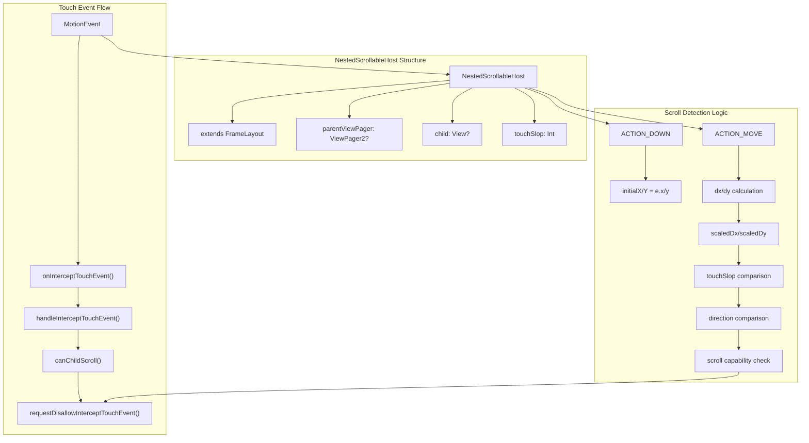
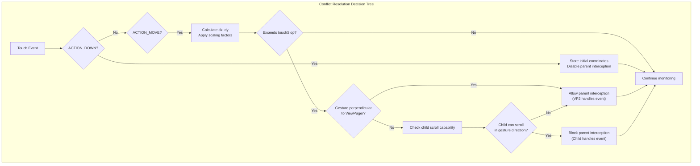
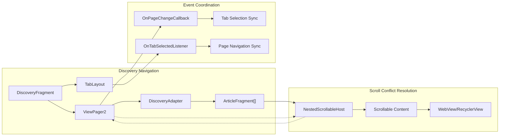
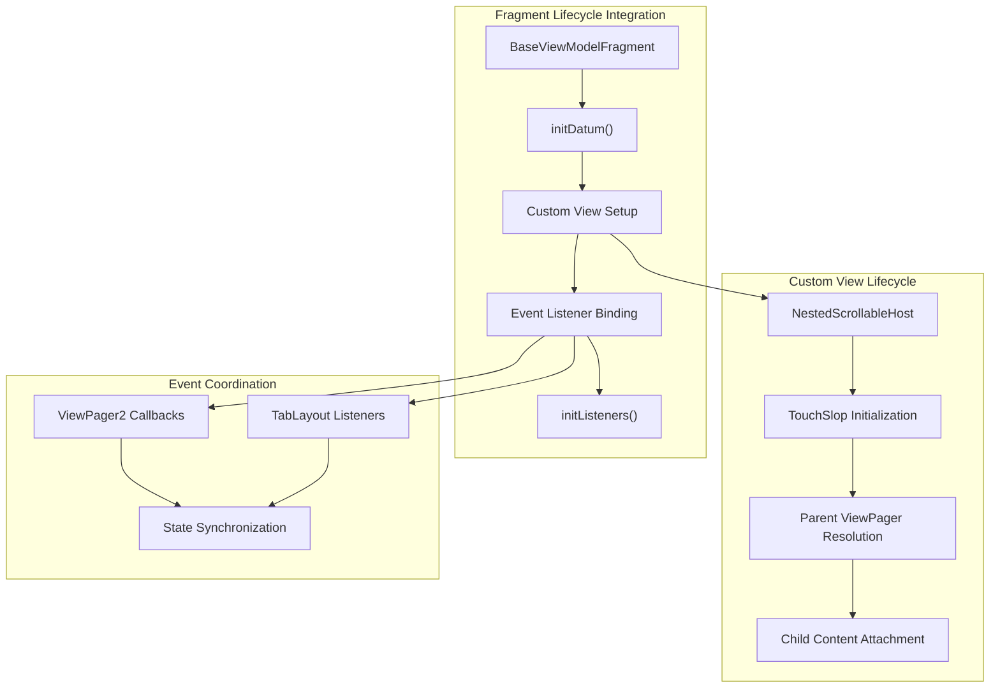

# Custom Views and Utilities

<details>
<summary>Relevant source files</summary>

The following files were used as context for generating this wiki page:

- [app/src/main/java/com/suzhe/playdemo/component/discovery/DiscoveryAdapter.kt](app/src/main/java/com/suzhe/playdemo/component/discovery/DiscoveryAdapter.kt)
- [app/src/main/java/com/suzhe/playdemo/component/discovery/DiscoveryFragment.kt](app/src/main/java/com/suzhe/playdemo/component/discovery/DiscoveryFragment.kt)
- [app/src/main/java/com/suzhe/playdemo/view/NestedScrollableHost.kt](app/src/main/java/com/suzhe/playdemo/view/NestedScrollableHost.kt)
- [app/src/main/res/drawable/github.png](app/src/main/res/drawable/github.png)
- [app/src/main/res/drawable/shape_edit_text_surface.xml](app/src/main/res/drawable/shape_edit_text_surface.xml)
- [app/src/main/res/layout/layout_custom_view.xml](app/src/main/res/layout/layout_custom_view.xml)

</details>


This document covers the custom view implementations, utility classes, and reusable UI components
developed specifically for the PlayDemo application. These components provide enhanced functionality
for handling complex UI scenarios such as scroll conflicts, custom layouts, and specialized view
behaviors.

For information about dialog and popup systems, see [Dialog and Popup System](#5.2). For details
about web content integration, see [Web Content Integration](#5.1).

## Overview

The PlayDemo application includes several custom view implementations designed to solve specific UI
challenges, particularly around scroll conflict resolution and enhanced user experience patterns.
The primary custom view is `NestedScrollableHost`, which addresses scroll conflicts in ViewPager2
scenarios.

## Nested Scroll Conflict Resolution

### NestedScrollableHost Implementation

The `NestedScrollableHost` class provides a solution for handling scroll conflicts between
ViewPager2 and nested scrollable components that scroll in the same direction.



**Touch Event Handling Architecture**

The `NestedScrollableHost` implements a sophisticated touch event interception system based on the
internal interception pattern.

| Component                     | Purpose                           | Implementation                                                              |
|-------------------------------|-----------------------------------|-----------------------------------------------------------------------------|
| `onInterceptTouchEvent()`     | Entry point for touch events      | [app/src/main/java/com/suzhe/playdemo/view/NestedScrollableHost.kt:54-57]() |
| `handleInterceptTouchEvent()` | Core conflict resolution logic    | [app/src/main/java/com/suzhe/playdemo/view/NestedScrollableHost.kt:62-99]() |
| `canChildScroll()`            | Child scroll capability detection | [app/src/main/java/com/suzhe/playdemo/view/NestedScrollableHost.kt:45-52]() |
| `parentViewPager`             | ViewPager2 reference resolution   | [app/src/main/java/com/suzhe/playdemo/view/NestedScrollableHost.kt:30-37]() |

### Scroll Conflict Algorithm

The scroll conflict resolution algorithm operates through several phases:

1. **Parent ViewPager Detection**: Traverses the view hierarchy to locate the containing ViewPager2
2. **Child Scroll Capability Assessment**: Determines if the immediate child can scroll in the
   ViewPager's orientation
3. **Touch Direction Analysis**: Uses scaled sensitivity to distinguish between primary and
   secondary scroll directions
4. **Dynamic Interception Control**: Modifies parent interception behavior based on scroll
   capability and direction



**Sources**: [app/src/main/java/com/suzhe/playdemo/view/NestedScrollableHost.kt:62-99]()

## Integration with Navigation System

### ViewPager2 Integration Pattern

The `NestedScrollableHost` is specifically designed to work within the application's navigation
system, particularly with the `DiscoveryFragment` and its tabbed interface.



**ViewPager2 and TabLayout Synchronization**

The navigation system maintains synchronization between ViewPager2 page changes and TabLayout
selections through callback mechanisms.

**Sources
**: [app/src/main/java/com/suzhe/playdemo/component/discovery/DiscoveryFragment.kt:30-48](), [app/src/main/java/com/suzhe/playdemo/component/discovery/DiscoveryAdapter.kt:8-16]()

## Custom Layout Resources

### Layout Templates

The application includes custom layout templates for specialized UI patterns and testing scenarios.

| Layout Resource          | Purpose                        | Key Components                           |
|--------------------------|--------------------------------|------------------------------------------|
| `layout_custom_view.xml` | Custom layout testing template | ImageView, TextView with centered layout |

The custom layout template demonstrates a standard pattern used throughout the application for
creating reusable UI components with consistent styling and behavior.

```xml
<!-- Example structure from layout_custom_view.xml -->
RelativeLayout (root)
├── LinearLayout (centered container)
    ├── ImageView (icon display)
    └── TextView (descriptive text)
```

**Sources**: [app/src/main/res/layout/layout_custom_view.xml:1-30]()

### Custom Drawable Resources

The application utilizes custom drawable resources for enhanced visual presentation:

| Resource Type   | Example                       | Purpose                       |
|-----------------|-------------------------------|-------------------------------|
| Shape Drawables | `shape_edit_text_surface.xml` | EditText background styling   |
| Image Assets    | `github.png`                  | Platform-specific iconography |

The shape drawable resources follow a consistent pattern using theme-aware colors and standardized
corner radius values (`@dimen/d50`).

**Sources
**: [app/src/main/res/drawable/shape_edit_text_surface.xml:1-7](), [app/src/main/res/drawable/github.png:1-13]()

## Utility Integration Patterns

### Fragment State Management

Custom views integrate with the application's fragment-based architecture through standardized
patterns:



**Custom View Integration Points**

Custom views are integrated into the fragment lifecycle through specific initialization and event
binding patterns that ensure proper coordination with the overall application state management
system.

**Sources**: [app/src/main/java/com/suzhe/playdemo/component/discovery/DiscoveryFragment.kt:20-50]()

## Implementation Characteristics

### Technical Specifications

| Aspect                   | Implementation Details                                            |
|--------------------------|-------------------------------------------------------------------|
| **Inheritance Model**    | FrameLayout extension with touch event override                   |
| **Touch Sensitivity**    | ViewConfiguration.scaledTouchSlop for platform consistency        |
| **Direction Detection**  | Scaled sensitivity factors (0.5f/1.0f) for primary/secondary axes |
| **Parent Communication** | requestDisallowInterceptTouchEvent() for dynamic control          |
| **Child Limitations**    | Single immediate child requirement for optimal performance        |

### Performance Considerations

The `NestedScrollableHost` implementation includes several performance optimizations:

- Lazy parent ViewPager2 resolution to minimize hierarchy traversal
- Early return conditions for non-scrollable content scenarios
- Efficient direction calculation using sign-based comparisons
- Minimal state tracking with only essential coordinate storage

**Sources**: [app/src/main/java/com/suzhe/playdemo/view/NestedScrollableHost.kt:23-100]()