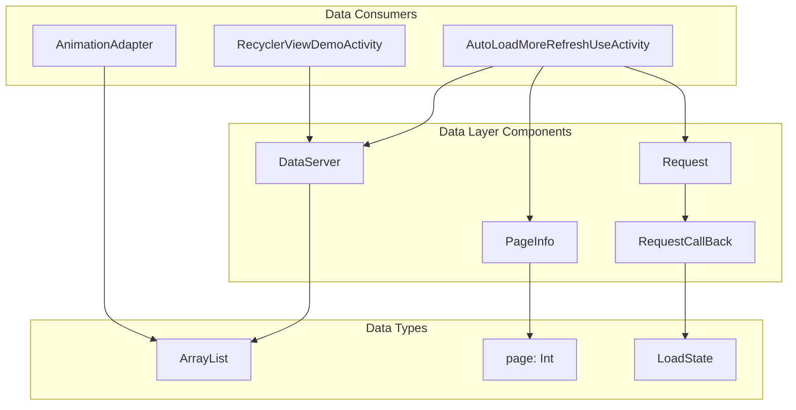
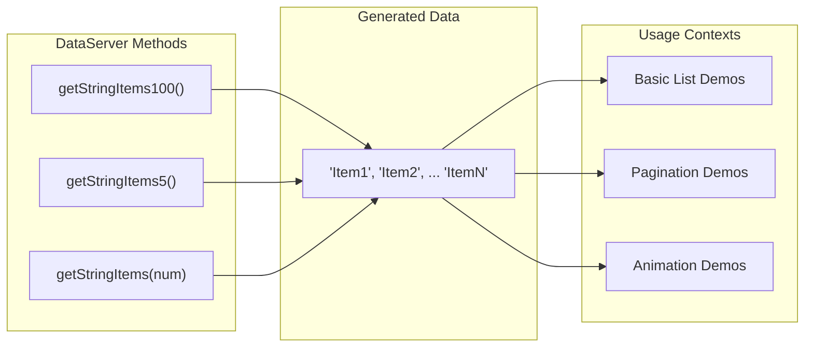
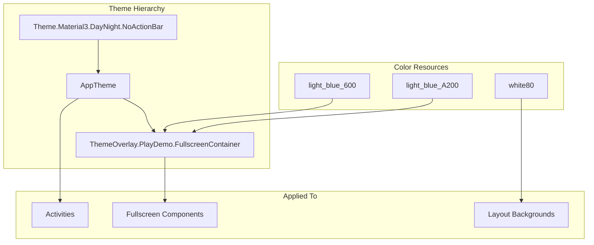
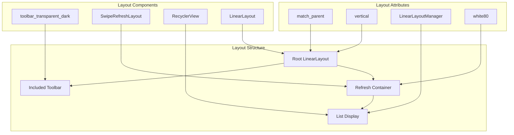

# Data and Resource Management

Relevant source files

The following files were used as context for generating this wiki page:

- [app/src/main/java/com/suzhe/playdemo/component/brvah/autoLoad/AutoLoadMoreRefreshUseActivity.kt](app/src/main/java/com/suzhe/playdemo/component/brvah/autoLoad/AutoLoadMoreRefreshUseActivity.kt)
- [app/src/main/java/com/suzhe/playdemo/data/DataServer.kt](app/src/main/java/com/suzhe/playdemo/data/DataServer.kt)
- [app/src/main/res/drawable/icon_load.png](app/src/main/res/drawable/icon_load.png)
- [app/src/main/res/layout/activity_auto_load_more_refresh_use.xml](app/src/main/res/layout/activity_auto_load_more_refresh_use.xml)
- [app/src/main/res/values/strings.xml](app/src/main/res/values/strings.xml)
- [app/src/main/res/values/themes.xml](app/src/main/res/values/themes.xml)

This page covers the data handling, resource management, theming, and backend systems that support
the PlayDemo demonstration application. The focus is on how mock data is served, resources are
organized, and application state is managed to enable the various BRVAH feature demonstrations.

For information about preference storage and application initialization,
see [App Initialization](#3.1). For details about specific data consumption patterns in BRVAH demos,
see [BRVAH Demo System](#4).

## Data Layer Architecture

The PlayDemo application uses a simplified data layer designed to support demonstration scenarios
rather than production data requirements. The system centers around the `DataServer` object which
provides mock data for various RecyclerView demonstrations.

**Data Layer Architecture**

The `DataServer` provides three primary methods for generating mock string data:
`getStringItems100()`, `getStringItems5()`, and `getStringItems(num: Int)`. These methods generate
sequential string items for testing various list scenarios.

Sources: [app/src/main/java/com/suzhe/playdemo/data/DataServer.kt:3-30](https://github.com/SuZhelevel6/PlayDemo/blob/a2338414/app/src/main/java/com/suzhe/playdemo/data/DataServer.kt#L3-L30)

## Mock Data System

The mock data system is implemented as a simple Kotlin object that generates predictable test data
for RecyclerView demonstrations.

| Method                     | Purpose                          | Return Type         |
|----------------------------|----------------------------------|---------------------|
| `getStringItems100()`      | Provides 100 test items          | `ArrayList<String>` |
| `getStringItems5()`        | Provides 5 test items            | `ArrayList<String>` |
| `getStringItems(num: Int)` | Provides variable count of items | `ArrayList<String>` |

The data format follows a simple pattern: "Item1", "Item2", etc., which makes it easy to verify
correct ordering and pagination in list demonstrations.

**Mock Data Generation and Usage**

Sources: [app/src/main/java/com/suzhe/playdemo/data/DataServer.kt:6-28](https://github.com/SuZhelevel6/PlayDemo/blob/a2338414/app/src/main/java/com/suzhe/playdemo/data/DataServer.kt#L6-L28)

## Pagination and State Management

The application demonstrates sophisticated pagination patterns through the `PageInfo` class and
associated request handling system. This system simulates real-world data loading scenarios
including network delays, loading failures, and end-of-data conditions.

The `PageInfo` class manages pagination state with three key methods:

- `nextPage()` - Increments the current page
- `reset()` - Resets to page 0 for refresh scenarios
- `isFirstPage` - Property indicating if currently on the first page

The mock request system in `AutoLoadMoreRefreshUseActivity` simulates realistic loading patterns:

- 800ms network delay simulation
- Intentional failure on page 3 to demonstrate error handling
- Progressive loading with configurable page sizes

Sources: [app/src/main/java/com/suzhe/playdemo/component/brvah/autoLoad/AutoLoadMoreRefreshUseActivity.kt:24-36](https://github.com/SuZhelevel6/PlayDemo/blob/a2338414/app/src/main/java/com/suzhe/playdemo/component/brvah/autoLoad/AutoLoadMoreRefreshUseActivity.kt#L24-L36), [app/src/main/java/com/suzhe/playdemo/component/brvah/autoLoad/AutoLoadMoreRefreshUseActivity.kt:138-162](https://github.com/SuZhelevel6/PlayDemo/blob/a2338414/app/src/main/java/com/suzhe/playdemo/component/brvah/autoLoad/AutoLoadMoreRefreshUseActivity.kt#L138-L162)

## Resource Management System

The resource management system follows standard Android patterns while providing specific
configurations for the demo application's needs.

### Theme System

The application uses Material Design 3 theming with a minimal configuration approach:

**Theme and Color Resource Structure**

The main `AppTheme` extends Material Design 3 with no action bar, while
`ThemeOverlay.PlayDemo.FullscreenContainer` provides specific styling for fullscreen presentations.

Sources: [app/src/main/res/values/themes.xml:1-10](https://github.com/SuZhelevel6/PlayDemo/blob/a2338414/app/src/main/res/values/themes.xml#L1-L10)

### String Resources

The string resource system includes localized application text and comprehensive terms of service
content:

| Resource Type  | Key Examples                                | Purpose           |
|----------------|---------------------------------------------|-------------------|
| App Labels     | `app_name`, `loading`, `error_load`         | Basic UI text     |
| User Agreement | `agree`, `disagree`, `term_service_privacy` | Legal compliance  |
| Network States | `error_network_not_connect`                 | Error messaging   |
| Copyright      | `copyright`                                 | Legal attribution |

The terms of service content is embedded as HTML within the string resources, including links to
external policy documents.

Sources: [app/src/main/res/values/strings.xml:1-44](https://github.com/SuZhelevel6/PlayDemo/blob/a2338414/app/src/main/res/values/strings.xml#L1-L44)

### Drawable Resources

The drawable system includes loading indicators and other UI assets. The `icon_load.png` serves as a
loading state indicator throughout the application.

Sources: [app/src/main/res/drawable/icon_load.png:1](https://github.com/SuZhelevel6/PlayDemo/blob/a2338414/app/src/main/res/drawable/icon_load.png#L1)

## Layout Resource Patterns

Layout resources follow consistent patterns that support the demo application's requirements:

**Layout Resource Composition Pattern**

The layout pattern demonstrates consistent structure across activities: root container, included
toolbar, refresh wrapper, and RecyclerView for content display.

Sources: [app/src/main/res/layout/activity_auto_load_more_refresh_use.xml:1-27](https://github.com/SuZhelevel6/PlayDemo/blob/a2338414/app/src/main/res/layout/activity_auto_load_more_refresh_use.xml#L1-L27)

## Integration with Application Components

The data and resource management systems integrate seamlessly with the application's component
architecture:

- `DataServer` provides consistent mock data across all BRVAH demonstrations
- Theme resources maintain visual consistency throughout the navigation system
- String resources support internationalization and legal compliance requirements
- Layout patterns enable consistent user experience across different demo activities

The `AutoLoadMoreRefreshUseActivity` exemplifies this integration by combining data serving, state
management, and resource utilization in a comprehensive demonstration of pagination functionality.

Sources: [app/src/main/java/com/suzhe/playdemo/component/brvah/autoLoad/AutoLoadMoreRefreshUseActivity.kt:22-184](https://github.com/SuZhelevel6/PlayDemo/blob/a2338414/app/src/main/java/com/suzhe/playdemo/component/brvah/autoLoad/AutoLoadMoreRefreshUseActivity.kt#L22-L184)