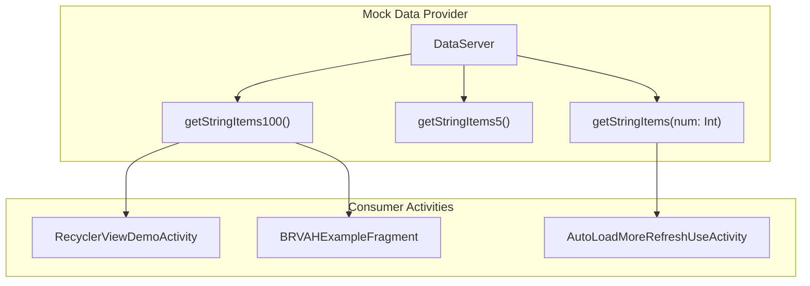
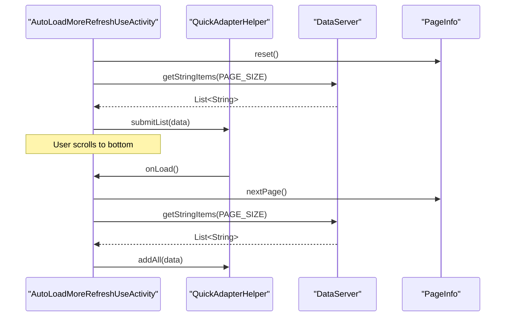
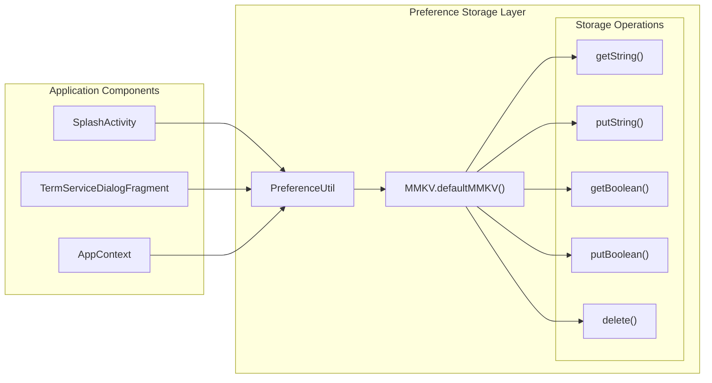
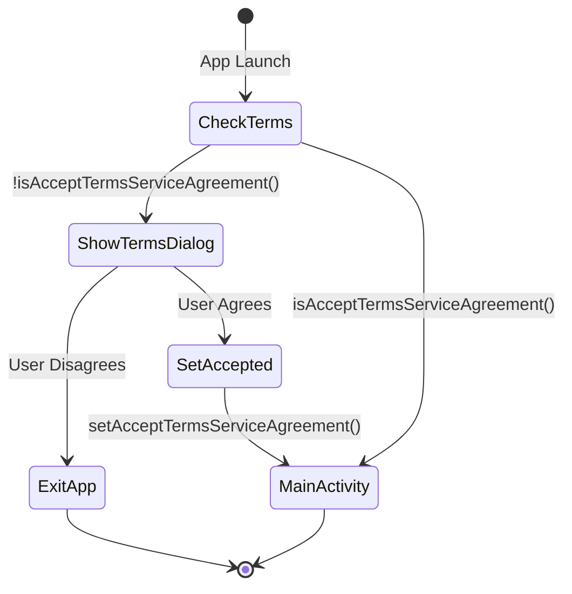
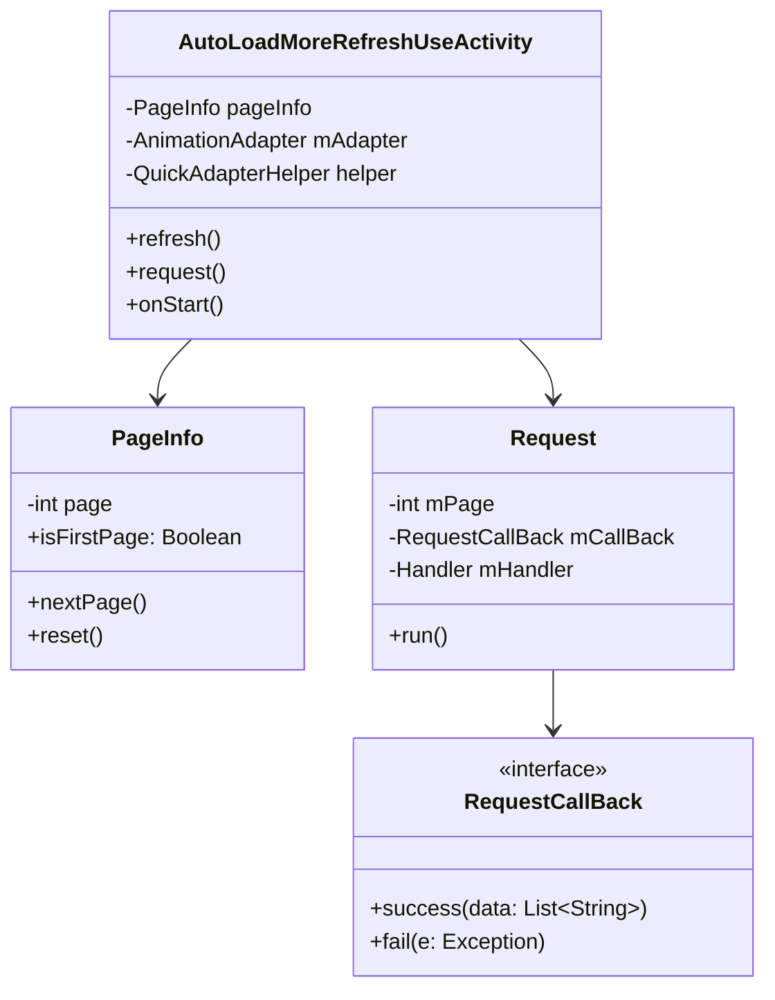
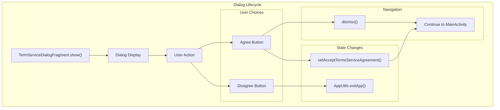
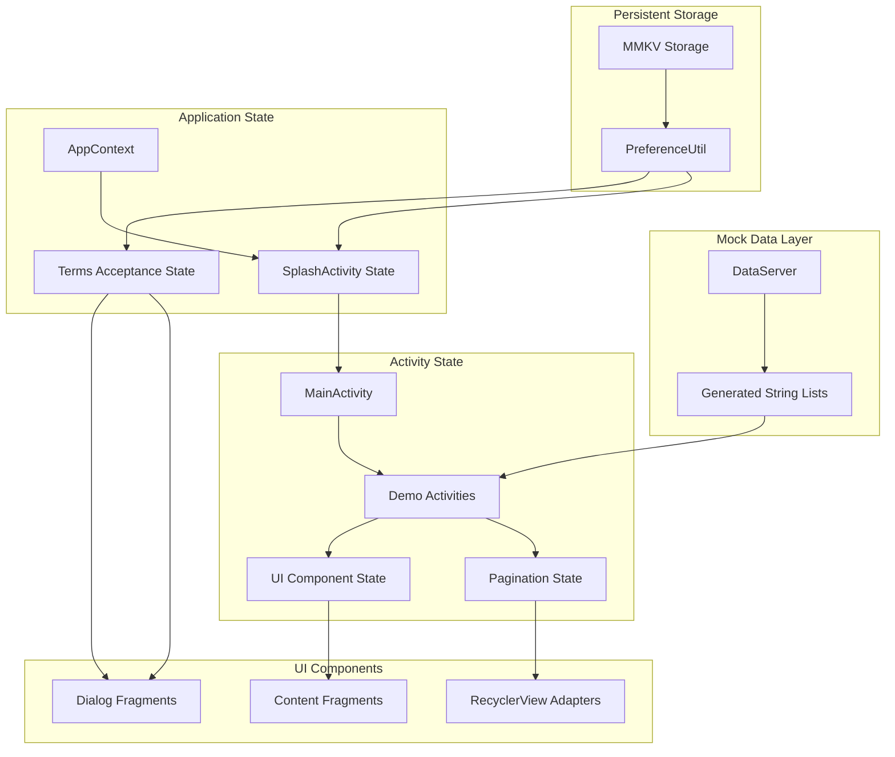

# Data Layer and State Management

Relevant source files

The following files were used as context for generating this wiki page:

- [app/src/main/java/com/suzhe/playdemo/component/brvah/autoLoad/AutoLoadMoreRefreshUseActivity.kt](app/src/main/java/com/suzhe/playdemo/component/brvah/autoLoad/AutoLoadMoreRefreshUseActivity.kt)
- [app/src/main/java/com/suzhe/playdemo/component/splash/TermServiceDialogFragment.kt](app/src/main/java/com/suzhe/playdemo/component/splash/TermServiceDialogFragment.kt)
- [app/src/main/java/com/suzhe/playdemo/data/DataServer.kt](app/src/main/java/com/suzhe/playdemo/data/DataServer.kt)
- [app/src/main/java/com/suzhe/playdemo/utils/PreferenceUtil.kt](app/src/main/java/com/suzhe/playdemo/utils/PreferenceUtil.kt)
- [app/src/main/res/drawable/icon_load.png](app/src/main/res/drawable/icon_load.png)
- [app/src/main/res/layout/activity_auto_load_more_refresh_use.xml](app/src/main/res/layout/activity_auto_load_more_refresh_use.xml)

This document covers the data layer architecture and state management patterns used throughout the
PlayDemo application. This includes the mock data system, persistent preference storage, and state
management patterns used in demo activities. For information about UI state and view management,
see [UI Components and Patterns](#5). For details about BRVAH-specific data handling,
see [BRVAH Demo System](#4).

## Overview

The PlayDemo application uses a simplified data layer designed to support demonstration scenarios
rather than production data requirements. The data layer consists of three primary components:

- **DataServer**: Mock data provider for demo activities
- **PreferenceUtil**: MMKV-based persistent storage for application preferences
- **Activity-level state management**: Local state handling within individual demo activities

## Mock Data System

### DataServer Implementation

The `DataServer` object provides static mock data for demonstration purposes across multiple demo
activities. It generates simple string-based datasets of varying sizes to support different testing
scenarios.

**DataServer Data Generation Methods**

| Method                     | Purpose                | Output Size | Usage Pattern                |
|----------------------------|------------------------|-------------|------------------------------|
| `getStringItems100()`      | Standard large dataset | 100 items   | Initial list population      |
| `getStringItems5()`        | Small dataset testing  | 5 items     | Quick demos, error states    |
| `getStringItems(num: Int)` | Custom size generation | Variable    | Pagination, custom scenarios |

The implementation follows a simple pattern where each method generates `ArrayList<String>` with
items labeled as "Item1", "Item2", etc. This provides predictable, testable data for RecyclerView
demonstrations.

**
Sources: ** [app/src/main/java/com/suzhe/playdemo/data/DataServer.kt:1-30](https://github.com/SuZhelevel6/PlayDemo/blob/a2338414/app/src/main/java/com/suzhe/playdemo/data/DataServer.kt#L1-L30)

### Data Usage in Demo Activities

The `AutoLoadMoreRefreshUseActivity` demonstrates the most sophisticated usage of `DataServer`,
implementing pagination state management with the mock data provider.

**
Sources: ** [app/src/main/java/com/suzhe/playdemo/component/brvah/autoLoad/AutoLoadMoreRefreshUseActivity.kt:91-133](https://github.com/SuZhelevel6/PlayDemo/blob/a2338414/app/src/main/java/com/suzhe/playdemo/component/brvah/autoLoad/AutoLoadMoreRefreshUseActivity.kt#L91-L133)

## Preference Management System

### MMKV Integration

The application uses Tencent's MMKV library through the `PreferenceUtil` wrapper for persistent
key-value storage. This provides efficient, type-safe preference management with better performance
than Android's SharedPreferences.

**
Sources: ** [app/src/main/java/com/suzhe/playdemo/utils/PreferenceUtil.kt:8-11](https://github.com/SuZhelevel6/PlayDemo/blob/a2338414/app/src/main/java/com/suzhe/playdemo/utils/PreferenceUtil.kt#L8-L11)

### Terms of Service State Management

The most significant state managed through preferences is the user's acceptance of terms and
conditions. This state determines application initialization flow and first-run experience.

The implementation uses specific preference keys and methods:

- **Storage Key**: `ACCEPT_TERM` constant for terms acceptance state
- **Getter**: `isAcceptTermsServiceAgreement(): Boolean` - checks if user has accepted terms
- **Setter**: `setAcceptTermsServiceAgreement()` - marks terms as accepted

**
Sources: ** [app/src/main/java/com/suzhe/playdemo/utils/PreferenceUtil.kt:13-21](https://github.com/SuZhelevel6/PlayDemo/blob/a2338414/app/src/main/java/com/suzhe/playdemo/utils/PreferenceUtil.kt#L13-L21), [app/src/main/java/com/suzhe/playdemo/component/splash/TermServiceDialogFragment.kt:42-51](https://github.com/SuZhelevel6/PlayDemo/blob/a2338414/app/src/main/java/com/suzhe/playdemo/component/splash/TermServiceDialogFragment.kt#L42-L51)

## Activity-Level State Management

### Pagination State Pattern

Demo activities that require pagination implement local state management using internal classes and
state objects. The `AutoLoadMoreRefreshUseActivity` exemplifies this pattern with its `PageInfo`
class.

**State Management Features:**

| Component            | Responsibility | State Tracked                             |
|----------------------|----------------|-------------------------------------------|
| `PageInfo`           | Page tracking  | Current page number, first page detection |
| `QuickAdapterHelper` | Load state     | Loading, error, no-more-data states       |
| `SwipeRefreshLayout` | Refresh state  | Pull-to-refresh active state              |

**
Sources: ** [app/src/main/java/com/suzhe/playdemo/component/brvah/autoLoad/AutoLoadMoreRefreshUseActivity.kt:24-36](https://github.com/SuZhelevel6/PlayDemo/blob/a2338414/app/src/main/java/com/suzhe/playdemo/component/brvah/autoLoad/AutoLoadMoreRefreshUseActivity.kt#L24-L36), [app/src/main/java/com/suzhe/playdemo/component/brvah/autoLoad/AutoLoadMoreRefreshUseActivity.kt:38-54](https://github.com/SuZhelevel6/PlayDemo/blob/a2338414/app/src/main/java/com/suzhe/playdemo/component/brvah/autoLoad/AutoLoadMoreRefreshUseActivity.kt#L38-L54)

### Dialog State Management

The `TermServiceDialogFragment` demonstrates state management for modal dialogs, including
persistent state changes and application flow control.

**
Sources: ** [app/src/main/java/com/suzhe/playdemo/component/splash/TermServiceDialogFragment.kt:41-51](https://github.com/SuZhelevel6/PlayDemo/blob/a2338414/app/src/main/java/com/suzhe/playdemo/component/splash/TermServiceDialogFragment.kt#L41-L51), [app/src/main/java/com/suzhe/playdemo/component/splash/TermServiceDialogFragment.kt:64-70](https://github.com/SuZhelevel6/PlayDemo/blob/a2338414/app/src/main/java/com/suzhe/playdemo/component/splash/TermServiceDialogFragment.kt#L64-L70)

## Data Flow Architecture

### Complete Data Flow Pattern

The application's data flow follows a layered approach where different types of data and state are
managed at appropriate levels of the application hierarchy.

**
Sources: ** [app/src/main/java/com/suzhe/playdemo/utils/PreferenceUtil.kt:1-44](https://github.com/SuZhelevel6/PlayDemo/blob/a2338414/app/src/main/java/com/suzhe/playdemo/utils/PreferenceUtil.kt#L1-L44), [app/src/main/java/com/suzhe/playdemo/data/DataServer.kt:1-30](https://github.com/SuZhelevel6/PlayDemo/blob/a2338414/app/src/main/java/com/suzhe/playdemo/data/DataServer.kt#L1-L30), [app/src/main/java/com/suzhe/playdemo/component/brvah/autoLoad/AutoLoadMoreRefreshUseActivity.kt:22-55](https://github.com/SuZhelevel6/PlayDemo/blob/a2338414/app/src/main/java/com/suzhe/playdemo/component/brvah/autoLoad/AutoLoadMoreRefreshUseActivity.kt#L22-L55)