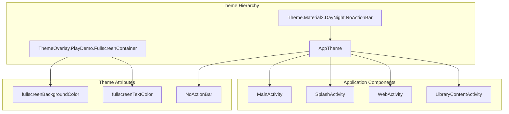
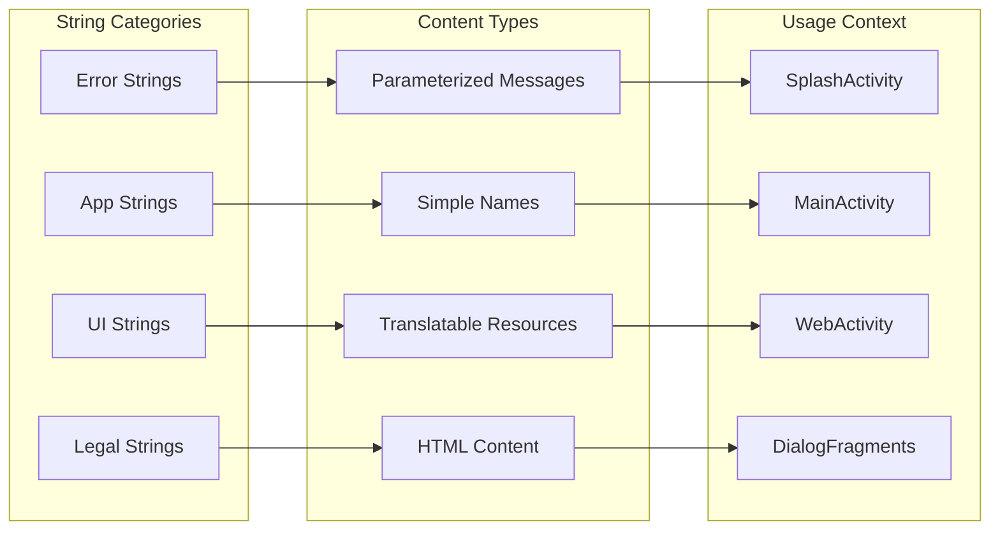
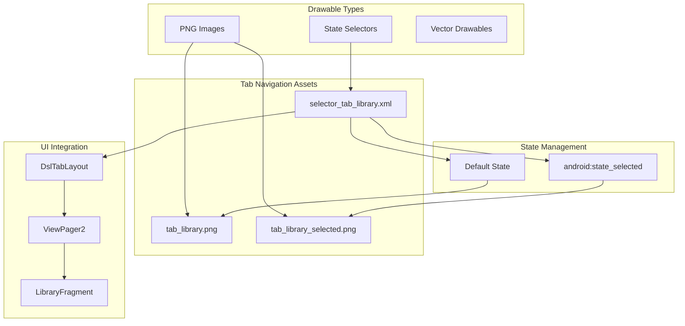
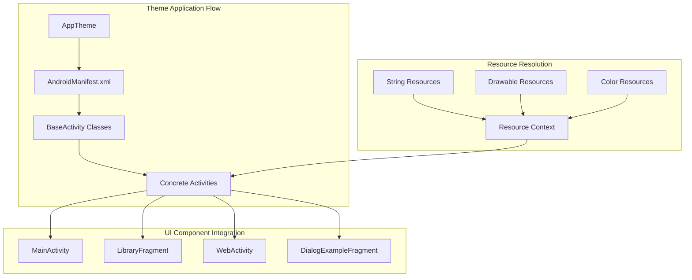

# Theming and Resources

Relevant source files

The following files were used as context for generating this wiki page:

- [.idea/gradle.xml](.idea/gradle.xml)
- [app/src/main/res/drawable/bg_sky.webp](app/src/main/res/drawable/bg_sky.webp)
- [app/src/main/res/drawable/selector_tab_library.xml](app/src/main/res/drawable/selector_tab_library.xml)
- [app/src/main/res/drawable/tab_library.png](app/src/main/res/drawable/tab_library.png)
- [app/src/main/res/drawable/tab_library_selected.png](app/src/main/res/drawable/tab_library_selected.png)
- [app/src/main/res/values/strings.xml](app/src/main/res/values/strings.xml)
- [app/src/main/res/values/themes.xml](app/src/main/res/values/themes.xml)

This document covers the theming system, resource management, and asset organization used throughout
the PlayDemo application. It details how the app implements Material Design 3 theming, manages
string resources for internationalization, and organizes drawable assets for consistent UI
presentation.

For information about how these resources are integrated into specific UI components,
see [UI Components and Patterns](#5). For data storage and preference management,
see [Data Layer and State Management](#6.1).

## Theme System Architecture

The PlayDemo application implements a Material Design 3 based theming system that provides
consistent styling across all UI components while supporting both light and dark modes.

### Base Theme Configuration

The application uses `AppTheme` as its primary theme, which extends
`Theme.Material3.DayNight.NoActionBar` [app/src/main/res/values/themes.xml:4](). This provides:

- Material Design 3 component styling
- Automatic light/dark mode switching based on system preference
- Custom action bar handling through `NoActionBar` configuration

### Custom Theme Overlays

The app defines specialized theme overlays for specific UI contexts:

| Theme Overlay                               | Purpose                  | Key Attributes                                     |
|---------------------------------------------|--------------------------|----------------------------------------------------|
| `ThemeOverlay.PlayDemo.FullscreenContainer` | Fullscreen content areas | `fullscreenBackgroundColor`, `fullscreenTextColor` |

The fullscreen theme overlay uses Material Design color values:

- Background: `@color/light_blue_600` [app/src/main/res/values/themes.xml:7]()
- Text: `@color/light_blue_A200` [app/src/main/res/values/themes.xml:8]()

**
Sources: ** [app/src/main/res/values/themes.xml:1-10](https://github.com/SuZhelevel6/PlayDemo/blob/a2338414/app/src/main/res/values/themes.xml#L1-L10)

## String Resource Organization

The application manages string resources through a structured approach that supports both static
content and dynamic localization requirements.

### Core Application Strings

The primary application strings include basic identifiers and user-facing content:

| String Resource             | Value                         | Usage Context               |
|-----------------------------|-------------------------------|-----------------------------|
| `app_name`                  | "PlayDemo"                    | Application title, launcher |
| `loading`                   | "loading"                     | Progress indicators         |
| `error_load`                | "loading_error"               | Error state displays        |
| `error_network_not_connect` | "error network not connected" | Network failure messages    |

### Legal and Compliance Content

The application includes comprehensive legal text for terms of service and privacy
policy [app/src/main/res/values/strings.xml:13-41](). This content is structured as:

- HTML-formatted text using `CDATA` sections
- Embedded hyperlinks to external policy documents
- Chinese language content for target audience
- Non-translatable copyright information with parameterized year

### Localization Strategy

String resources follow Android localization patterns:

- Base strings in default locale
- Copyright text marked as `translatable="false"` [app/src/main/res/values/strings.xml:7]()
- Parameterized strings using format specifiers (e.g., `%1$d` for copyright year)

**
Sources: ** [app/src/main/res/values/strings.xml:1-44](https://github.com/SuZhelevel6/PlayDemo/blob/a2338414/app/src/main/res/values/strings.xml#L1-L44)

## Drawable Resource System

The application implements a comprehensive drawable resource system that supports state-based UI
elements and consistent visual presentation across different interaction states.

### State-Based Selectors

The application uses XML selector drawables to manage different visual states for interactive
elements. The tab library selector demonstrates this
pattern [app/src/main/res/drawable/selector_tab_library.xml:1-5]():

- Selected state: `tab_library_selected.png` when `android:state_selected="true"`
- Default state: `tab_library.png` for normal display

### Asset Organization

Drawable resources are organized by function and state:

| Resource Type   | File Pattern     | Purpose                 |
|-----------------|------------------|-------------------------|
| State Selectors | `selector_*.xml` | Multi-state UI elements |
| Tab Icons       | `tab_*.png`      | Navigation interface    |
| Selected States | `*_selected.png` | Active state indicators |

### Image Asset Specifications

The tab navigation uses PNG assets with consistent specifications:

- Dimensions: 72x72 pixels (H: 0x48)
- Format: PNG with transparency support
- Color profile: sRGB color space
- Both normal and selected state variants

**
Sources: ** [app/src/main/res/drawable/selector_tab_library.xml:1-5](https://github.com/SuZhelevel6/PlayDemo/blob/a2338414/app/src/main/res/drawable/selector_tab_library.xml#L1-L5), [app/src/main/res/drawable/tab_library.png:1-14](https://github.com/SuZhelevel6/PlayDemo/blob/a2338414/app/src/main/res/drawable/tab_library.png#L1-L14), [app/src/main/res/drawable/tab_library_selected.png:1-19](https://github.com/SuZhelevel6/PlayDemo/blob/a2338414/app/src/main/res/drawable/tab_library_selected.png#L1-L19)

## Resource Integration Patterns

The theming and resource system integrates throughout the application architecture to provide
consistent styling and content management across all UI components.

### Theme Inheritance Chain

The application applies themes through a hierarchical inheritance system:

1. **Base Theme**: `Theme.Material3.DayNight.NoActionBar` provides Material Design foundation
2. **App Theme**: `AppTheme` customizes base theme for application-specific needs
3. **Component Themes**: Activities and fragments inherit from `AppTheme`
4. **Overlay Themes**: Specialized overlays for specific UI contexts (fullscreen, dialogs)

### Resource Naming Conventions

The application follows consistent naming patterns for maintainability:

| Resource Type | Naming Pattern                        | Example                                     |
|---------------|---------------------------------------|---------------------------------------------|
| Themes        | `AppTheme`, `ThemeOverlay.PlayDemo.*` | `ThemeOverlay.PlayDemo.FullscreenContainer` |
| Selectors     | `selector_*`                          | `selector_tab_library`                      |
| State Assets  | `*_selected`, `*_pressed`             | `tab_library_selected`                      |
| Error Strings | `error_*`                             | `error_network_not_connect`                 |

### Dynamic Resource Usage

The resource system supports dynamic content through:

- Parameterized strings for runtime value injection
- State selectors for responsive UI behavior
- Theme-aware color resolution for light/dark mode adaptation
- Localization-ready string organization

**
Sources: ** [app/src/main/res/values/themes.xml:1-10](https://github.com/SuZhelevel6/PlayDemo/blob/a2338414/app/src/main/res/values/themes.xml#L1-L10), [app/src/main/res/values/strings.xml:1-44](https://github.com/SuZhelevel6/PlayDemo/blob/a2338414/app/src/main/res/values/strings.xml#L1-L44), [app/src/main/res/drawable/selector_tab_library.xml:1-5](https://github.com/SuZhelevel6/PlayDemo/blob/a2338414/app/src/main/res/drawable/selector_tab_library.xml#L1-L5)