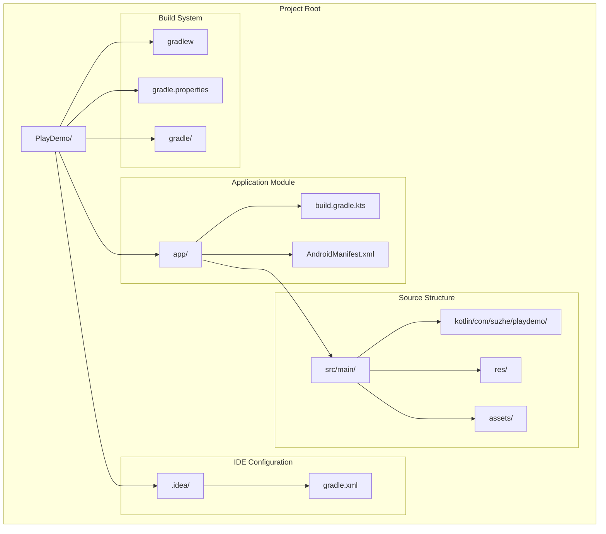
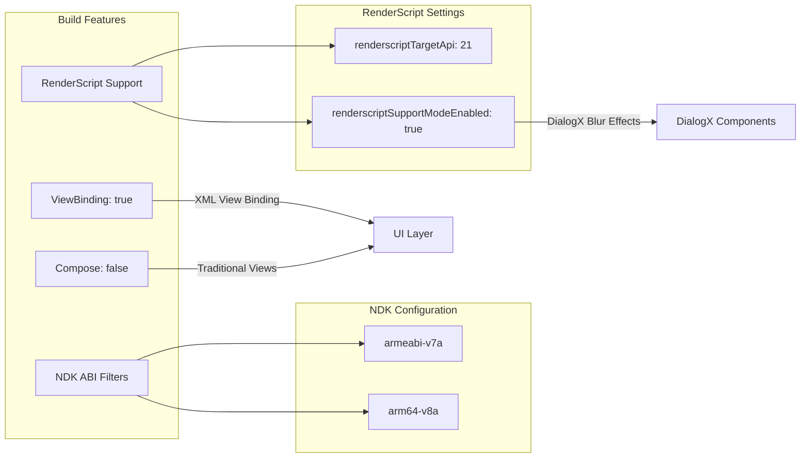
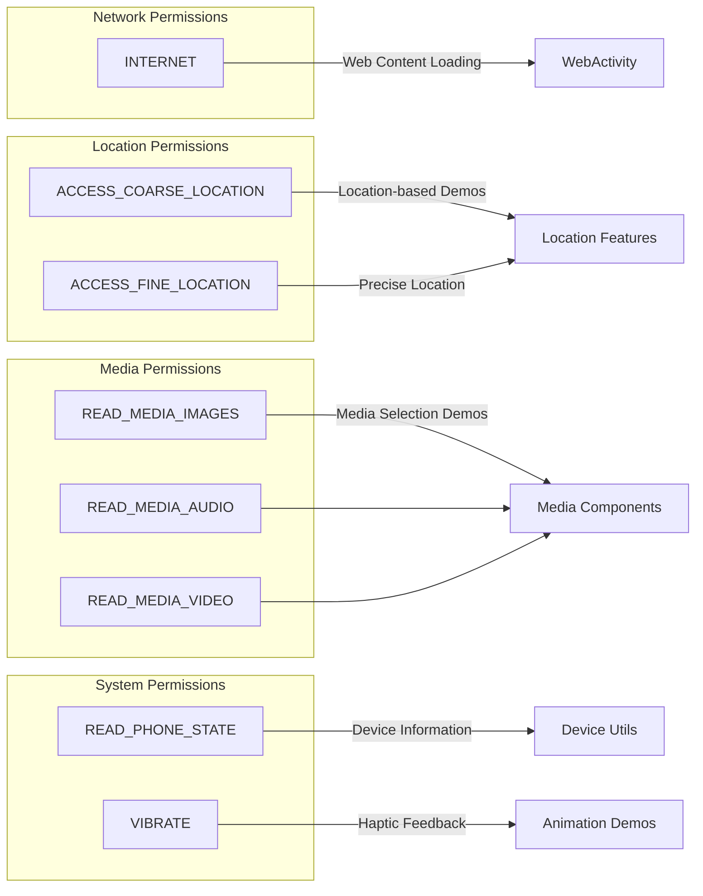
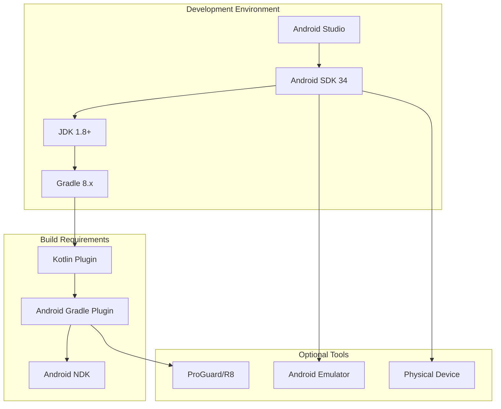

# Development and Build Configuration

Relevant source files

The following files were used as context for generating this wiki page:

- [.idea/gradle.xml](.idea/gradle.xml)
- [app/build.gradle.kts](app/build.gradle.kts)
- [app/src/main/AndroidManifest.xml](app/src/main/AndroidManifest.xml)
- [app/src/main/res/drawable/bg_sky.webp](app/src/main/res/drawable/bg_sky.webp)
- [app/src/main/res/drawable/selector_tab_library.xml](app/src/main/res/drawable/selector_tab_library.xml)
- [app/src/main/res/drawable/tab_library.png](app/src/main/res/drawable/tab_library.png)
- [app/src/main/res/drawable/tab_library_selected.png](app/src/main/res/drawable/tab_library_selected.png)

This document covers the project structure, build configuration, dependency management, and
development environment setup for the PlayDemo Android application. It provides technical details
for developers setting up the development environment, understanding the build process, and managing
project dependencies.

For information about application architecture and component organization,
see [Application Architecture](#3). For details about data and resource management patterns,
see [Data and Resource Management](#6).

## Project Structure Overview

The PlayDemo application follows standard Android project conventions with a single-module
architecture. The project is configured as a Kotlin-based Android application using Gradle Kotlin
DSL for build configuration.

**
Sources: ** [.idea/gradle.xml:1-19](https://github.com/SuZhelevel6/PlayDemo/blob/a2338414/.idea/gradle.xml#L1-L19), [app/build.gradle.kts:1-131](https://github.com/SuZhelevel6/PlayDemo/blob/a2338414/app/build.gradle.kts#L1-L131), [app/src/main/AndroidManifest.xml:1-73](https://github.com/SuZhelevel6/PlayDemo/blob/a2338414/app/src/main/AndroidManifest.xml#L1-L73)

## Build Configuration Details

The application build configuration is defined in the Gradle Kotlin DSL build script, targeting
modern Android development practices with specific optimizations for the demo application's
requirements.

### Core Build Settings

| Configuration | Value                | Purpose                           |
|---------------|----------------------|-----------------------------------|
| Namespace     | `com.suzhe.playdemo` | Application package identifier    |
| Compile SDK   | 34                   | Target Android API level          |
| Min SDK       | 33                   | Minimum supported Android version |
| Target SDK    | 33                   | Primary target Android version    |
| Version Code  | 1                    | Internal version number           |
| Version Name  | "1.0"                | User-visible version string       |

### Specialized Build Features

The build configuration includes several specialized settings optimized for the demo application's
functionality:

**
Sources: ** [app/build.gradle.kts:6-60](https://github.com/SuZhelevel6/PlayDemo/blob/a2338414/app/build.gradle.kts#L6-L60)

### Java and Kotlin Compatibility

The project maintains Java 1.8 compatibility for broad device support while leveraging Kotlin
language features:

- **Source Compatibility:** JavaVersion.VERSION_1_8
- **Target Compatibility:** JavaVersion.VERSION_1_8
- **Kotlin JVM Target:** "1.8"

**
Sources: ** [app/build.gradle.kts:41-47](https://github.com/SuZhelevel6/PlayDemo/blob/a2338414/app/build.gradle.kts#L41-L47)

## Dependency Management Architecture

The application's dependency management is organized into distinct categories, each serving specific
functional requirements of the demo application.

```mermaid
graph TB
    subgraph "Android Framework"
        ACK["androidx.core:core-ktx:1.13.0"]
        ALC["androidx.lifecycle:lifecycle-runtime-ktx:2.6.2"]
        AAK["androidx.activity:activity-ktx:1.9.0"]
        AAC["androidx.appcompat:appcompat:1.4.1"]
        MAT["com.google.android.material:material:1.12.0"]
        CON["androidx.constraintlayout:constraintlayout:2.1.4"]
    end
    
    subgraph "UI Framework Libraries"
        QMUI["com.qmuiteam:qmui:2.1.0"]
        DX["DialogX Suite"]
        DSL["DslTabLayout:3.5.3"]
        DSLA["DslAdapter:6.0.4"]
    end
    
    subgraph "Core Demo Target"
        BRVAH["BaseRecyclerViewAdapterHelper4:4.1.4"]
        MS["MaterialSpinner:1.3.1"]
        CI["CircleIndicator:2.1.6"]
        WP["WebProgress:1.2.0"]
    end
    
    subgraph "System Utilities"
        MMKV["MMKV:1.2.16"]
        XC["XCrash:3.1.0"]
        UC["AndroidUtilCode:1.31.1"]
        ACL["Apache Commons Lang3:3.8"]
    end
    
    ACK --> |"Core Extensions"| APP["PlayDemo App"]
    QMUI --> |"UI Framework"| APP
    BRVAH --> |"Primary Demo Target"| APP
    MMKV --> |"Preference Storage"| APP
```

**
Sources: ** [app/build.gradle.kts:62-131](https://github.com/SuZhelevel6/PlayDemo/blob/a2338414/app/build.gradle.kts#L62-L131)

### Primary Library Categories

#### UI Framework Dependencies

The application leverages several UI framework libraries for enhanced user interface components:

- **QMUI Framework:** Comprehensive Android UI toolkit providing consistent design patterns
- **DialogX Suite:** Multi-style dialog framework with iOS, MIUI, and Material You themes
- **DslTabLayout:** Advanced tab layout component with ViewPager2 integration
- **DslAdapter:** DSL-based RecyclerView adapter framework

#### Demo-Specific Libraries

Core libraries that serve as the primary demonstration targets:

- **BaseRecyclerViewAdapterHelper4:** Main focus of the demo application, providing enhanced
  RecyclerView functionality
- **MaterialSpinner:** Custom dropdown selection components
- **CircleIndicator:** ViewPager indicators for navigation flows
- **WebProgress:** Enhanced WebView progress indication

#### System and Utility Libraries

Foundation libraries providing core system functionality:

- **MMKV:** High-performance key-value storage replacing SharedPreferences
- **XCrash:** Comprehensive crash detection and reporting for Android
- **AndroidUtilCode:** Extensive collection of Android utility classes
- **Apache Commons Lang3:** Java utility library providing StringUtils and related tools

**
Sources: ** [app/build.gradle.kts:77-131](https://github.com/SuZhelevel6/PlayDemo/blob/a2338414/app/build.gradle.kts#L77-L131)

## Application Configuration

The Android manifest defines critical application configuration, permissions, and component
declarations required for the demo application's functionality.

### Permission Configuration

**
Sources: ** [app/src/main/AndroidManifest.xml:5-12](https://github.com/SuZhelevel6/PlayDemo/blob/a2338414/app/src/main/AndroidManifest.xml#L5-L12)

### Application Component Declaration

The manifest declares the complete activity hierarchy used throughout the demo application:

| Activity                      | Purpose                                      | Export Status |
|-------------------------------|----------------------------------------------|---------------|
| `SplashActivity`              | Application entry point with launcher intent | Exported      |
| `MainActivity`                | Primary tabbed navigation interface          | Exported      |
| `LibraryContentActivity`      | Demo component hosting                       | Internal      |
| `WebActivity`                 | Web content display                          | Internal      |
| Various BRVAH Demo Activities | Specific feature demonstrations              | Internal      |

**
Sources: ** [app/src/main/AndroidManifest.xml:25-71](https://github.com/SuZhelevel6/PlayDemo/blob/a2338414/app/src/main/AndroidManifest.xml#L25-L71)

## Development Environment Setup

### Required Development Tools

The project requires specific development environment configuration for optimal development
experience:

### Gradle Project Configuration

The Gradle project configuration is managed through the IDE settings, defining module structure and
build preferences:

- **Test Runner:** `CHOOSE_PER_TEST` for flexible testing configuration
- **Gradle JVM:** `#GRADLE_LOCAL_JAVA_HOME` using local Java installation
- **Module Structure:** Single `app` module with root project dependency

**
Sources: ** [.idea/gradle.xml:4-18](https://github.com/SuZhelevel6/PlayDemo/blob/a2338414/.idea/gradle.xml#L4-L18)

### Build Variants and Configuration

The application supports standard Android build variants with specific configuration for development
and release builds:

#### Debug Configuration

- **Minification:** Disabled for faster builds and debugging
- **ProGuard:** Optional for testing obfuscation
- **Debugging:** Full debug information included

#### Release Configuration

- **Minification:** Currently disabled but configurable
- **ProGuard Rules:** Standard Android optimization rules available
- **Signing:** Requires release signing configuration

**
Sources: ** [app/build.gradle.kts:32-40](https://github.com/SuZhelevel6/PlayDemo/blob/a2338414/app/build.gradle.kts#L32-L40)